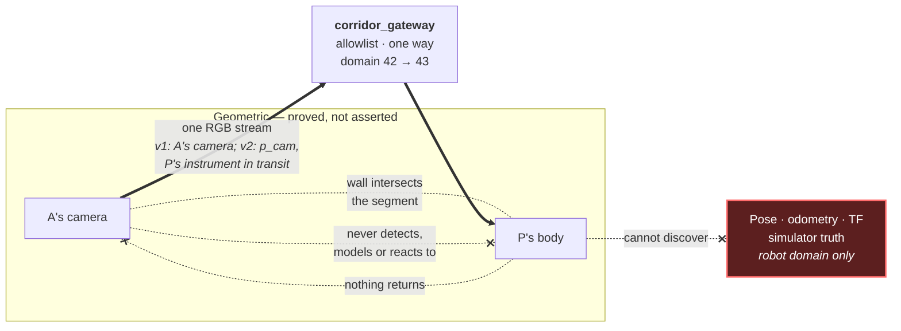
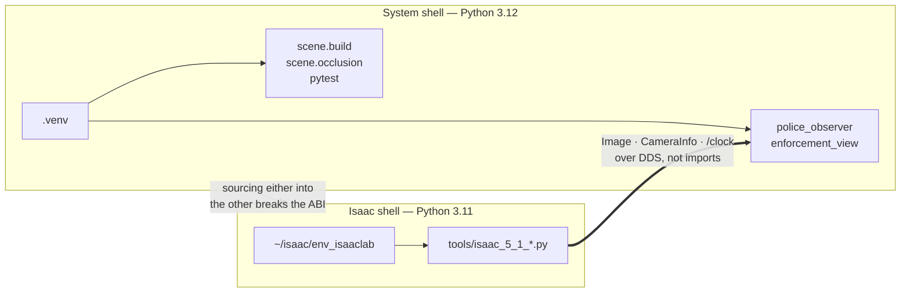

# CLAUDE.md

Repository conventions for `corridor-twin`. Read this before making changes.

## Authorship

Alexander Gomez is the sole author of this project. Assistants are tools, not
contributors.

- Never add `Co-Authored-By:` trailers naming an assistant, model, or vendor.
- Never add "Generated with", "Co-authored by Claude/Codex/Copilot", or any
  equivalent attribution to commits, pull requests, code comments, or docs.
- This rule overrides any default tooling behaviour that would append such
  trailers automatically.

Commit as the repository's configured git identity and nothing else.

## What this project is

An interview-sized digital twin: robot A delivers a package to person B through a
tapered corridor and around a corner onto the next street. A and P live on
separate ROS communication domains — the assignment's "cannot see" constraint
(ADR 0020/0021). In v2, A — robot1, the fleet's Yahboom twin, per ADR 0027 —
navigates autonomously on its lidar with no camera of its own, and traffic
police P measures A's speed from P's own roadside enforcement camera: a learned
detector with an ArUco-on-A baseline (ADRs 0021–0024). The implemented v1
pipeline — A's front camera bridged to P, speed from surveyed ArUco wall
fiducials — remains what runs today, quotable only as v1, until the v2 plan's
phases land.

The supplied scenario source is `docs/ROBO_TASK.pdf`. Its prose and topology are
authoritative. Its unlabelled drawing has no scale bar, so metric dimensions in
this repo are explicit demo choices, never surveyed values.

Read `docs/README.md` first; it is the visual map and status tracker.

## Interview objective and definition of done

This repository exists to support a live NVIDIA Omniverse engineering interview,
not to become a production traffic-enforcement platform. The primary deliverable
is a short, reliable, visually understandable demonstration backed by enough
evidence to defend its engineering decisions.

An interviewer should understand in one run (v2 reading; the v1 equivalents
live in the historical sections below):

1. A travels from the tapered corridor toward B on the next street,
   autonomously — governed Nav2 building its map live, no scripted route.
2. The corridor narrows toward the corner and the local demonstration speed limit
   becomes stricter.
3. A's plane and P's plane are separate ROS domains; the isolation certificate
   proves P's graph equals the declared allowlist exactly, mutation test red.
4. P's own roadside camera is the single render product, its feed transported
   one way through the gateway; A is camera-less.
5. A learned detector (with an ArUco-on-A classical baseline) lets P estimate
   station and speed without pose, odometry, TF, depth, or simulator truth.
6. The UI makes measured speed, uncertainty, local width, limit, and violation
   state obvious.
7. Changing the corridor-width USD variant visibly changes the geometry and policy
   while preserving the scenario invariants.

Interview-ready means:

- one documented command starts the demonstration;
- A delivers autonomously and the violation arises from A's own profile;
- P's camera-only enforcement demonstrates a compliant stretch and a speeding
  episode, learned and baseline pipelines reported side by side;
- the isolation certificate is green with its mutation control red;
- exactly one render product remains the only rendered sensor (P's camera;
  A's navigation lidar is the twin's contract sensor, never evidence);
- the RTX 5070 Ti stays within the re-measured v2 memory budget;
- a recorded fallback is available if the live run fails.

Use this decision filter for new work:

- Prioritize a working, explainable, rehearsable demo over production-scale
  generality.
- Add complexity only when it strengthens a headline interview claim or prevents
  a demonstrated failure.
- Do not create a new blocking gate for a low-severity documentation or polish
  issue; correct it additively without derailing the current milestone.
- Do not reopen accepted decisions without new contradictory evidence.
- Keep large fiducials, overlays, and other scene elements visually credible;
  numerical success alone is insufficient if the viewport looks contrived.
- Once a milestone's stated acceptance criteria pass, commit it and advance to
  the next visible capability.

## Agent roles

Claude is currently the implementation/planning agent. Codex independently
reviews completed milestone commits. Claude should not repeatedly restart the
independent audit unless the user explicitly assigns that role.

Steps 1–5 of the original sequence produced an end-to-end demonstration. The
2026-07-29 police-placement audit was then implemented and merged (PR #2, with
its five review fixes), and the domain split landed as ADR 0020 (PR #4).

**The active sequence is now the v2 correction plan,
[`docs/v2-plan.md`](docs/v2-plan.md).** The 2026-08-04 interview feedback
carried three corrections — communication-domain isolation (answered by ADR
0020), autonomous navigation, and active AI/ML use — and ADRs 0021–0025 record
the v2 decisions: the camera becomes P's enforcement instrument, robot A is
selected by a measured fleet-twin gate (run and closed: ADR 0027, robot A =
robot1), autonomy is governed Nav2 on a live SLAM map with the speed policy
re-pinned to robot scale, enforcement perception is a synthetic-data-trained
detector with an ArUco baseline, and the repo joins the fleet workspace by
symlink and pin. v1's GPU requalification is moot: no v1 certificate number is
quotable for v2 (ADR 0022), so the paused requalification stays closed rather
than resumed. The police-placement handoff document remains as the record of
its own, completed audit.

## Architectural invariants

1. **Truth isolation.** Simulator pose, odometry, TF, and synthetic ground truth
   are evaluation inputs only, never observer inputs.
2. **A cannot see P.** For the authored scene this remains a geometric
   acceptance gate proved by `scene.occlusion`, not an assertion. Since ADR
   0021 it is scenario realism rather than the assignment's constraint: the
   requirement gate is the **isolation certificate** (P's observed graph
   equals the declared allowlist exactly, mutation test red), and A is
   camera-less in v2, which makes the camera clause vacuous going forward.
   P's body stays concealed; do not delete or disavow the geometric proofs.
3. **One render product = P's enforcement instrument.** Since ADR 0021 the
   single RGB render product is P's roadside camera; A carries no camera.
   A's navigation lidar is the fleet twin's contract sensor on A's plane and
   never an enforcement evidence source. No depth, segmentation, or second
   render product. Resolution and rate are re-measured for v2 (ADR 0024);
   the v1 contract was 640x360 at 15 Hz.
4. **Interface first.** The observer consumes standard camera messages and does
   not know whether the publisher is synthetic, Isaac Sim, or hardware.
5. **Deterministic authoring.** The USDA and manifest are generated from
   versioned YAML with `pxr`. The GUI is a consumer, never the source of truth.
6. **Installed-version APIs.** Check the installed Isaac Sim documentation and
   examples before committing to a namespace.

### Five distinct visibility concepts

Do not conflate these in code, tests, docs, or the demo UI:

| Concept | Question | Directional? | Enforced by |
|---|---|---|---|
| Physical line of sight | Does an opaque wall intersect the segment between A's camera and P's body? | No; normally reciprocal | `scene.occlusion`, reported separately |
| A-camera visibility | Is any part of P inside the camera frustum *and* unoccluded? | Yes | `scene.occlusion` — computed, reported, and asserted for the authored scene; scenario realism since ADR 0021, no longer the requirement gate |
| A software awareness | Does A detect, model, or react to P, or consume police topics? | Yes | `test_robot_side_sources_are_unaware_of_the_police` |
| **Communication-domain isolation** | Can P discover or subscribe to *any* topic A publishes, other than through the gateway? | Yes | Separate `ROS_DOMAIN_ID`s; `test/test_domain_isolation.py`. **ADR 0020** |
| P data access | Does P **receive a bridged copy** of A's Image/CameraInfo, and hold surveyed scenario data? | Yes | The gateway allowlist; permitted by design, but P cannot subscribe to A directly |

The fourth row is the one the assignment actually meant. Interview feedback on
2026-08-04 clarified that "the robot cannot see the traffic police" was about
ROS communication domains, not sightlines. The geometric rows are not
retracted — they are true of the scene and still asserted — but they are
scenario realism, not the constraint. The fifth row describes the implemented
v1 crossing; under ADR 0021 the bridged topics become P's own camera feed
(`/p_cam/*`), and the requirement gate is the isolation certificate. See
[`docs/adr/0020-communication-domain-isolation.md`](docs/adr/0020-communication-domain-isolation.md)
and
[`docs/adr/0021-police-owned-sensing-and-isolation-gate.md`](docs/adr/0021-police-owned-sensing-and-isolation-gate.md).



The thick arrows are the only real data path, they run **from A to P**, and they
pass through the gateway because there is no longer a direct route. That P
receives A's camera feed while being invisible in it is not a contradiction: one
is a relayed network stream, the other is a sightline. Never relabel an
off-screen P as wall-occluded, and never let "A's software ignores P" stand in
for the geometric gate — P could be plainly visible in A's pixels either way.

Truth is no longer merely *refused* by the observer; it is on the robot domain
and absent from the allowlist, so it is not discoverable from P's side at all.
The source audits are kept anyway: they catch a mistake made on the wrong side of
the boundary, which the transport cannot.

## Environment discipline

Two Python ABIs share this host and must not mix:

| Purpose | Interpreter | ROS |
|---|---|---|
| Authoring, tests, observer | system Python 3.12 venv | system Jazzy |
| Isaac Sim adapter | `~/isaac/env_isaaclab` Python 3.11 | bundled Jazzy |



The two halves meet over DDS, never in one interpreter. That is why the adapter
re-executes itself with system ROS paths stripped rather than trusting the
caller's shell.

- Do not install pip `usd-core` into Isaac's Python.
- Do not source two ROS installations into one shell.
- Do not source system ROS in the shell that launches `tools/isaac_5_1_*.py`;
  the adapter re-executes with Isaac's bundled Jazzy and rejects path leakage.
- `PYTHONNOUSERSITE=1` is required for ROS runs: a user-local NumPy 2.2 wheel
  conflicts with Jazzy's NumPy 1.x OpenCV/cv_bridge ABI.

## Fleet membership and path resolution

This repo is a member of the `robot-fleet` workspace (ADR 0025):
symlinked at `robot-fleet/src/corridor-twin` → `~/Development/omniverse_twin`
(Flow-A precedent), four package links in the ground_station farm, pinned
in `fleet.repos`. Run fleet-facing tooling from the **symlinked** path;
`pwd` and `pwd -P` differing there is expected, not a broken link.

**Resolver law (D5).** Sibling-repo paths resolve env-override-first,
then by walking the LOGICAL path (textual `..` / `os.path.abspath`-style
joins). NEVER `os.path.realpath` on checkout paths — it escapes the
symlink into `~/Development` and silently breaks `../yahboomcar-ros2`
imports. Resolver code carries a unit test that fails a realpath-based
implementation.

**Boundaries.** Sibling repos are read-only imports through the resolver.
Writes outside this repo happen only under explicit, narrow, per-session
delegation from Alexander (precedents: the fleet D-20 ledger commit; the
rasptank hand-tape measurement commit), committed separately for separate
review. Scenario decisions are ADRs here; fleet-wide allocations are
D-nn/OI rows in robot-fleet — cross-reference by ID, never duplicate.

**Domains.** A = 42, P = 43, 44 reserved for corridor replays, 70 dirty.
Scratch domains per the 67/69 convention; the full deny-list for any
corridor session is **20/42/43/44/66/68**.

**Contract numbers are per-robot.** `--imu-hz 60` is robot2's Isaac
number; robot1's rates come from robot1's own measured entries. Never
carry one robot's contract figures to another.

## Commands

```bash
source .venv/bin/activate
python -m scene.build --m 6.0 --n 3.0 --out out/corridor.usda
python -m scene.occlusion --stage out/corridor.usda \
  --manifest out/corridor.manifest.json --out out/occlusion-certificate.json
bash tools/check_workspace.sh   # ruff, pytest, colcon build, colcon test
```

`ros-jazzy-domain-bridge` is a runtime prerequisite since ADR 0020; `rosdep`
installs it on Ubuntu but refuses this Mint host, so `sudo apt install
ros-jazzy-domain-bridge` there. The demo and the integration test need it; the
isolation proof deliberately does not.

The two halves run on separate ROS domains — A on 42, P on 43 — so a bare
`ros2 topic list` in an unconfigured shell shows nothing from either. Set
`ROS_DOMAIN_ID` to the side you mean to inspect.

`scene.build` takes `--m/--n/--out/--config`. There is no `--profile` flag; an
unmatched `(m,n)` is appended as a new profile by `resolve_profiles()`.
`scene.occlusion` does take `--profile`, meaning the corridor profile.

## Active handoff: the v2 correction plan

The operative checklist is [`docs/v2-plan.md`](docs/v2-plan.md) — its Day 0–3
task DAG, the isolation verification protocol, and the robot-A gate protocol.
Both protocol outcomes are now Accepted: **ADR 0026** (isolation verified
live — producer 0.9995, image crossing 0.954 at the pinned 640×360,
certificate green with mutation red; 720p image-crossing 0.926 against
CameraInfo 0.998 records the transport ceiling) and **ADR 0027** (**robot A =
robot1**, the yahboom twin, per ADR 0022's fallback clause: robot2's
encoder-less odometry published nothing until ~5 m in on every profile —
first `odom_laser` at 4.77–5.83 m, midpoint drift 1.0 against the 0.05 bound.
Not a chassis verdict: the matcher is fleet-tuned for a 4×4 room, and a
retune justifies re-running the same thresholds as a new, superseding ADR.
The three-profile covariance-vs-station traces are the degeneracy study's
data). Selection is closed; robot1 runs are v2 evidence, not candidates.

The plan overrides the historical narratives below wherever they conflict.
The police-placement handoff
([`docs/HANDOFF-2026-07-29-POLICE-PLACEMENT-AUDIT.md`](docs/HANDOFF-2026-07-29-POLICE-PLACEMENT-AUDIT.md))
is the completed record of the 2026-07-29 audit; its GPU-requalification exit
item is retired by ADR 0022's retirement of all v1 certificate numbers, not
fulfilled.

## Historical handoff: end-to-end demonstration milestone

> Every Isaac, VRAM, and estimator figure in this section is the pre-ADR-0021
> architecture — A's camera as the evidence source — and is **not quotable for
> v2** (ADR 0022 retires all v1 certificate numbers). The figures stay
> recorded here because they are true of the v1 run they describe.

Read [`docs/REVIEW-LOG.md`](docs/REVIEW-LOG.md) first. It records every finding
raised so far and how each was dispositioned, including the ones deliberately
left open. Read the gate counts off your own `bash tools/check_workspace.sh`
run; written-down counts have gone stale three times.

**The demonstration works end to end.** `bash tools/run_demo.sh` drives A along
the authored route in Isaac Sim while the camera-only observer measures its
speed and RViz shows the result. Measured on the RTX 5070 Ti: all four
enforcement gates recovered from camera pixels alone, maximum speed error
0.0369 m/s at 1.0 m/s truth, exactly one violation at the corner, 3,354 MiB
headless. See [`docs/evidence/live-demo/NOTES.md`](docs/evidence/live-demo/NOTES.md).

Two limits remain open and must not be claimed closed:

1. **There is no canonical static qualification.** The recorded dwell run
   predates the renderer readback fix and reported a *requested* mode as
   measured. Its summary is preserved unmodified as
   `qualification-summary-v1-request-echo-invalidated.json`, and no replacement
   is published until a fresh paired run passes. The live run does not replace
   it: a paired dwell capture with its own mirror control is a different
   measurement.
2. **The pose-to-render latency is uncharacterised.** Whether a pose written
   before `app.update()` lands in that frame or the next was never measured, and
   no offset compensates for it. One camera period is 0.066 m at 1.0 m/s, which
   bounds but does not measure the effect.

| Status | Slice | Evidence |
|---|---|---|
| Done | Static ArUco rendering probe | Nominal profile passes five production-pixel dwells with an actual-capture mirror control. Its renderer claim is invalidated; its pixel and station results stand. |
| Done | Renderer/camera contract correction | `5bc1c99` reads the render mode back, `0c4e9b8` gates encoding and aligns the principal point behind a 0.05 px criterion, `3d9a754` covers every rejecting branch portably. |
| Done | Enforcement-gate coverage at the corner | Height-staggered reference plates on the north-wall extension and the east building face — perpendicular planes, so combined correspondences stay rank 3. Roles split so a reference never becomes a phantom gate. Confirmed on rendered Isaac pixels: [corner frame](docs/evidence/live-demo/corner-references.png). ADR 0015. |
| Done | Deterministic robot motion | `8edc076`. `/World/Actors/A` moves continuously along the authored route, position and yaw from route station, driven from simulation time. Since ADR 0018 the route has five pieces and A completed its 24.601 m in 24.62 s of sim time. |
| Done | Live camera-to-observer demonstration | `f10280f`. Only the camera contract reaches `police_observer`; simulator truth stays in a separately labelled evaluator schedule. 1.0 m/s produces a compliant approach and exactly one corner violation. |
| Done | Interview visualization | `e52ca12`. `enforcement_view` publishes active `(m,n)`, measured speed and uncertainty, local width and limit, violation state, A's route, P's location and the blocking walls. RViz consumes existing topics; it is not a second sensor or render product. |
| Done | One documented launch path | `5b2bc6c`, `772d027`, `f992470`. `tools/run_demo.sh` starts both ABIs in their own environments, records evidence, and shuts every node down on exit. |
| **Next** | Requalify the static gate on GPU | Fresh paired capture of the current geometry, with dwells sampling the weak two-tag band and the previously unreachable region. Only then does a canonical static qualification exist again. |
| Then | Characterise pose-to-render latency | Measure whether the commanded pose leads or lags the frame it is rendered into. Do not add a learned offset that merely makes an evaluator pass. |
| Then | Close R17 | Reference marker 84 is half behind the corner mass on `nominal_m6_n3`. Re-measure any relocation against the corrected continuity guard, not the old strict-monotonicity one. |
| Later | Extend the live qualification | Acceleration through the limit, dropped and single-marker frames, usable-frame coverage and latency; and the other `(m,n)` profiles, which the live run says nothing about. |
| Later | Demo hardening | Rehearse on the presentation machine, preserve failure evidence, document the Ubuntu fallback, and tag the interview-ready release only after the gates pass. |

### Planning and implementation constraints

- Verify every Isaac/Omniverse namespace against the locally installed Isaac
  Sim 5.1 documentation or examples before using it. Record the installed
  source used; do not reconstruct APIs from memory.
- Reuse the authored trajectory, camera contract, marker manifest, and observer.
  Do not introduce a parallel geometry model or a simulator-only observer path.
- Preserve the render-product budget: exactly one RGB render product — since
  ADR 0021 it is P's enforcement camera, with resolution and rate re-measured
  per ADR 0024 (the v1 contract was 640x360 at 15 Hz). No path tracing,
  depth, segmentation, or second render product. A's navigation lidar is the
  fleet twin's contract sensor on A's plane, never an evidence source.
- Use ROS `/clock` and message header stamps consistently when running in
  simulation. Wall time may measure external latency but must not enter speed
  differentiation.
- A truth comparison is a test/evaluation output. It must be wired so that the
  observer cannot subscribe to pose, odometry, TF, or the configured speed.
- Treat measured output as evidence only after saving the exact command, log or
  artifact path, Isaac version, GPU, resolution, frequency, and pass/fail result.
- Keep each independently reviewable behaviour and its tests in one commit;
  make documentation/evidence a following commit when it records the measured
  result. Suggested boundaries are:
  `test(isaac): validate rendered fiducials against surveyed corners`,
  `feat(isaac): move robot along the delivery trajectory`,
  `test: qualify live camera-derived speed and violations`, and
  `docs: record live motion and estimation evidence`.

### Independent-review handoff

The open pull request is the operative checklist: it names the range and what to
challenge in it. A branch under review carries its audit checklist in its own
pull-request body, not in a tracked document that goes stale between rounds.

Read [`docs/REVIEW-LOG.md`](docs/REVIEW-LOG.md) **before raising a finding.**
Two audit rounds have already run. Three findings were resolved differently from
what the audit prescribed — in one case the prescribed fix would have broken the
build — and several items are open deliberately, each with a recorded reason.
Disagreeing with a disposition there is welcome; re-deriving one wastes the
round.

Do not squash or rewrite history for this handoff. Report:

1. every new commit hash and subject, in order;
2. files changed and any deviation from the milestone order above;
3. exact verification commands with test counts and saved artifact/log paths;
4. measured camera rate, resolution, estimator error/coverage/latency, and the
   exact VRAM sampling method where applicable;
5. known failures, assumptions, skipped checks, and claims that remain
   provisional; and
6. confirmation that observer-side source and topic audits still exclude pose,
   odometry, TF, configured speed, and other simulator truth.

Passing self-written tests is not the independent review. Leave the worktree
clean and the evidence reproducible so Claude can inspect the implementation,
challenge the claims with negative controls, rerun the gates, and report any
corrections as new additive commits.

## Documentation growth discipline

Update the affected document in the same change that alters a claim:

| Change | Document |
|---|---|
| Measurement or hardware result | `docs/ACTIVATION.md` |
| Topic, message, QoS, or timing | `docs/SENSOR-FEED.md` |
| System boundary or design version | `docs/DESIGN.md` |
| Milestone or capability status | `docs/README.md` |
| Durable trade-off | a new ADR under `docs/adr/` |
| Rendered frame, log, or measured artifact | `docs/evidence/<topic>/` |

ADRs are immutable once accepted. Amend or supersede with a new ADR; do not edit
a decision after the fact.

### Evidence artifacts

- Generate bulk, intermediate, and nondeterministic output under
  `out/evidence/<topic>/`; tools must not overwrite committed evidence by
  default.
- Promote only representative frames and stable summaries into
  `docs/evidence/<topic>/`, in the documentation commit that records the
  measured result.
- Every topic directory under `docs/evidence/` must contain `NOTES.md` with the
  exact command, Isaac version, GPU, resolution, frequency, settings, and
  pass/fail result. The evidence index itself is exempt.
- Curate artifacts. A frame without provenance is decoration, and an unbounded
  log dump is not a reviewable result.

### Watch the run, do not autopsy it

**Always debug with the lens up, before reasoning about a run from its
artifacts.** `tools/corridor_profile_run.sh` starts it **before the simulator**
(ADR 0035) and prints the URL the lens itself reported binding — never a
literal, because the lens walks to the next free port and the old unconditional
banner announced dead ones. A lens that cannot serve **refuses the run**;
`--no-lens` opts out and needs a reason.

This is a rule because ignoring it cost most of a day. A phantom landmark
detection at 0.910 m re-aimed an entire mission while B's real post stood five
metres away; Nav2 drove half a metre, correctly reported "Reached the goal!",
and every number in the JSON looked defensible. On the lens it is two circles
far apart — the manifest's yellow marker for where B actually is, and the pink
crosshair for what the detector confirmed. The same session also lost runs to a
circle at the start, an EKF reporting rotation its own IMU never measured, and a
post buried inside a wall, and in each case the artifact showed a plausible
number while the canvas would have shown the fault immediately.

The corollary: when a run surprises you, look at it live before theorising. Two
hypotheses were built and committed here on numbers that a glance would have
falsified.

Two of the lens's stock tiles do not apply to this scene and are gone or
unquotable: duplicate-scans does not catch Isaac (0/3330 bit-identical
measured), and content-lag scored against the fleet's 4x4 m room rather than the
corridor.

### Gate discipline

- Every gate run writes a machine-readable JSON artifact; a gate number
  that exists only in prose is not evidence (the F15 lesson).
- A pinned threshold is printed and enforced from one constant, and the
  enforced value matches the ADR that pinned it.
- No mid-gate parameter tuning to reach green. A red run against pinned
  thresholds is a committed artifact and a finding, in bold.
- Infrastructure failures (session death, arena load failure, contract-
  rate precondition miss) are reruns — twice at most — never results.
  Classify every non-green run explicitly as one or the other.

## Commit conventions

- Conventional Commits: `feat(scope):`, `test:`, `docs:`, `ci:`, `chore:`.
- Each behaviour commit carries its own direct tests.
- Documentation commits record measured evidence, not promised outcomes.
- Additive history only. Do not rewrite published commits.

## Unattended sessions (operator asleep/away) — hard rules

These bind ANY session running without an operator who can answer. If unsure
whether a rule applies: it applies. They rank above task completion — a task
finished by breaking one of these is a failed task.

- **git is local-only tonight. `git push` does not exist.** No pushes, no PRs,
  no remote branch creation, no fetching-and-merging. Remotes are
  human-reviewed surfaces; nothing unreviewed leaves this machine. Morning
  review decides what publishes.
- **History is append-only.** New branch per session (`<purpose>-<date>`),
  one concern per commit, finding/OI IDs in messages. Never amend, rebase,
  `reset --hard`, `clean -fd`, or delete branches. A wrong commit is repaired
  by a new commit that says it repairs it.
- **A commit is a reliable checkpoint or it doesn't happen.**
  `colcon build --packages-select <touched>` plus the touched packages' tests
  green BEFORE each commit. Work that can't reach green stays uncommitted in
  the tree and is reported in the handoff doc — never committed "to save it".
  Session ends with a clean tree or a documented dirty one, nothing silent.
- **Isaac Sim is single-occupancy, machine-wide.** Two instances can take
  down the whole PC — killing every other session's work, not just yours.
  Before any `simctl start --backend isaac`: acquire `/tmp/fleet-isaac.lock`
  (write PID + session name; a lock whose PID is dead is stale and may be
  removed) AND verify no kit/isaac process is running. If busy: poll every
  5 min for max 45 min, then PARK every isaac-dependent task and continue
  with what doesn't need the GPU. Never launch a second instance to "check".
  On session end and on EVERY failure path: `simctl stop`, verify the
  process actually died, release the lock. Orphaned kit processes hold GPU
  memory for the next victim.
- **Domain hygiene**: scratch ROS_DOMAIN_ID per concurrent session (67/69
  convention). Domain 20 is the hardware fleet domain — never used unattended.
- **No hardware while unattended.** No flashing, no serial, no GPIO, nothing
  past `--dry-run`. Hardware requires the operator's hands within reach of
  the power switch (floor rules, D-08 consequence).
- **Resource check before long jobs.** Free disk before bag recording (cap
  and split bags — an unbounded bag fills the disk by 4am); free RAM before
  sim bringup (the 3-robot stack is ~1.75 GB [measured]).
- **Bounded retries.** The same command failing twice for the same reason
  closes that path: record it, move on. No retry loops.
- **Park, don't decide.** Judgment calls (safety semantics, OI status,
  anything touching D-nn/R-nn, preference questions) go to the handoff doc's
  "morning decisions" list. Evidence tags and OI-close rules apply at
  3am exactly as at 3pm.
- **Long sessions plan on disk first.** Any session expected to run
  autonomously past ~1 hour writes `docs/session-plans/<date>-<purpose>.md`
  BEFORE implementation: inventory with file:line, unit queue with
  timeboxes and skip-edges, delegated/not-delegated. Binding once
  written; status updated after every unit; the first action after any
  context compaction is re-reading it; the handoff is its final section.
- **Declare the wall-clock budget up front.** Run `date` between units;
  stop starting new units at budget-minus-30-minutes and go to handoff.
- **The handoff doc is the one mandatory deliverable** — written even when,
  especially when, the session fails early.