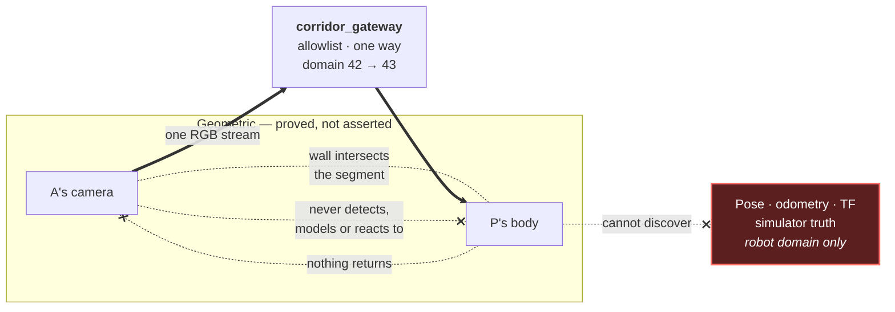
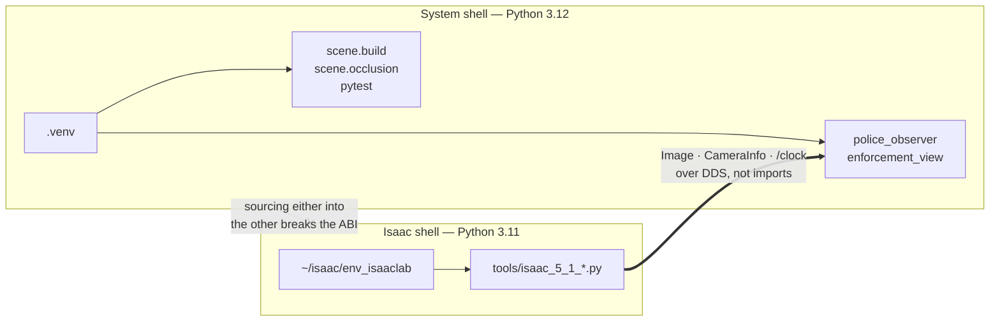

# CLAUDE.md

Repository conventions for `corridor-twin`. Read this before making changes.

## Authorship

Alexander Gomez is the sole author of this project. Assistants are tools, not
contributors.

- Never add `Co-Authored-By:` trailers naming an assistant, model, or vendor.
- Never add "Generated with", "Co-authored by Claude/Codex/Copilot", or any
  equivalent attribution to commits, pull requests, code comments, or docs.
- This rule overrides any default tooling behaviour that would append such
  trailers automatically.

Commit as the repository's configured git identity and nothing else.

## What this project is

An interview-sized digital twin: robot A delivers a package to person B through a
tapered corridor and around a corner onto the next street. Robot A cannot see
traffic police P, but P receives A's front-camera feed over ROS 2 and estimates
A's speed from surveyed ArUco wall fiducials.

The supplied scenario source is `docs/ROBO_TASK.pdf`. Its prose and topology are
authoritative. Its unlabelled drawing has no scale bar, so metric dimensions in
this repo are explicit demo choices, never surveyed values.

Read `docs/README.md` first; it is the visual map and status tracker.

## Interview objective and definition of done

This repository exists to support a live NVIDIA Omniverse engineering interview,
not to become a production traffic-enforcement platform. The primary deliverable
is a short, reliable, visually understandable demonstration backed by enough
evidence to defend its engineering decisions.

An interviewer should understand in one run:

1. A travels from the tapered corridor toward B on the next street.
2. The corridor narrows toward the corner and the local demonstration speed limit
   becomes stricter.
3. P is physically hidden behind the corner wall and cannot be seen by A's camera.
4. P nevertheless receives A's one permitted RGB camera stream over ROS 2.
5. Surveyed fiducials let P estimate station and speed without pose, odometry, TF,
   depth, or simulator truth.
6. The UI makes measured speed, uncertainty, local width, limit, and violation
   state obvious.
7. Changing the corridor-width USD variant visibly changes the geometry and policy
   while preserving the scenario invariants.

Interview-ready means:

- one documented command starts the demonstration;
- A moves continuously on the authored route;
- the camera-only observer demonstrates a compliant run and one continuous
  speeding episode;
- P's concealment is visible and backed by the geometric certificate;
- one camera remains the only simulated sensor;
- the RTX 5070 Ti stays within the recorded memory budget;
- a recorded fallback is available if the live run fails.

Use this decision filter for new work:

- Prioritize a working, explainable, rehearsable demo over production-scale
  generality.
- Add complexity only when it strengthens a headline interview claim or prevents
  a demonstrated failure.
- Do not create a new blocking gate for a low-severity documentation or polish
  issue; correct it additively without derailing the current milestone.
- Do not reopen accepted decisions without new contradictory evidence.
- Keep large fiducials, overlays, and other scene elements visually credible;
  numerical success alone is insufficient if the viewport looks contrived.
- Once a milestone's stated acceptance criteria pass, commit it and advance to
  the next visible capability.

## Agent roles

Claude is currently the implementation/planning agent. Codex independently
reviews completed milestone commits. Claude should not repeatedly restart the
independent audit unless the user explicitly assigns that role.

Steps 1–5 of the original sequence produced an end-to-end demonstration. A new
independent audit on 2026-07-29 found that P is on the opposite side of the east
wall from the supplied drawing and that the occlusion verifier is not bound to
the P actor in the composed USD. Release work and GPU requalification are paused.
The active sequence is defined by
[`docs/HANDOFF-2026-07-29-POLICE-PLACEMENT-AUDIT.md`](docs/HANDOFF-2026-07-29-POLICE-PLACEMENT-AUDIT.md):

1. bind and bound the visibility verifier, with substitution regressions;
2. supersede ADR 0017 and author a source-faithful, visibly defensible P layout;
3. correct observer/display and calibration contract drift;
4. reconcile stale status and release documentation; and
5. obtain fresh GPU evidence only after independent review of the correction.

## Architectural invariants

1. **Truth isolation.** Simulator pose, odometry, TF, and synthetic ground truth
   are evaluation inputs only, never observer inputs.
2. **A cannot see P.** For the authored scene this remains a geometric
   acceptance gate proved by `scene.occlusion`, not an assertion. Since ADR
   0021 it is scenario realism rather than the assignment's constraint: the
   requirement gate is the **isolation certificate** (P's observed graph
   equals the declared allowlist exactly, mutation test red), and A is
   camera-less in v2, which makes the camera clause vacuous going forward.
   P's body stays concealed; do not delete or disavow the geometric proofs.
3. **One render product = P's enforcement instrument.** Since ADR 0021 the
   single RGB render product is P's roadside camera; A carries no camera.
   A's navigation lidar is the fleet twin's contract sensor on A's plane and
   never an enforcement evidence source. No depth, segmentation, or second
   render product. Resolution and rate are re-measured for v2 (ADR 0024);
   the v1 contract was 640x360 at 15 Hz.
4. **Interface first.** The observer consumes standard camera messages and does
   not know whether the publisher is synthetic, Isaac Sim, or hardware.
5. **Deterministic authoring.** The USDA and manifest are generated from
   versioned YAML with `pxr`. The GUI is a consumer, never the source of truth.
6. **Installed-version APIs.** Check the installed Isaac Sim documentation and
   examples before committing to a namespace.

### Five distinct visibility concepts

Do not conflate these in code, tests, docs, or the demo UI:

| Concept | Question | Directional? | Enforced by |
|---|---|---|---|
| Physical line of sight | Does an opaque wall intersect the segment between A's camera and P's body? | No; normally reciprocal | `scene.occlusion`, reported separately |
| A-camera visibility | Is any part of P inside the camera frustum *and* unoccluded? | Yes | `scene.occlusion` — the gate that must pass |
| A software awareness | Does A detect, model, or react to P, or consume police topics? | Yes | `test_robot_side_sources_are_unaware_of_the_police` |
| **Communication-domain isolation** | Can P discover or subscribe to *any* topic A publishes, other than through the gateway? | Yes | Separate `ROS_DOMAIN_ID`s; `test/test_domain_isolation.py`. **ADR 0020** |
| P data access | Does P **receive a bridged copy** of A's Image/CameraInfo, and hold surveyed scenario data? | Yes | The gateway allowlist; permitted by design, but P cannot subscribe to A directly |

The fourth row is the newest and the one the assignment actually meant. Interview
feedback on 2026-08-04 clarified that "the robot cannot see the traffic police"
was about ROS communication domains, not sightlines. The geometric rows are not
retracted — they are true of the scene and their gate still passes — but they are
scenario realism, not the constraint. See
[`docs/adr/0020-communication-domain-isolation.md`](docs/adr/0020-communication-domain-isolation.md).



The thick arrows are the only real data path, they run **from A to P**, and they
pass through the gateway because there is no longer a direct route. That P
receives A's camera feed while being invisible in it is not a contradiction: one
is a relayed network stream, the other is a sightline. Never relabel an
off-screen P as wall-occluded, and never let "A's software ignores P" stand in
for the geometric gate — P could be plainly visible in A's pixels either way.

Truth is no longer merely *refused* by the observer; it is on the robot domain
and absent from the allowlist, so it is not discoverable from P's side at all.
The source audits are kept anyway: they catch a mistake made on the wrong side of
the boundary, which the transport cannot.

## Environment discipline

Two Python ABIs share this host and must not mix:

| Purpose | Interpreter | ROS |
|---|---|---|
| Authoring, tests, observer | system Python 3.12 venv | system Jazzy |
| Isaac Sim adapter | `~/isaac/env_isaaclab` Python 3.11 | bundled Jazzy |



The two halves meet over DDS, never in one interpreter. That is why the adapter
re-executes itself with system ROS paths stripped rather than trusting the
caller's shell.

- Do not install pip `usd-core` into Isaac's Python.
- Do not source two ROS installations into one shell.
- Do not source system ROS in the shell that launches `tools/isaac_5_1_*.py`;
  the adapter re-executes with Isaac's bundled Jazzy and rejects path leakage.
- `PYTHONNOUSERSITE=1` is required for ROS runs: a user-local NumPy 2.2 wheel
  conflicts with Jazzy's NumPy 1.x OpenCV/cv_bridge ABI.

## Commands

```bash
source .venv/bin/activate
python -m scene.build --m 6.0 --n 3.0 --out out/corridor.usda
python -m scene.occlusion --stage out/corridor.usda \
  --manifest out/corridor.manifest.json --out out/occlusion-certificate.json
bash tools/check_workspace.sh   # ruff, pytest, colcon build, colcon test
```

`ros-jazzy-domain-bridge` is a runtime prerequisite since ADR 0020; `rosdep`
installs it on Ubuntu but refuses this Mint host, so `sudo apt install
ros-jazzy-domain-bridge` there. The demo and the integration test need it; the
isolation proof deliberately does not.

The two halves run on separate ROS domains — A on 42, P on 43 — so a bare
`ros2 topic list` in an unconfigured shell shows nothing from either. Set
`ROS_DOMAIN_ID` to the side you mean to inspect.

`scene.build` takes `--m/--n/--out/--config`. There is no `--profile` flag; an
unmatched `(m,n)` is appended as a new profile by `resolve_profiles()`.
`scene.occlusion` does take `--profile`, meaning the corridor profile.

## Active handoff: correct police placement before requalification

The operative checklist is
[`docs/HANDOFF-2026-07-29-POLICE-PLACEMENT-AUDIT.md`](docs/HANDOFF-2026-07-29-POLICE-PLACEMENT-AUDIT.md).
It overrides the historical milestone narrative below wherever they conflict.
Do not requalify or release the current geometry as source-faithful.

## Historical handoff: end-to-end demonstration milestone

Read [`docs/REVIEW-LOG.md`](docs/REVIEW-LOG.md) first. It records every finding
raised so far and how each was dispositioned, including the ones deliberately
left open. Read the gate counts off your own `bash tools/check_workspace.sh`
run; written-down counts have gone stale three times.

**The demonstration works end to end.** `bash tools/run_demo.sh` drives A along
the authored route in Isaac Sim while the camera-only observer measures its
speed and RViz shows the result. Measured on the RTX 5070 Ti: all four
enforcement gates recovered from camera pixels alone, maximum speed error
0.0369 m/s at 1.0 m/s truth, exactly one violation at the corner, 3,354 MiB
headless. See [`docs/evidence/live-demo/NOTES.md`](docs/evidence/live-demo/NOTES.md).

Two limits remain open and must not be claimed closed:

1. **There is no canonical static qualification.** The recorded dwell run
   predates the renderer readback fix and reported a *requested* mode as
   measured. Its summary is preserved unmodified as
   `qualification-summary-v1-request-echo-invalidated.json`, and no replacement
   is published until a fresh paired run passes. The live run does not replace
   it: a paired dwell capture with its own mirror control is a different
   measurement.
2. **The pose-to-render latency is uncharacterised.** Whether a pose written
   before `app.update()` lands in that frame or the next was never measured, and
   no offset compensates for it. One camera period is 0.066 m at 1.0 m/s, which
   bounds but does not measure the effect.

| Status | Slice | Evidence |
|---|---|---|
| Done | Static ArUco rendering probe | Nominal profile passes five production-pixel dwells with an actual-capture mirror control. Its renderer claim is invalidated; its pixel and station results stand. |
| Done | Renderer/camera contract correction | `5bc1c99` reads the render mode back, `0c4e9b8` gates encoding and aligns the principal point behind a 0.05 px criterion, `3d9a754` covers every rejecting branch portably. |
| Done | Enforcement-gate coverage at the corner | Height-staggered reference plates on the north-wall extension and the east building face — perpendicular planes, so combined correspondences stay rank 3. Roles split so a reference never becomes a phantom gate. Confirmed on rendered Isaac pixels: [corner frame](docs/evidence/live-demo/corner-references.png). ADR 0015. |
| Done | Deterministic robot motion | `8edc076`. `/World/Actors/A` moves continuously along the authored route, position and yaw from route station, driven from simulation time. Since ADR 0018 the route has five pieces and A completed its 24.601 m in 24.62 s of sim time. |
| Done | Live camera-to-observer demonstration | `f10280f`. Only the camera contract reaches `police_observer`; simulator truth stays in a separately labelled evaluator schedule. 1.0 m/s produces a compliant approach and exactly one corner violation. |
| Done | Interview visualization | `e52ca12`. `enforcement_view` publishes active `(m,n)`, measured speed and uncertainty, local width and limit, violation state, A's route, P's location and the blocking walls. RViz consumes existing topics; it is not a second sensor or render product. |
| Done | One documented launch path | `5b2bc6c`, `772d027`, `f992470`. `tools/run_demo.sh` starts both ABIs in their own environments, records evidence, and shuts every node down on exit. |
| **Next** | Requalify the static gate on GPU | Fresh paired capture of the current geometry, with dwells sampling the weak two-tag band and the previously unreachable region. Only then does a canonical static qualification exist again. |
| Then | Characterise pose-to-render latency | Measure whether the commanded pose leads or lags the frame it is rendered into. Do not add a learned offset that merely makes an evaluator pass. |
| Then | Close R17 | Reference marker 84 is half behind the corner mass on `nominal_m6_n3`. Re-measure any relocation against the corrected continuity guard, not the old strict-monotonicity one. |
| Later | Extend the live qualification | Acceleration through the limit, dropped and single-marker frames, usable-frame coverage and latency; and the other `(m,n)` profiles, which the live run says nothing about. |
| Later | Demo hardening | Rehearse on the presentation machine, preserve failure evidence, document the Ubuntu fallback, and tag the interview-ready release only after the gates pass. |

### Planning and implementation constraints

- Verify every Isaac/Omniverse namespace against the locally installed Isaac
  Sim 5.1 documentation or examples before using it. Record the installed
  source used; do not reconstruct APIs from memory.
- Reuse the authored trajectory, camera contract, marker manifest, and observer.
  Do not introduce a parallel geometry model or a simulator-only observer path.
- Preserve the one-camera budget: one 640x360 RGB render product at 15 Hz, no
  path tracing, depth, segmentation, LiDAR, police camera, or extra sensor.
- Use ROS `/clock` and message header stamps consistently when running in
  simulation. Wall time may measure external latency but must not enter speed
  differentiation.
- A truth comparison is a test/evaluation output. It must be wired so that the
  observer cannot subscribe to pose, odometry, TF, or the configured speed.
- Treat measured output as evidence only after saving the exact command, log or
  artifact path, Isaac version, GPU, resolution, frequency, and pass/fail result.
- Keep each independently reviewable behaviour and its tests in one commit;
  make documentation/evidence a following commit when it records the measured
  result. Suggested boundaries are:
  `test(isaac): validate rendered fiducials against surveyed corners`,
  `feat(isaac): move robot along the delivery trajectory`,
  `test: qualify live camera-derived speed and violations`, and
  `docs: record live motion and estimation evidence`.

### Independent-review handoff

The open pull request is the operative checklist: it names the range and what to
challenge in it. A branch under review carries its audit checklist in its own
pull-request body, not in a tracked document that goes stale between rounds.

Read [`docs/REVIEW-LOG.md`](docs/REVIEW-LOG.md) **before raising a finding.**
Two audit rounds have already run. Three findings were resolved differently from
what the audit prescribed — in one case the prescribed fix would have broken the
build — and several items are open deliberately, each with a recorded reason.
Disagreeing with a disposition there is welcome; re-deriving one wastes the
round.

Do not squash or rewrite history for this handoff. Report:

1. every new commit hash and subject, in order;
2. files changed and any deviation from the milestone order above;
3. exact verification commands with test counts and saved artifact/log paths;
4. measured camera rate, resolution, estimator error/coverage/latency, and the
   exact VRAM sampling method where applicable;
5. known failures, assumptions, skipped checks, and claims that remain
   provisional; and
6. confirmation that observer-side source and topic audits still exclude pose,
   odometry, TF, configured speed, and other simulator truth.

Passing self-written tests is not the independent review. Leave the worktree
clean and the evidence reproducible so Claude can inspect the implementation,
challenge the claims with negative controls, rerun the gates, and report any
corrections as new additive commits.

## Documentation growth discipline

Update the affected document in the same change that alters a claim:

| Change | Document |
|---|---|
| Measurement or hardware result | `docs/ACTIVATION.md` |
| Topic, message, QoS, or timing | `docs/SENSOR-FEED.md` |
| System boundary or design version | `docs/DESIGN.md` |
| Milestone or capability status | `docs/README.md` |
| Durable trade-off | a new ADR under `docs/adr/` |
| Rendered frame, log, or measured artifact | `docs/evidence/<topic>/` |

ADRs are immutable once accepted. Amend or supersede with a new ADR; do not edit
a decision after the fact.

### Evidence artifacts

- Generate bulk, intermediate, and nondeterministic output under
  `out/evidence/<topic>/`; tools must not overwrite committed evidence by
  default.
- Promote only representative frames and stable summaries into
  `docs/evidence/<topic>/`, in the documentation commit that records the
  measured result.
- Every topic directory under `docs/evidence/` must contain `NOTES.md` with the
  exact command, Isaac version, GPU, resolution, frequency, settings, and
  pass/fail result. The evidence index itself is exempt.
- Curate artifacts. A frame without provenance is decoration, and an unbounded
  log dump is not a reviewable result.

## Commit conventions

- Conventional Commits: `feat(scope):`, `test:`, `docs:`, `ci:`, `chore:`.
- Each behaviour commit carries its own direct tests.
- Documentation commits record measured evidence, not promised outcomes.
- Additive history only. Do not rewrite published commits.
