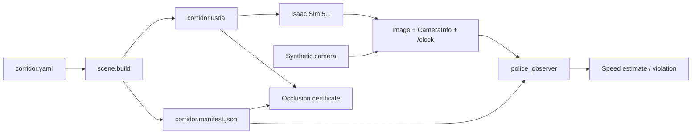

# corridor-twin

An interview-sized digital-twin scenario for OpenUSD, ROS 2 Jazzy, and NVIDIA
Isaac Sim. Robot A delivers a package to person B through a tapered corridor.
Police observer P has no direct line of sight to A, but is permitted to consume
A's front-camera feed and detect speed violations from surveyed ArUco markers.

## Current status

**Phase 1 baseline and first Isaac/ROS integration working — 2026-07-26.**
Parametric USDA generation, finite width variants, static colliders, ArUco
assets, a shared manifest, camera-only speed estimation, synthetic ROS playback,
violation events, and continuous occlusion evidence are implemented. The RTX
5070 Ti passes Isaac Sim 5.1's hardware checks. A version-specific adapter now
publishes the single 640×360 RGB camera, matching `CameraInfo`, and simulation
`/clock` through the installed Jazzy bridge. Independent ROS probes passed in
both headless and visible modes at exactly 15 Hz.

The checker still marks the host unsupported because it is Linux Mint. This is
recorded as a platform risk rather than hidden by the successful hardware and
live-stream checks.

**Geometry reconciled with the supplied diagram — 2026-07-27.** The corridor now
carries the drawing's one-sided taper, a real perpendicular next street with a
corner mass, and a continuous line-arc-line delivery trajectory. P is placed
from the occluding wall faces, so it follows the geometry when a different
`(m,n)` profile is selected.

**Static production-camera fiducials qualified — 2026-07-27.** The existing
one-product Isaac ROS graph now passes surveyed station recovery at five nominal
approach dwells. All 15 selected frames passed; maximum station error was
0.010563 m, the delivered rate was 14.999999 Hz, and a mirror applied to the
same capture produced zero passing frames. The final run used 3,024 MiB. This
gate exposed and corrected buried, undersampled marker plates before motion was
added. Deterministic motion along the authored trajectory is next.

## Architecture at a glance



The observer is prohibited from reading simulated pose, odometry, TF-derived
robot position, or synthetic ground truth. Its measurement timestamp comes from
the image header.

## Repository layout

- `src/corridor_scene`: `usd-core` authoring, marker assets, manifest generation,
  stage validation, and CPU geometric occlusion verification.
- `src/corridor_interfaces`: timestamped speed-estimate and violation messages.
- `src/police_observer`: pure perception core, ROS adapter, synthetic frame
  generator, and synthetic publisher.
- `docs/adr`: architecture decisions and consequences.
- `docs/DESIGN.md`: versioned system design and hardware budget.
- `docs/SENSOR-FEED.md`: the robot-to-observer interface contract.
- `test`: repository and end-to-end contract tests.
- `tools/isaac_5_1_ros_camera.py`: installed-version camera/clock adapter, kept
  outside the CPU-testable packages.
- `tools/ros_camera_contract_probe.py`: simulator-independent live ROS contract
  probe.
- `tools/ros_aruco_capture.py` and `tools/aruco_render_gate.py`: production-feed
  capture plus truth-isolated static station qualification.
- `docs/evidence`: curated measured results and provenance; bulk runs remain
  under ignored `out/evidence`.

## Build and run

### 1. Read the reconciled scenario

The supplied task and drawing are versioned at [`docs/ROBO_TASK.pdf`](docs/ROBO_TASK.pdf).
It is a plan view with no scale bar and widths labelled only as `m` and `n`, so
the project separates what it fixes from what the project chooses:

| From the source | A project choice |
|---|---|
| `m >= n`, narrowing toward the corner | Corridor length, 12.0 m |
| One straight face, one tapering face | Next-street width 6.0 m, length 10.0 m |
| A perpendicular next street with real walls | Turn radius 2.0 m |
| B along that street, P at its corner | B at 8.0 m along the street |

`src/corridor_scene/config/corridor.yaml` publishes this as
`topology: reconciled_with_supplied_diagram` and
`metric_scale: demo_assumption`. The speed limit is a demonstration-only
piecewise rule, because the task states none. See
[ADR 0010](docs/adr/0010-supplied-diagram-geometry.md).

### 2. Review the demo GPU qualification

The installed RTX 5070 Ti reports 16303 MiB with driver 580.173.02. The complete
activation evidence and repeatable commands are in `docs/ACTIVATION.md`.
Headless and visible loaded-stage snapshots used 916 MiB and 871 MiB total,
respectively. With the one camera render product and ROS bridge active, measured
totals were 2,494 MiB headless and 2,591 MiB visible. Every run used real-time
`RaytracedLighting`; none used path tracing. The unsupported Mint result and
IOMMU warning remain known risks; Ubuntu 24.04 is the fallback rather than an
unrecorded last-minute change.

The current reconciled scene's static rendered-fiducial gate is the most relevant
measurement: one headless product used 3,024 MiB while delivering 57 synchronized
pairs. See the [accepted evidence](docs/evidence/static-fiducials/NOTES.md).

### 3. Create the development environment

Keep ordinary OpenUSD/ROS development separate from Isaac's Python environment:

```bash
source /opt/ros/jazzy/setup.bash
/usr/bin/python3.12 -m venv --system-site-packages .venv
source .venv/bin/activate
python -m pip install --upgrade pip
python -m pip install -r requirements-dev.txt
python -m pip install --no-deps -e src/corridor_scene -e src/police_observer
rosdep install --from-paths src --ignore-src -r -y --rosdistro jazzy \
  --os=ubuntu:noble
```

Do not install pip `usd-core` into Isaac Sim's bundled Python. Do not source two
different ROS installations into the same shell.

### 4. Generate and prove the scene

```bash
source .venv/bin/activate
python -m scene.build --m 6.0 --n 3.0 --out out/corridor.usda
python -m scene.occlusion \
  --stage out/corridor.usda \
  --manifest out/corridor.manifest.json \
  --out out/occlusion-certificate.json
```

The build creates the USDA, `corridor.manifest.json`, and marker PNG files, and
rejects any authored profile whose layout would put P in a wall or in the road,
or whose turn would not fit the junction.

The occlusion command exits nonzero if any trajectory interval or composed-mesh
audit ray is uncertified. It proves the binding requirement that A's camera
never images P, and the stronger reciprocal claim that an opaque wall does the
hiding. Straight route intervals use their exact endpoint segment; turn
intervals use a conservative rectangle derived from the circular arc's exact
extrema, so an arc is never replaced by its chord. Current result for the
nominal profile: 78 certified interval and sub-volume pairs, 204 audit rays with
0 failures, nearest blocking surface 3.116 m.

Check the other authored profiles too, since each one moves P:

```bash
python -m scene.occlusion --stage out/corridor.usda \
  --manifest out/corridor.manifest.json \
  --profile wide_corner_m6_n4_5 --out out/occlusion-wide.json
python -m scene.occlusion --stage out/corridor.usda \
  --manifest out/corridor.manifest.json \
  --profile uniform_m6_n6 --out out/occlusion-uniform.json
```

### 5. Build and test ROS

```bash
source /opt/ros/jazzy/setup.bash
source .venv/bin/activate
colcon build --symlink-install
source install/setup.bash
export PYTHONNOUSERSITE=1
export PYTHONPATH="$PWD/.venv/lib/python3.12/site-packages${PYTHONPATH:+:$PYTHONPATH}"
pytest -q
colcon test
colcon test-result --verbose
```

Or run the same sequence, including lint, with `bash tools/check_workspace.sh`.
The explicit `PYTHONPATH` is needed because `colcon test` launches the system
Python even when the calling shell has an active venv; it keeps both `pxr` and
the NumPy version used by ROS/OpenCV deterministic on this host.

### 6. Run the simulator-free ROS demo

```bash
source /opt/ros/jazzy/setup.bash
source install/setup.bash
ros2 launch police_observer synthetic_demo.launch.py \
  manifest:=$PWD/out/corridor.manifest.json speed_mps:=1.8
```

In another sourced shell:

```bash
ros2 topic echo /police/speed_violation \
  corridor_interfaces/msg/SpeedViolation --once --no-daemon
```

The launch deliberately sets `PYTHONNOUSERSITE=1`: this machine has a user-local
NumPy 2.2 wheel, while ROS Jazzy's OpenCV/cv_bridge binaries use the NumPy 1.x
ABI. No global package is modified. Add `use_sim_time:=true` to make the
synthetic publisher the single `/clock` source for both nodes.

### 7. Run the live Isaac camera contract

Start the external probe in a system-ROS terminal before starting Isaac:

```bash
source /opt/ros/jazzy/setup.bash
PYTHONNOUSERSITE=1 /usr/bin/python3 \
  tools/ros_camera_contract_probe.py --minimum-pairs 12 --timeout 90
```

In a second terminal, start the finite adapter. Do not source system ROS there;
the adapter re-executes with Isaac's bundled Jazzy libraries and rejects Python
path leakage from the host environment:

```bash
OMNI_KIT_ACCEPT_EULA=YES \
  ~/isaac/env_isaaclab/bin/python tools/isaac_5_1_ros_camera.py \
  out/corridor.usda --updates 420 --report-gpu-memory
```

Add `--gui` for the finite visible-viewport check. Success requires both
`ROS_CAMERA_PROBE_PASS` and `ISAAC_ROS_CAMERA_PASS`; an Isaac-only pass does not
prove the ROS interface. The adapter creates exactly one render product and no
pose, odometry, TF, depth, or test-truth publisher.

### 8. Qualify rendered fiducials through the production ROS camera

Start a dedicated capture process in the system-Jazzy environment:

```bash
source /opt/ros/jazzy/setup.bash
source install/setup.bash
PYTHONNOUSERSITE=1 .venv/bin/python tools/ros_aruco_capture.py \
  --out-dir out/evidence/static-fiducials/manual/capture \
  --minimum-pairs 18 --timeout 240 --idle-after-minimum 3
```

In the Isaac shell, hold A at the five required world-X stations while reusing
the same camera graph:

```bash
env -u ROS_DISTRO -u AMENT_PREFIX_PATH -u PYTHONPATH \
OMNI_KIT_ACCEPT_EULA=YES \
~/isaac/env_isaaclab/bin/python tools/isaac_5_1_ros_camera.py \
  out/corridor.usda --manifest out/corridor.manifest.json \
  --profile nominal_m6_n3 \
  --static-probe-out out/evidence/static-fiducials/manual/static-truth.json \
  --report-gpu-memory
```

Then run the offline acceptance comparison:

```bash
PYTHONPATH=src/police_observer .venv/bin/python tools/aruco_render_gate.py \
  --capture out/evidence/static-fiducials/manual/capture/capture.json \
  --truth out/evidence/static-fiducials/manual/static-truth.json \
  --manifest out/corridor.manifest.json --profile nominal_m6_n3 \
  --out out/evidence/static-fiducials/manual/aruco-gate.json
```

The capture process receives no pose or truth topic. Pixel analysis is separate
from the evaluator that reads the static schedule. Exact accepted commands and
the actual-capture mirror control are in the
[evidence notes](docs/evidence/static-fiducials/NOTES.md).

### 9. Repeat the installed Isaac 5.1 composition smoke

```bash
OMNI_KIT_ACCEPT_EULA=YES \
  ~/isaac/env_isaaclab/bin/python tools/isaac_5_1_smoke.py \
  out/corridor.usda --updates 60 --report-gpu-memory

OMNI_KIT_ACCEPT_EULA=YES \
  ~/isaac/env_isaaclab/bin/python tools/isaac_5_1_smoke.py \
  out/corridor.usda --gui --updates 240 --report-gpu-memory
```

The smoke uses explicit real-time `RaytracedLighting`, 640×360, no path tracing,
and no sensor render product. Both modes validate composition and
installed-version schemas; the finite GUI mode opens a visible viewport and
closes itself. Use the preceding live contract for camera/ROS validation.

## Deliberate GPU budget

The selected RTX 5070 Ti has 16 GB VRAM, but this demo still avoids spending that
capacity casually. The initial Isaac configuration remains:

- one 640×360 RGB camera at 15 Hz;
- one small robot and primitive static environment;
- small marker textures and simple opaque materials;
- primitive/convex colliders where possible;
- CPU physics until measurement shows a reason to change;
- no depth, LiDAR, radar, segmentation, Replicator, RL, or extra render products;
- no interactive path tracing.

The soft operating target is below 14 GB steady-state VRAM, leaving recovery
headroom for the GUI and ROS bridge.

## Interview talking points

- USD is generated deterministically and measured from the composed stage; the
  GUI is a consumer, not the source of truth.
- USD variants represent finite named corridor profiles, not arbitrary numeric
  sliders.
- Speed is inferred only from camera pixels, calibration, surveyed marker poses,
  and image acquisition timestamps.
- Synthetic frames make the estimator falsifiable before simulator rendering is
  trusted.
- The supplied drawing is treated as evidence about topology, not about scale;
  every metric length is declared a project choice rather than dressed up as a
  survey.
- "A cannot see P" stays a geometric gate over P's whole body and the whole
  turn, with failing controls. The rule that A's software ignores P is additive:
  P could fill A's pixels while A's code ignored them.
- The proof reports wall occlusion separately from being merely off-screen, and
  never relabels one as the other.
- Simulated time uses one `/clock` publisher and resets estimator state on time
  jumps.
- Isaac-specific code is isolated and checked against the installed version's API.

## Explicit non-goals

Docker, Replicator, Isaac Lab/RL, Unreal/Unity, a multi-sensor robot, large asset
packs, cloud deployment, and CI beyond the single lint-and-test workflow are out
of scope for this interview demo.

## Documentation

- [Supplied task and diagram](docs/ROBO_TASK.pdf)
- [Visual project map and growth tracker](docs/README.md)
- [System design](docs/DESIGN.md)
- [Sensor-feed contract](docs/SENSOR-FEED.md)
- [Hardware and Isaac activation record](docs/ACTIVATION.md)
- [Development workflow, CI recovery, and commit history](docs/DEVELOPMENT.md)
- [Architecture decisions](docs/adr/README.md)
- [Measured evidence index](docs/evidence/README.md)

## License

Apache-2.0. See `LICENSE`.
