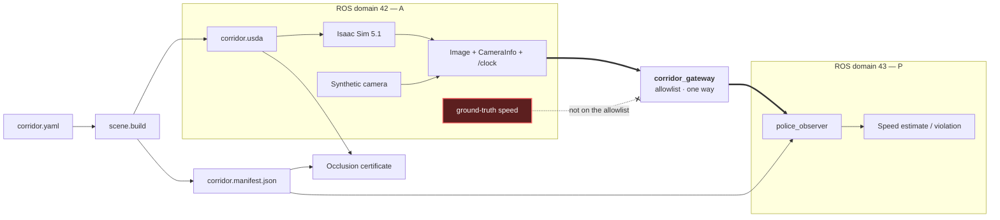

# corridor-twin

An interview-sized digital-twin scenario for OpenUSD, ROS 2 Jazzy, and NVIDIA
Isaac Sim. Robot A delivers a package to person B through a tapered corridor.
Police observer P runs on a **separate ROS communication domain** from A and has
no direct line of sight to it, but is permitted to consume A's front-camera feed
through one allowlisted gateway and detect speed violations from surveyed ArUco
markers.

## Current status

**Delivered 2026-08-14 — read [`DELIVERY.md`](DELIVERY.md) first.** It maps the
three corrections from the 2026-08-04 review to their mechanisms, artifacts and
measured numbers, and lists what is deliberately not claimed.

The v2 headline: the isolation certificate is green with its mutation control
red; A delivers autonomously and touches B, reproducibly to 3.5 mm across seven
runs while the map quality varies 4.3x; and P's learned detector recovers speed
at all five gates from pixels alone, with the estimator's own contribution to
the error measured at **+0.62%** once a newly-characterised recording-path
timing defect is accounted for.

The table below is the milestone history. **Every 2026-07 row is a v1 figure**
and ADR 0022 retires all v1 certificate numbers for v2 purposes; they remain
true of the runs they describe and are quotable only as v1.

| Date | Milestone | State | Measured result | Evidence |
|---|---|---|---|---|
| 2026-07-26 | Phase 1 baseline and first Isaac/ROS integration | **Working** | One 640×360 RGB render product, matching `CameraInfo`, and simulation `/clock` through the installed Jazzy bridge. Independent ROS probes passed headless and visible at exactly 15 Hz | [Activation record](docs/ACTIVATION.md) |
| 2026-07-27 | Geometry reconciled with the supplied diagram | **Working** | One-sided taper, a real perpendicular next street with a corner mass, and a five-piece route that turns in behind the east-wall stub to reach B in the pocket the drawing puts B in | [ADR 0010](docs/adr/0010-supplied-diagram-geometry.md), [ADR 0018](docs/adr/0018-model-the-east-wall-stub.md) |
| 2026-07-27 | Static production-camera fiducials | **Pixels valid, renderer claim invalidated** | All 15 selected frames passed, maximum station error 0.010563 m, delivered rate 14.999999 Hz, and a mirror applied to the same capture produced zero passing frames | [Static fiducials](docs/evidence/static-fiducials/NOTES.md) |
| 2026-07-27 | Live camera-only enforcement demonstration | **Working** | All four enforcement gates measured at 1.0 m/s truth, maximum speed error 0.0369 m/s, **exactly one** violation — 0.191 m/s over the 0.80 m/s corner rule at station 10.0 m — and 3354 MiB of the RTX 5070 Ti with one render product | [Live demo](docs/evidence/live-demo/NOTES.md) |
| 2026-07-31 | Police placement audit and correction | **Merged** | P moved inside the east wall behind a purpose-built corner screen; the occlusion verifier bound to the composed USD; twelve findings closed across two review rounds | [ADR 0019](docs/adr/0019-relocate-p-inside-the-east-wall-with-a-corner-screen.md), [Review log](docs/REVIEW-LOG.md) |
| 2026-08-04 | Communication-domain isolation | **Working** | A and P on separate ROS domains, crossed only by a three-topic one-way allowlist. Proved without a GPU: the police domain cannot discover A's camera topic, and forcing both probes onto one domain fails the guard | [ADR 0020](docs/adr/0020-communication-domain-isolation.md) |

### What is deliberately not claimed

Each of these is open on purpose and recorded rather than hidden. None is a
known failure; each is a measurement that has not been taken.

| Open item | Why it is not claimed | Consequence |
|---|---|---|
| No canonical **static** qualification | The recorded dwell run reported a *requested* renderer mode as measured. Its summary is preserved unmodified as `qualification-summary-v1-request-echo-invalidated.json` | Its pixel, calibration, rate and mirror-control results stand; its renderer claim does not. A fresh paired capture is required |
| ~~Pose-to-render latency uncharacterised~~ **MEASURED 2026-08-14, and far worse than the bound** | It is not a latency but a rate deficit: image content advances at 0.888x the clock on a 33 s run and 0.713x on a 92 s one | Any speed read off those header stamps is low by 11-29%. Measured, attributed, and **not corrected for** — see [the estimator evidence](docs/evidence/estimator/NOTES.md). Fixing how frames are stamped is future work |
| Every GPU figure predates ADR 0019 | The scene changed shape after the last capture: P moved sides and a `CornerScreen` was added | The figures above describe the pre-correction geometry and are pending refresh, not withdrawn |
| Host is unsupported | NVIDIA's checker rejects Linux Mint regardless of the passing hardware and live-stream gates | Recorded as a platform risk; Ubuntu 24.04 remains the fallback |

## The visibility constraint, reinterpreted (2026-08-04)

The supplied task says *the robot cannot see the traffic police, but the police
can read the data from the robot*. This repository first read that as a statement
about **what A's camera can image**, and built the geometry to match: continuous
occlusion certification over the turn, a purpose-built corner screen, and the
placement chain in ADR 0011, 0017, 0018 and 0019.

In the technical interview on 2026-08-04 the interviewer clarified the intended
meaning. The constraint was about **ROS 2 / DDS communication-domain isolation**:
A and P were meant to run on separate communication planes with no topic-level
visibility between them. Not occlusion.

That is a reinterpretation, not a discovery, and it is recorded as one. The
geometric reading was a reasonable construction of an ambiguous English sentence,
it was implemented thoroughly, and it was wrong about the author's intent.

**What changed.** A runs on ROS domain 42, P on domain 43. DDS discovery does not
cross a domain boundary, so P cannot discover, list, or subscribe to anything A
publishes — including topics nobody thought to forbid. One gateway
(`src/corridor_gateway`) relays exactly three topics one way, A to P: the camera
image, its calibration, and `/clock`. Simulator truth stays on A's domain and is
not on that list, so P's inability to read truth is now a property of the
transport rather than a rule the observer promises to obey.

**What did not change.** The occlusion work stands. P really is hidden behind a
wall, the certificate still proves it, and its gate still passes. It is now
understood as *physical-scenario realism* rather than as the implementation of
the assignment's constraint — both claims are true of the shipped system, and
they are separate claims. Nothing in ADR 0001–0019 was edited; ADR 0020 amends a
single row of ADR 0011's concept table by new record, as the immutability rule
requires, and supersedes nothing.

**Why it is not just a naming convention.** The isolation is proved, without a
GPU or Isaac, by standing a node up in each domain and asking what it can see
([`test/test_domain_isolation.py`](test/test_domain_isolation.py)). Every
negative is paired with a positive control in the same environment and skips
rather than passes when discovery is unavailable, so a container without
multicast cannot report an isolation it never tested. Forcing both probes onto
one domain fails the guard.

## Architecture at a glance



The observer is prohibited from reading simulated pose, odometry, TF-derived
robot position, or synthetic ground truth — and since ADR 0020 it is also unable
to: those producers live on A's domain and are absent from the gateway allowlist,
so they never appear in P's graph. Its measurement timestamp comes from the image
header. The manifest reaches P as a file, not a topic, so it crosses no boundary.

## Repository layout

- `src/corridor_scene`: `usd-core` authoring, marker assets, manifest generation,
  stage validation, and CPU geometric occlusion verification.
- `src/corridor_interfaces`: timestamped speed-estimate and violation messages.
- `src/police_observer`: pure perception core, ROS adapter, synthetic frame
  generator, and synthetic publisher.
- `docs/adr`: architecture decisions and consequences.
- `docs/DESIGN.md`: versioned system design and hardware budget.
- `docs/SENSOR-FEED.md`: the robot-to-observer interface contract.
- `test`: repository and end-to-end contract tests.
- `tools/isaac_5_1_ros_camera.py`: installed-version camera/clock adapter, kept
  outside the CPU-testable packages.
- `tools/ros_camera_contract_probe.py`: simulator-independent live ROS contract
  probe.
- `tools/ros_aruco_capture.py` and `tools/aruco_render_gate.py`: production-feed
  capture plus truth-isolated static station qualification.
- `docs/evidence`: curated measured results and provenance; bulk runs remain
  under ignored `out/evidence`.

## Build and run

### 1. Read the reconciled scenario

The supplied task and drawing are versioned at [`docs/ROBO_TASK.pdf`](docs/ROBO_TASK.pdf).
It is a plan view with no scale bar and widths labelled only as `m` and `n`, so
the project separates what it fixes from what the project chooses:

| From the source | A project choice |
|---|---|
| `m >= n`, narrowing toward the corner | Corridor length, 12.0 m |
| One straight face, one tapering face | Next-street width 6.0 m, length 10.0 m |
| A perpendicular next street with real walls | Turn radius 2.0 m |
| B along that street, P at its corner | B at 8.0 m along the street |

`src/corridor_scene/config/corridor.yaml` publishes this as
`topology: reconciled_with_supplied_diagram` and
`metric_scale: demo_assumption`. The speed limit is a demonstration-only
piecewise rule, because the task states none. See
[ADR 0010](docs/adr/0010-supplied-diagram-geometry.md).

### 2. Review the demo GPU qualification

The installed RTX 5070 Ti reports 16303 MiB with driver 580.173.02. The complete
activation evidence and repeatable commands are in `docs/ACTIVATION.md`.
Headless and visible loaded-stage snapshots used 916 MiB and 871 MiB total,
respectively. With the one camera render product and ROS bridge active, measured
totals were 2,494 MiB headless and 2,591 MiB visible. Every run used real-time
`RaytracedLighting`; none used path tracing. The unsupported Mint result and
IOMMU warning remain known risks; Ubuntu 24.04 is the fallback rather than an
unrecorded last-minute change.

The current reconciled scene's static rendered-fiducial gate is the most relevant
measurement: one headless product used 3,024 MiB while delivering 57 synchronized
pairs. See the [accepted evidence](docs/evidence/static-fiducials/NOTES.md).

### 3. Create the development environment

Keep ordinary OpenUSD/ROS development separate from Isaac's Python environment:

```bash
source /opt/ros/jazzy/setup.bash
/usr/bin/python3.12 -m venv --system-site-packages .venv
source .venv/bin/activate
python -m pip install --upgrade pip
python -m pip install -r requirements-dev.txt
python -m pip install --no-deps -e src/corridor_scene -e src/police_observer
rosdep install --from-paths src --ignore-src -r -y --rosdistro jazzy \
  --os=ubuntu:noble
```

The demonstration needs the upstream domain bridge, which `corridor_gateway`
declares as a dependency. On Ubuntu the `rosdep` line above installs it; this
host runs Linux Mint, which `rosdep` refuses (`Unsupported OS: mint`), so install
it directly:

```bash
sudo apt install ros-jazzy-domain-bridge
```

Without it the demonstration cannot bridge A's camera to P and the integration
test skips. The isolation proof itself does not need it and still runs.

Do not install pip `usd-core` into Isaac Sim's bundled Python. Do not source two
different ROS installations into the same shell.

### 4. Generate and prove the scene

```bash
source .venv/bin/activate
python -m scene.build --m 6.0 --n 3.0 --out out/corridor.usda
python -m scene.occlusion \
  --stage out/corridor.usda \
  --manifest out/corridor.manifest.json \
  --out out/occlusion-certificate.json
```

The build creates the USDA, `corridor.manifest.json`, and marker PNG files, and
rejects any authored profile whose layout would put P in a wall or in the road,
or whose turn would not fit the junction.

The occlusion command exits nonzero if any trajectory interval or composed-mesh
audit ray is uncertified. It proves the binding requirement that A's camera
never images P, and the stronger reciprocal claim that an opaque wall does the
hiding. Straight route intervals use their exact endpoint segment; turn
intervals use a conservative rectangle derived from the circular arc's exact
extrema, so an arc is never replaced by its chord. Current result for the
nominal profile: 5 covered intervals, 404 audit rays with 0 failures, nearest
blocking surface 5.366 m, `EastBuilding` the sole blocking prim. Since ADR 0017
put P east of the junction, one plane of constant X separates it from the whole
route, so the proof needs five intervals rather than the seventy-eight the
previous placement required.

Check the other authored profiles too, since each one moves P:

```bash
python -m scene.occlusion --stage out/corridor.usda \
  --manifest out/corridor.manifest.json \
  --profile wide_corner_m6_n4_5 --out out/occlusion-wide.json
python -m scene.occlusion --stage out/corridor.usda \
  --manifest out/corridor.manifest.json \
  --profile uniform_m6_n6 --out out/occlusion-uniform.json
```

### 5. Build and test ROS

```bash
source /opt/ros/jazzy/setup.bash
source .venv/bin/activate
colcon build --symlink-install
source install/setup.bash
export PYTHONNOUSERSITE=1
export PYTHONPATH="$PWD/.venv/lib/python3.12/site-packages${PYTHONPATH:+:$PYTHONPATH}"
pytest -q
colcon test
colcon test-result --verbose
```

Or run the same sequence, including lint, with `bash tools/check_workspace.sh`.
The explicit `PYTHONPATH` is needed because `colcon test` launches the system
Python even when the calling shell has an active venv; it keeps both `pxr` and
the NumPy version used by ROS/OpenCV deterministic on this host.

### 6. Run the live demonstration

One command, once the scene is generated and the workspace is built:

```bash
bash tools/run_demo.sh
```

It starts all three parts of the demonstration in the environments they require
and never in one shell: the camera-only observer, the enforcement display and
RViz on system Jazzy on **domain 43**; the gateway, which is the only participant
in both domains; then Isaac Sim on its bundled Jazzy on **domain 42**, driving A
along the authored route. The observer side comes up first so the consumers have
finished discovery before the publisher starts, which is the ordering the live
camera contract in step 8 already validates.

Override the domains with `ROBOT_DOMAIN_ID` and `POLICE_DOMAIN_ID` if 42 and 43
are taken on your network. The script refuses to run them equal — that failure is
otherwise silent, because everything starts, every topic flows, and the isolation
claim is simply false.

To see the boundary rather than take it on trust, with the demo running:

```bash
ROS_DOMAIN_ID=42 ros2 topic list   # A's camera and its ground-truth speed
ROS_DOMAIN_ID=43 ros2 topic list   # the bridged camera and P's output; no truth
```

The same two commands diagnose a silent run. With `--wait-for-publisher` at its
upstream default, a dead Isaac side looks exactly like working isolation: no
camera topic on domain 42 means A never published, not that the boundary held.

The default drives A at a constant **1.0 m/s**. That one unchanged speed is
legal on the wide approach at a 1.2 m/s limit and illegal once the corridor
narrows to a 0.8 m/s limit, so a single pass shows a compliant stretch and
exactly one violation episode without anyone touching a throttle.

| Option | Effect |
|---|---|
| `--headless` | no Isaac viewport; RViz still shows the camera feed and readout |
| `--no-rviz` | observer and display only, for a terminal-only check |
| `--record` | `ros2 bag record` the camera, estimate, violation and clock topics |
| `VIEW=corner` | Isaac viewport perspective; `rviz` (default) matches the RViz angle, `corner` frames the junction, `chase` follows A. GUI only; it moves Kit's own viewport camera and adds no render product |
| `SPEED_MPS=1.8` | sustained speeding: one episode that opens on the approach |
| `SPEED_MPS=0.6` | fully compliant run, no violation |
| `CORRIDOR_PROFILE=wide_corner_m6_n4_5` | a different authored `(m,n)`; **no violation at 1.0 m/s**, see below |

**Switching the corridor variant changes the policy, not just the walls.** The
speed limit is a function of local clear width, so a wider corner means a
looser rule at the same station:

| Profile | Narrowest gate | Limit there | Violation at 1.0 m/s |
|---|---:|---:|---|
| `nominal_m6_n3` | 3.50 m | 0.8 m/s | yes, one at station 10.0 m |
| `wide_corner_m6_n4_5` | 4.75 m | 1.2 m/s | **no** |
| `uniform_m6_n6` | 6.00 m | 1.5 m/s | **no** |

A variant switch therefore turns the readout green at the same commanded speed.
That is the demonstration's point — geometry drives policy — and not a fault.
To show a violation on `wide_corner_m6_n4_5`, raise the speed above its 1.2 m/s
limit; `uniform_m6_n6` has no taper at all, so it is the control case where the
rule never tightens. Only `nominal_m6_n3` has been measured live.

Logs and the commanded-pose schedule land under `out/evidence/live-demo/`. The
commanded schedule is simulator truth and is labelled as evaluator-only; it is
never an observer input.

If Isaac is unavailable, the script says so and points at the simulator-free
fallback below, which is also the recorded fallback for the demonstration.

### 7. Run the simulator-free ROS demo

```bash
source /opt/ros/jazzy/setup.bash
source install/setup.bash
ros2 launch police_observer synthetic_demo.launch.py \
  manifest:=$PWD/out/corridor.manifest.json speed_mps:=1.8
```

In another sourced shell:

```bash
ROS_DOMAIN_ID=43 ros2 topic echo /police/speed_violation \
  corridor_interfaces/msg/SpeedViolation --once --no-daemon
```

Note the echo needs `ROS_DOMAIN_ID=43`, or the shell will find nothing: this
launch runs the same two-domain topology the live path does. The synthetic
publisher stands in for A on domain 42, the observer and display sit on domain
43, and the gateway is started between them. It is the only end-to-end path that
needs no GPU, so it is where the isolation is easiest to see for yourself.

The launch deliberately sets `PYTHONNOUSERSITE=1`: this machine has a user-local
NumPy 2.2 wheel, while ROS Jazzy's OpenCV/cv_bridge binaries use the NumPy 1.x
ABI. No global package is modified. Add `use_sim_time:=true` to make the
synthetic publisher the single `/clock` source, which the gateway then relays to
P's domain.

### 8. Run the live Isaac camera contract

Start the external probe in a system-ROS terminal before starting Isaac:

```bash
source /opt/ros/jazzy/setup.bash
PYTHONNOUSERSITE=1 /usr/bin/python3 \
  tools/ros_camera_contract_probe.py --minimum-pairs 12 --timeout 90
```

In a second terminal, start the finite adapter. Do not source system ROS there;
the adapter re-executes with Isaac's bundled Jazzy libraries and rejects Python
path leakage from the host environment:

```bash
OMNI_KIT_ACCEPT_EULA=YES \
  ~/isaac/env_isaaclab/bin/python tools/isaac_5_1_ros_camera.py \
  out/corridor.usda --updates 420 --report-gpu-memory
```

Add `--gui` for the finite visible-viewport check. Success requires both
`ROS_CAMERA_PROBE_PASS` and `ISAAC_ROS_CAMERA_PASS`; an Isaac-only pass does not
prove the ROS interface. The adapter creates exactly one render product and no
pose, odometry, TF, depth, or test-truth publisher.

### 9. Qualify rendered fiducials through the production ROS camera

Start a dedicated capture process in the system-Jazzy environment:

```bash
source /opt/ros/jazzy/setup.bash
source install/setup.bash
PYTHONNOUSERSITE=1 .venv/bin/python tools/ros_aruco_capture.py \
  --out-dir out/evidence/static-fiducials/manual/capture \
  --minimum-pairs 18 --timeout 240 --idle-after-minimum 3
```

In the Isaac shell, hold A at the five required world-X stations while reusing
the same camera graph:

```bash
env -u ROS_DISTRO -u AMENT_PREFIX_PATH -u PYTHONPATH \
OMNI_KIT_ACCEPT_EULA=YES \
~/isaac/env_isaaclab/bin/python tools/isaac_5_1_ros_camera.py \
  out/corridor.usda --manifest out/corridor.manifest.json \
  --profile nominal_m6_n3 \
  --static-probe-out out/evidence/static-fiducials/manual/static-truth.json \
  --report-gpu-memory
```

Then run the offline acceptance comparison:

```bash
PYTHONPATH=src/police_observer .venv/bin/python tools/aruco_render_gate.py \
  --capture out/evidence/static-fiducials/manual/capture/capture.json \
  --truth out/evidence/static-fiducials/manual/static-truth.json \
  --manifest out/corridor.manifest.json --profile nominal_m6_n3 \
  --out out/evidence/static-fiducials/manual/aruco-gate.json
```

The capture process receives no pose or truth topic. Pixel analysis is separate
from the evaluator that reads the static schedule. Exact accepted commands and
the actual-capture mirror control are in the
[evidence notes](docs/evidence/static-fiducials/NOTES.md).

### 10. Repeat the installed Isaac 5.1 composition smoke

```bash
OMNI_KIT_ACCEPT_EULA=YES \
  ~/isaac/env_isaaclab/bin/python tools/isaac_5_1_smoke.py \
  out/corridor.usda --updates 60 --report-gpu-memory

OMNI_KIT_ACCEPT_EULA=YES \
  ~/isaac/env_isaaclab/bin/python tools/isaac_5_1_smoke.py \
  out/corridor.usda --gui --updates 240 --report-gpu-memory
```

The smoke uses explicit real-time `RaytracedLighting`, 640×360, no path tracing,
and no sensor render product. Both modes validate composition and
installed-version schemas; the finite GUI mode opens a visible viewport and
closes itself. Use the preceding live contract for camera/ROS validation.

## Deliberate GPU budget

The selected RTX 5070 Ti has 16 GB VRAM, but this demo still avoids spending that
capacity casually. The initial Isaac configuration remains:

- one 640×360 RGB camera at 15 Hz;
- one small robot and primitive static environment;
- small marker textures and simple opaque materials;
- primitive/convex colliders where possible;
- CPU physics until measurement shows a reason to change;
- no depth, LiDAR, radar, segmentation, Replicator, RL, or extra render products;
- no interactive path tracing.

The soft operating target is below 14 GB steady-state VRAM, leaving recovery
headroom for the GUI and ROS bridge.

## Interview talking points

- USD is generated deterministically and measured from the composed stage; the
  GUI is a consumer, not the source of truth.
- USD variants represent finite named corridor profiles, not arbitrary numeric
  sliders.
- Speed is inferred only from camera pixels, calibration, surveyed marker poses,
  and image acquisition timestamps.
- Synthetic frames make the estimator falsifiable before simulator rendering is
  trusted.
- The supplied drawing is treated as evidence about topology, not about scale;
  every metric length is declared a project choice rather than dressed up as a
  survey.
- "A cannot see P" stays a geometric gate over P's whole body and the whole
  turn, with failing controls. The rule that A's software ignores P is additive:
  P could fill A's pixels while A's code ignored them.
- The proof reports wall occlusion separately from being merely off-screen, and
  never relabels one as the other.
- Simulated time uses one `/clock` publisher and resets estimator state on time
  jumps.
- Isaac-specific code is isolated and checked against the installed version's API.

## Explicit non-goals

Docker, Replicator, Isaac Lab/RL, Unreal/Unity, a multi-sensor robot, large asset
packs, cloud deployment, and CI beyond the single lint-and-test workflow are out
of scope for this interview demo.

## Documentation

- [Supplied task and diagram](docs/ROBO_TASK.pdf)
- [Visual project map and growth tracker](docs/README.md)
- [System design](docs/DESIGN.md)
- [Sensor-feed contract](docs/SENSOR-FEED.md)
- [Hardware and Isaac activation record](docs/ACTIVATION.md)
- [Development workflow, CI recovery, and commit history](docs/DEVELOPMENT.md)
- [Architecture decisions](docs/adr/README.md)
- [Measured evidence index](docs/evidence/README.md)

## License

Apache-2.0. See `LICENSE`.
