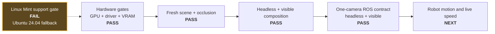

# Hardware and Isaac activation record

| Field | Value |
|---|---|
| Record date | 2026-07-26 |
| Host | Linux Mint 22.3 Zena, kernel 6.8.0-136-generic |
| CPU / RAM | Ryzen 9 5950X, 16 cores / 32 threads, 48 GB |
| Current / demo GPU | GeForce RTX 5070 Ti, 16303 MiB reported by `nvidia-smi` |
| Driver | NVIDIA 580.173.02 |
| Graphics / compute | Vulkan 1.4.312 / driver CUDA compatibility 13.0 |
| Installed simulator | Isaac Sim 5.1.0, Python 3.11 |
| Installed Isaac Lab | 2.3.2 |
| Compatibility result | GPU, driver, VRAM, CPU, RAM, storage, and displays pass; overall `FAILED` because Mint is unsupported |

## RTX 5070 Ti qualification evidence

- `nvidia-smi` identifies the RTX 5070 Ti, driver 580.173.02, and 16303 MiB.
  The initial desktop idle snapshot used 468 MiB; the post-test snapshot used
  494 MiB. These totals include Xorg and Cinnamon.
- `vulkaninfo --summary` selects the RTX 5070 Ti as the discrete GPU and reports
  the proprietary NVIDIA driver with Vulkan API 1.4.312. The separately listed
  llvmpipe device is the host's software fallback, not the device Isaac selected.
- The installed Isaac Sim 5.1 compatibility checker passes the NVIDIA driver,
  GPU, 17.09 GB checker-reported VRAM, 32 logical CPU cores, 50.41 GB
  checker-reported RAM, storage, and two displays. Its overall result remains
  `FAILED` solely because Linux Mint 22.3 is not one of NVIDIA's supported
  distributions. The result is therefore a supported-platform risk, not a GPU
  capacity failure.
- A fresh `m=6.0`, `n=3.0` build passed the continuous occlusion proof with 57
  coverage intervals and the composed-USD audit with 226 rays and zero failures.
- The installed-version headless smoke composed the stage with Vulkan and
  real-time `RaytracedLighting` at 640×360. It found one authored robot camera,
  all three corridor variants, both building colliders, and used 916 MiB at the
  loaded-stage snapshot.
- The same validation passed with a visible real-time viewport after 240 Kit
  updates and used 871 MiB at the loaded-stage snapshot. No sensor render
  product was created, and no Isaac/Kit process remained after shutdown.
- The one-render-product camera/clock adapter passed headless with 2,494 MiB
  total GPU memory and visible with 2,591 MiB. In both modes an external system
  Jazzy process received 12 synchronized 640×360 RGB/calibration pairs at
  15.000 Hz, a monotonic `/clock`, and one publisher per endpoint.
- All observed totals are far below the 14 GB soft ceiling. The live camera runs
  leave more than 11 GB of budget headroom, even though no additional rendered
  sensor is planned.
- Isaac Sim 5.1 documentation is now marked unsupported upstream. Keep the
  installed version pinned for the interview demo; schedule an upgrade as a
  separate, tested change rather than mixing it with the GPU swap.
- IOMMU is enabled and reported as a warning. It did not prevent the small stage
  from composing or rendering, but it remains in the recorded risk list.

## Activation progression



The OS result makes the workstation conditionally qualified even though every
hardware and project-specific gate shown on the main path passes.

## GPU-memory growth

These are independent point-in-time totals from `nvidia-smi`, not values to add
together. Headroom is measured against the project's 14,336 MiB soft ceiling.

| Checkpoint | Render products | Viewport | Total used | Headroom to soft ceiling |
|---|---:|---|---:|---:|
| Initial desktop | 0 | Desktop only | 468 MiB | 13,868 MiB |
| Corridor composition smoke | 0 | Headless | 916 MiB | 13,420 MiB |
| Corridor composition smoke | 0 | Visible | 871 MiB | 13,465 MiB |
| Live ROS camera contract | 1 | Headless | 2,494 MiB | 11,842 MiB |
| Live ROS camera contract | 1 | Visible | 2,591 MiB | 11,745 MiB |
| Project soft ceiling | — | — | 14,336 MiB | 0 MiB |

## Activation gate results

| Gate | Result |
|---|---|
| GPU model, driver, and VRAM | Pass |
| NVIDIA GPU selected by Vulkan | Pass |
| Installed Isaac compatibility checker | Conditional: all hardware gates pass; unsupported Mint makes the aggregate result fail |
| Fresh USDA and occlusion certificate | Pass |
| Headless installed-version stage smoke | Pass, 916 MiB total GPU memory |
| Visible 640×360 real-time viewport | Pass, 871 MiB total GPU memory |
| Below 14 GB soft ceiling | Pass with large margin |
| One-camera render-product steady state | Pass, 2,494 MiB headless / 2,591 MiB visible |
| Live camera/CameraInfo/clock ROS contract | Pass in headless and visible modes at 15.000 Hz |
| Synthetic ROS regression before adapter | Covered by the full workspace test |

The compatibility checker log is
`~/.nvidia-omniverse/logs/Kit/Isaac-Sim_Compatibility_Checker/5.1/kit_20260726_211003.log`.
The two smoke logs are under the installed environment's
`isaacsim/kit/logs/Kit/Isaac-Sim Python/5.1/` directory with timestamps
`20260726_211232` and `20260726_211324`.

The successful camera-adapter logs are in the same directory with timestamps
`20260726_215349` (headless) and `20260726_215509` (visible). Each run terminated
cleanly after 420 updates.

## Isaac/ROS environment finding

The host shell exports system Jazzy paths for Python 3.12. Isaac Sim uses Python
3.11 and ships its own Jazzy bridge libraries. Directly inheriting the system
`PYTHONPATH` causes Isaac to attempt to import the incompatible Python 3.12
`rclpy` extension. An early activation attempt exposed this boundary and is not
counted as validation evidence.

The final adapter re-executes once with user/system ROS Python paths removed,
prepends the bridge extension's bundled Jazzy library directory, and selects
Fast DDS. Final logs show internal Jazzy `rclpy` loading successfully. The
external probe remains an ordinary system-Jazzy Python 3.12 process. This split
is intentional and repeatable; it does not install or replace either ROS copy.

## Repeat the qualification

```bash
python -m scene.build --m 6.0 --n 3.0 --out out/corridor.usda
python -m scene.occlusion \
  --stage out/corridor.usda \
  --manifest out/corridor.manifest.json \
  --out out/occlusion-certificate.json

OMNI_KIT_ACCEPT_EULA=YES \
  ~/isaac/env_isaaclab/bin/python tools/isaac_5_1_smoke.py \
  out/corridor.usda --updates 60 --report-gpu-memory

OMNI_KIT_ACCEPT_EULA=YES \
  ~/isaac/env_isaaclab/bin/python tools/isaac_5_1_smoke.py \
  out/corridor.usda --gui --updates 240 --report-gpu-memory
```

The `--gui` run is intentionally finite and closes itself. Both commands force
real-time `RaytracedLighting`, 640×360, and no path tracing. Run these outside a
restricted sandbox because hidden NVML/Vulkan devices produce false negatives.

Do not move `~/isaac`: the environment contains editable/path-sensitive installs.
The repo consumes it through an explicit command and keeps the ROS/OpenUSD Python
3.12 environment separate from Isaac's Python 3.11 environment.

To repeat the live ROS acceptance check, start this external probe first:

```bash
source /opt/ros/jazzy/setup.bash
PYTHONNOUSERSITE=1 /usr/bin/python3 \
  tools/ros_camera_contract_probe.py --minimum-pairs 12 --timeout 90
```

Then run either finite adapter mode in another terminal:

```bash
OMNI_KIT_ACCEPT_EULA=YES \
  ~/isaac/env_isaaclab/bin/python tools/isaac_5_1_ros_camera.py \
  out/corridor.usda --updates 420 --report-gpu-memory

OMNI_KIT_ACCEPT_EULA=YES \
  ~/isaac/env_isaaclab/bin/python tools/isaac_5_1_ros_camera.py \
  out/corridor.usda --gui --updates 420 --report-gpu-memory
```

Run the probe separately for each adapter mode. Require both processes to print
their `PASS` marker; the adapter's local graph check alone does not prove DDS
delivery or the external message contract.

## Official references used

- [Isaac Sim 5.1 requirements](https://docs.isaacsim.omniverse.nvidia.com/5.1.0/installation/requirements.html)
- [Isaac Sim 5.1 ROS 2 installation and bridge](https://docs.isaacsim.omniverse.nvidia.com/5.1.0/installation/install_ros.html)
- [Isaac Sim 5.1 ROS camera tutorial](https://docs.isaacsim.omniverse.nvidia.com/5.1.0/ros2_tutorials/tutorial_ros2_camera.html)
- [Isaac Sim 5.1 ROS clock tutorial](https://docs.isaacsim.omniverse.nvidia.com/5.1.0/ros2_tutorials/tutorial_ros2_clock.html)
- [OpenUSD `UsdVariantSet` API](https://openusd.org/release/api/class_usd_variant_set.html)
- [OpenUSD physics schema](https://openusd.org/release/api/usd_physics_page_front.html)
- [ROS 2 Jazzy sensor-data QoS](https://docs.ros.org/en/ros2_packages/jazzy/api/rclcpp/generated/classrclcpp_1_1SensorDataQoS.html)
- [OpenCV ArUco detection and pose estimation](https://docs.opencv.org/4.7.0/d5/dae/tutorial_aruco_detection.html)
