# Hardware and Isaac activation record

> **Every GPU/VRAM figure below predates the 2026-07-29 police-placement
> correction (ADR 0019).** The scene changed shape again: P moved to the near
> side of the east wall and a new `CornerScreen` prim was added. None of the
> measurements below were retaken against that geometry, and per the
> [active handoff](HANDOFF-2026-07-29-POLICE-PLACEMENT-AUDIT.md) fresh GPU
> evidence is deliberately deferred until independent review of the portable
> correction closes. Treat everything in this file as historical until a new,
> explicitly-dated re-qualification section is added the same way the
> 2026-07-27 reconciliation entry below was.

| Field | Value |
|---|---|
| Initial record date | 2026-07-26 |
| Last updated | 2026-07-27 |
| Host | Linux Mint 22.3 Zena, kernel 6.8.0-136-generic |
| CPU / RAM | Ryzen 9 5950X, 16 cores / 32 threads, 48 GB |
| Current / demo GPU | GeForce RTX 5070 Ti, 16303 MiB reported by `nvidia-smi` |
| Driver | NVIDIA 580.173.02 |
| Graphics / compute | Vulkan 1.4.312 / driver CUDA compatibility 13.0 |
| Installed simulator | Isaac Sim 5.1.0, Python 3.11 |
| Installed Isaac Lab | 2.3.2 |
| Compatibility result | GPU, driver, VRAM, CPU, RAM, storage, and displays pass; overall `FAILED` because Mint is unsupported |

## RTX 5070 Ti qualification evidence

- `nvidia-smi` identifies the RTX 5070 Ti, driver 580.173.02, and 16303 MiB.
  The initial desktop idle snapshot used 468 MiB; the post-test snapshot used
  494 MiB. These totals include Xorg and Cinnamon.
- `vulkaninfo --summary` selects the RTX 5070 Ti as the discrete GPU and reports
  the proprietary NVIDIA driver with Vulkan API 1.4.312. The separately listed
  llvmpipe device is the host's software fallback, not the device Isaac selected.
- The installed Isaac Sim 5.1 compatibility checker passes the NVIDIA driver,
  GPU, 17.09 GB checker-reported VRAM, 32 logical CPU cores, 50.41 GB
  checker-reported RAM, storage, and two displays. Its overall result remains
  `FAILED` solely because Linux Mint 22.3 is not one of NVIDIA's supported
  distributions. The result is therefore a supported-platform risk, not a GPU
  capacity failure.
- A fresh `m=6.0`, `n=3.0` build passed the continuous occlusion proof with 57
  coverage intervals and the composed-USD audit with 226 rays and zero failures.
- The installed-version headless smoke composed the stage with Vulkan and
  real-time `RaytracedLighting` at 640×360. It found one authored robot camera,
  all three corridor variants, both building colliders, and used 916 MiB at the
  loaded-stage snapshot.
- The same validation passed with a visible real-time viewport after 240 Kit
  updates and used 871 MiB at the loaded-stage snapshot. No sensor render
  product was created, and no Isaac/Kit process remained after shutdown.
- The one-render-product camera/clock adapter passed headless with 2,494 MiB
  total GPU memory and visible with 2,591 MiB. In both modes an external system
  Jazzy process received 12 synchronized 640×360 RGB/calibration pairs at
  15.000 Hz, a monotonic `/clock`, and one publisher per endpoint.
- All observed totals are far below the 14 GB soft ceiling. The live camera runs
  leave more than 11 GB of budget headroom, even though no additional rendered
  sensor is planned.
- Isaac Sim 5.1 documentation is now marked unsupported upstream. Keep the
  installed version pinned for the interview demo; schedule an upgrade as a
  separate, tested change rather than mixing it with the GPU swap.
- IOMMU is enabled and reported as a warning. It did not prevent the small stage
  from composing or rendering, but it remains in the recorded risk list.

## Re-qualification after the geometry reconciliation — 2026-07-27

The scene changed shape when it was reconciled with
[`ROBO_TASK.pdf`](ROBO_TASK.pdf), so every GPU-side claim was re-measured rather
than carried forward. The earlier entries above stay as the record of what was
true on 2026-07-26.

- The `m=6.0`, `n=3.0` build passed the strengthened visibility gate: line of
  sight blocked over the whole route, 78 certified interval and sub-volume
  pairs, and a composed-USD audit of 204 rays with zero failures. Nearest
  blocking surface 3.116 m. The `wide_corner_m6_n4_5` and `uniform_m6_n6`
  profiles pass independently, each with P moved by the geometry.

  > **Superseded by ADR 0017 and ADR 0018.** Those figures describe P behind the
  > corner mass on the old three-piece route. Measured on the current geometry:
  > **5 covered intervals, 404 audit rays, zero failures, 5.366 m nearest
  > blocking surface, `EastBuilding` the sole blocking prim, every witness
  > constant-X.** The other profiles give 408 and 416 rays at 5.705 m and
  > 5.909 m. One plane now separates P from the whole route, so the certificate
  > covers each profile in five intervals rather than seventy-eight.
- The headless smoke composed the reconciled stage and found one authored robot
  camera, all three corridor variants, and collision schemas on all four
  buildings including the new corner mass and next-street kerb. 1,486 MiB.
  (ADR 0018 added a fifth, the east-wall stub; the smoke test now derives its
  list from the manifest rather than naming four.)
- The same validation passed with a visible real-time viewport after 240 Kit
  updates at 3,147 MiB. The visible figure is now higher than headless, which
  the earlier smaller scene had reversed; both remain far below the ceiling.
- The one-render-product camera/clock adapter passed headless at 3,075 MiB, and
  an external system Jazzy probe received 12 synchronized 640×360 rgb8
  image/calibration pairs at exactly 15.000 Hz with one publisher per endpoint.
- The simulator-free ROS demo emitted one violation from a true 1.8 m/s run,
  measuring 1.7977 m/s against the harness-only truth topic. Re-measured after
  the fiducial plates were enlarged and the principal-point convention aligned,
  the same demo reports 1.7858 m/s at simulated time 4.368860 s.

The 14,336 MiB soft ceiling is unchanged and the largest reconciled measurement
uses 22% of it. Mint remains unsupported by NVIDIA; that risk is unaffected.

The subsequent proof-only correction in ADR 0012 did not change the generated
USD, manifest geometry, renderer, or Isaac adapter, so repeating GPU measurements
would measure the same artifact. The CPU certificate was rebuilt after replacing
the turn's endpoint chord with a conservative analytic arc enclosure. All three
profiles still pass; the nominal result at that time was 78 certified pairs, 204
audit rays, zero failures, and a 3.116 m nearest blocking surface. A new
curved-source negative control now fails where the old endpoint-only method
falsely passed. (Those counts are pre-ADR-0017; see the correction above.)

## Static rendered-fiducial run — 2026-07-27 — historical, renderer unqualified

> This run predates the renderer readback fix in `5bc1c99`. Its pixel,
> calibration, rate, station-error and mirror-control results below remain valid
> historical evidence. Its **renderer mode was requested, never measured**, so
> the run is not a current qualification and its summary is preserved unmodified
> as `qualification-summary-v1-request-echo-invalidated.json`. **No canonical
> static qualification exists until the planned requalification passes on the
> corrected geometry.**

The camera contract alone proved message delivery, not that the pixels supported
the intended measurement. This gate reused the same one-product OmniGraph
and held A at five world-X stations while a separate system-Jazzy process saved
actual `Image`, `CameraInfo`, and `/clock` messages.

The first captures correctly failed: 24 cm codes were undersampled, lacked a
physical white quiet zone, and their 35-degree plates were centered so close to
the wall that roughly half of each tag intersected the opaque building mesh.
The accepted scene uses 40 cm surveyed codes, a `9/7` white backing, and a
wall-normal bracket solve that preserves 15 mm clearance for the complete
backing. [ADR 0013](adr/0013-size-fiducials-from-delivered-camera.md) records the
decision and rejected alternatives.

| Measurement | Accepted result |
|---|---:|
| Captured synchronized pairs | 57 |
| Required world-X dwells | 5/5 passed |
| Selected frames per dwell | 3/3 passed at every dwell |
| Maximum station error | 0.010563 m |
| Maximum detected-corner RMSE | 1.550047 px |
| Maximum estimator reprojection RMSE | 1.091647 px |
| Delivered image frequency | 14.999999 Hz |
| Maximum K-matrix error | 0.0000149 px |
| Unsurveyed marker IDs | 0 |
| Mirrored actual-capture control | Gate failed; 0 passing frames |
| Active/default anti-aliasing enum | 3 / 3 after 12 warm-up updates |
| Active render mode | **Not measured in this run** — requested only |
| Total GPU memory | 3,024 MiB |

The acceptance limits were fixed before the run: 0.05 m station error, 3.0 px
corner and reprojection RMSE, at least two of three frames per dwell, and
14.5-15.5 Hz. Simulator pose was never a ROS input or estimator argument; only
the independent file-based evaluator read the commanded static schedule.

The Kit log is `kit_20260727_023440.log`. Curated commands, a representative
frame, and a stable per-dwell JSON result are in the
[static-fiducial evidence record](evidence/static-fiducials/NOTES.md).

## Activation progression

```mermaid
flowchart LR
    HW["Hardware gates<br/>GPU + driver + VRAM<br/><b>PASS</b>"] --> Scene["Fresh scene + occlusion<br/><b>PASS</b>"]
    Scene --> Smoke["Headless + visible composition<br/><b>PASS</b>"]
    Smoke --> Camera["One-camera ROS contract<br/>headless + visible<br/><b>PASS</b>"]
    Camera --> Static["Rendered fiducial station gate<br/><b>PASS</b>"]
    Static --> Motion["Robot motion and live speed<br/><b>PASS</b>"]
    Motion --> Requal["Paired static requalification<br/><b>NEXT</b>"]
    OS["Linux Mint support gate<br/><b>FAIL</b><br/>Ubuntu 24.04 fallback"]:::conditional -.-> HW

    classDef conditional fill:#5c471f,color:#ffffff,stroke:#ffc857,stroke-width:2px;
```



The OS result makes the workstation conditionally qualified even though every
hardware and project-specific gate shown on the main path passes.

## GPU-memory growth

These are independent point-in-time totals from `nvidia-smi`, not values to add
together. Headroom is measured against the project's 14,336 MiB soft ceiling.

| Checkpoint | Render products | Viewport | Total used | Headroom to soft ceiling |
|---|---:|---|---:|---:|
| Initial desktop | 0 | Desktop only | 468 MiB | 13,868 MiB |
| Corridor composition smoke | 0 | Headless | 916 MiB | 13,420 MiB |
| Corridor composition smoke | 0 | Visible | 871 MiB | 13,465 MiB |
| Live ROS camera contract | 1 | Headless | 2,494 MiB | 11,842 MiB |
| Live ROS camera contract | 1 | Visible | 2,591 MiB | 11,745 MiB |
| Reconciled composition smoke | 0 | Headless | 1,486 MiB | 12,850 MiB |
| Reconciled composition smoke | 0 | Visible | 3,147 MiB | 11,189 MiB |
| Reconciled live ROS camera contract | 1 | Headless | 3,075 MiB | 11,261 MiB |
| Static rendered-fiducial gate | 1 | Headless | 3,024 MiB | 11,312 MiB |
| Live demonstration, A driving the route | 1 | Headless | 3,411 MiB | 12,892 MiB |
| Live demonstration, A driving the route | 1 | Visible | 3,547 MiB | 12,756 MiB |
| Live demonstration after the R17 plate correction | 1 | Headless | 3,486 MiB | 12,817 MiB |
| Live demonstration, second run on the same geometry | 1 | Headless | 3,546 MiB | 12,757 MiB |
| Project soft ceiling | — | — | 14,336 MiB | 0 MiB |

## Activation gate results

| Gate | Result |
|---|---|
| GPU model, driver, and VRAM | Pass |
| NVIDIA GPU selected by Vulkan | Pass |
| Installed Isaac compatibility checker | Conditional: all hardware gates pass; unsupported Mint makes the aggregate result fail |
| Fresh USDA and occlusion certificate | Pass |
| Headless installed-version stage smoke | Pass, 916 MiB total GPU memory |
| Visible 640×360 real-time viewport | Pass, 871 MiB total GPU memory |
| Below 14 GB soft ceiling | Pass with large margin |
| One-camera render-product steady state | Pass, 2,494 MiB headless / 2,591 MiB visible |
| Live camera/CameraInfo/clock ROS contract | Pass in headless and visible modes at 15.000 Hz |
| Static rendered ArUco station gate | Pass at all five nominal dwells; mirrored actual capture fails |
| Synthetic ROS regression before adapter | Covered by the full workspace test |

The compatibility checker log is
`~/.nvidia-omniverse/logs/Kit/Isaac-Sim_Compatibility_Checker/5.1/kit_20260726_211003.log`.
The two smoke logs are under the installed environment's
`isaacsim/kit/logs/Kit/Isaac-Sim Python/5.1/` directory with timestamps
`20260726_211232` and `20260726_211324`.

The successful camera-adapter logs are in the same directory with timestamps
`20260726_215349` (headless) and `20260726_215509` (visible). Each run terminated
cleanly after 420 updates.

The reconciled-scene runs recorded above are in that directory with timestamps
`20260727_002342` (headless smoke, 1,486 MiB), `20260727_002449` (visible smoke,
3,147 MiB), and `20260727_002416` (headless camera contract, 3,075 MiB).

## Isaac/ROS environment finding

The host shell exports system Jazzy paths for Python 3.12. Isaac Sim uses Python
3.11 and ships its own Jazzy bridge libraries. Directly inheriting the system
`PYTHONPATH` causes Isaac to attempt to import the incompatible Python 3.12
`rclpy` extension. An early activation attempt exposed this boundary and is not
counted as validation evidence.

The final adapter re-executes once with user/system ROS Python paths removed,
prepends the bridge extension's bundled Jazzy library directory, and selects
Fast DDS. Final logs show internal Jazzy `rclpy` loading successfully. The
external probe remains an ordinary system-Jazzy Python 3.12 process. This split
is intentional and repeatable; it does not install or replace either ROS copy.

## Repeat the qualification

```bash
python -m scene.build --m 6.0 --n 3.0 --out out/corridor.usda
python -m scene.occlusion \
  --stage out/corridor.usda \
  --manifest out/corridor.manifest.json \
  --out out/occlusion-certificate.json

OMNI_KIT_ACCEPT_EULA=YES \
  ~/isaac/env_isaaclab/bin/python tools/isaac_5_1_smoke.py \
  out/corridor.usda --updates 60 --report-gpu-memory

OMNI_KIT_ACCEPT_EULA=YES \
  ~/isaac/env_isaaclab/bin/python tools/isaac_5_1_smoke.py \
  out/corridor.usda --gui --updates 240 --report-gpu-memory
```

The `--gui` run is intentionally finite and closes itself. Both commands force
real-time `RaytracedLighting`, 640×360, and no path tracing. Run these outside a
restricted sandbox because hidden NVML/Vulkan devices produce false negatives.

Do not move `~/isaac`: the environment contains editable/path-sensitive installs.
The repo consumes it through an explicit command and keeps the ROS/OpenUSD Python
3.12 environment separate from Isaac's Python 3.11 environment.

To repeat the live ROS acceptance check, start this external probe first:

```bash
source /opt/ros/jazzy/setup.bash
PYTHONNOUSERSITE=1 /usr/bin/python3 \
  tools/ros_camera_contract_probe.py --minimum-pairs 12 --timeout 90
```

Then run either finite adapter mode in another terminal:

```bash
OMNI_KIT_ACCEPT_EULA=YES \
  ~/isaac/env_isaaclab/bin/python tools/isaac_5_1_ros_camera.py \
  out/corridor.usda --updates 420 --report-gpu-memory

OMNI_KIT_ACCEPT_EULA=YES \
  ~/isaac/env_isaaclab/bin/python tools/isaac_5_1_ros_camera.py \
  out/corridor.usda --gui --updates 420 --report-gpu-memory
```

Run the probe separately for each adapter mode. Require both processes to print
their `PASS` marker; the adapter's local graph check alone does not prove DDS
delivery or the external message contract.

## Running the demonstration

`tools/run_demo.sh` automates exactly the two-environment split above: the
system-Jazzy consumers start first, then Isaac starts in a shell with
`AMENT_PREFIX_PATH`, `PYTHONPATH`, `ROS_DISTRO` and `CMAKE_PREFIX_PATH` unset,
because the adapter re-execs into its bundled Jazzy and aborts on leaked host
paths rather than silently mixing two ABIs.

```bash
bash tools/run_demo.sh                       # GUI, RViz, A driving at 1.0 m/s
bash tools/run_demo.sh --headless --record   # no viewport, rosbag the topics
SPEED_MPS=0.6 bash tools/run_demo.sh         # compliant run, no violation
SPEED_MPS=1.8 bash tools/run_demo.sh         # sustained speeding, one episode
```

The ROS side is `police_observer live_demo.launch.py`, which starts the
camera-only observer, the `enforcement_view` display, and RViz with the saved
layout. It runs on `use_sim_time:=true`: the adapter stamps camera messages from
the simulation clock and the observer differentiates those stamps, so putting
this side on wall time would mix two clocks inside one speed measurement.

Markers to require in the Isaac log:

| Marker | What it establishes |
|---|---|
| `ISAAC_ROS_CAMERA_RENDER_READY` | renderer state was read back from both settings trees, not echoed from the request |
| `ISAAC_ROS_CAMERA_DRIVE` | `reached_end=True` means A completed the authored route |
| `ISAAC_ROS_CAMERA_GPU` | VRAM against the RTX 5070 Ti budget |
| `ISAAC_ROS_CAMERA_PASS` | one render product, one camera, no pose or truth publisher |

`--drive-out` writes the commanded pose schedule to
`out/evidence/live-demo/commanded-pose-schedule.json`. It is simulator truth,
labelled `evaluator_only_commanded_pose_schedule`, and is never an observer
input; the observer's own measurements arrive on `/police/speed_estimate`.

If Isaac is unavailable the script says so and points at
`synthetic_demo.launch.py`, which needs no GPU and is the recorded fallback for
the demonstration.

## Official references used

- [Isaac Sim 5.1 requirements](https://docs.isaacsim.omniverse.nvidia.com/5.1.0/installation/requirements.html)
- [Isaac Sim 5.1 ROS 2 installation and bridge](https://docs.isaacsim.omniverse.nvidia.com/5.1.0/installation/install_ros.html)
- [Isaac Sim 5.1 ROS camera tutorial](https://docs.isaacsim.omniverse.nvidia.com/5.1.0/ros2_tutorials/tutorial_ros2_camera.html)
- [Isaac Sim 5.1 ROS clock tutorial](https://docs.isaacsim.omniverse.nvidia.com/5.1.0/ros2_tutorials/tutorial_ros2_clock.html)
- [OpenUSD `UsdVariantSet` API](https://openusd.org/release/api/class_usd_variant_set.html)
- [OpenUSD physics schema](https://openusd.org/release/api/usd_physics_page_front.html)
- [ROS 2 Jazzy sensor-data QoS](https://docs.ros.org/en/ros2_packages/jazzy/api/rclcpp/generated/classrclcpp_1_1SensorDataQoS.html)
- [OpenCV ArUco detection and pose estimation](https://docs.opencv.org/4.7.0/d5/dae/tutorial_aruco_detection.html)
