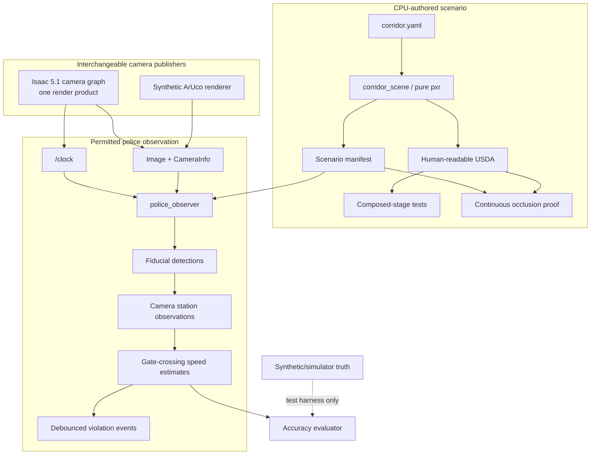
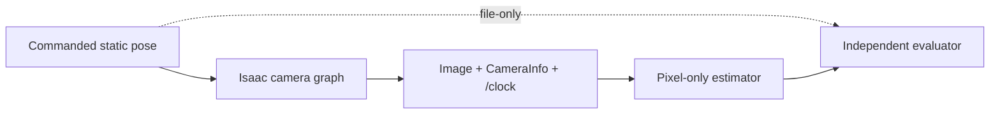
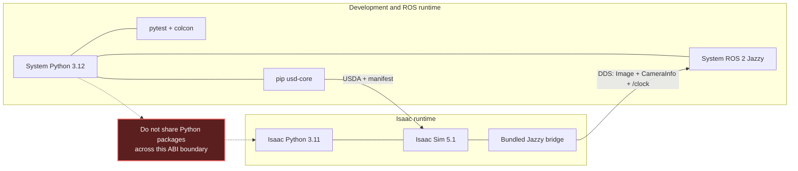

# corridor-twin system design

| Field | Value |
|---|---|
| Design version | 0.6.0 |
| Status | Static production-camera fiducial gate qualified; deterministic live motion is next |
| Last updated | 2026-07-27 |
| Scenario source | [`ROBO_TASK.pdf`](ROBO_TASK.pdf) |
| Target ROS | ROS 2 Jazzy |
| Target host | Linux Mint 22 demo host / Ubuntu 24.04 supported fallback |
| Current / target GPU | RTX 5070 Ti, 16 GB |

## Purpose

Demonstrate a small, explainable robotics digital twin in which A delivers a
package to B while P observes speed indirectly through A's camera stream. The
system must separate authored scene truth, simulated sensor data, and the
observer's permitted evidence.

This is an interview artifact, not a production traffic-enforcement system.

## Design principles

1. **Interface first.** The observer consumes standard camera messages and does
   not know whether their publisher is synthetic, Isaac Sim, or future hardware.
2. **Truth isolation.** Simulator pose and synthetic truth are evaluation inputs,
   never observer inputs.
3. **Deterministic authoring.** The USDA and its manifest are generated from
   versioned configuration with `pxr`; no GUI edits are required to reproduce it.
4. **Independent evidence.** Validators inspect the composed USD rather than
   trusting generator metadata.
5. **Small GPU surface.** One modest RGB camera and primitive geometry are enough
   to demonstrate the system claim.
6. **Installed-version APIs.** Isaac namespaces are isolated and committed only
   after checking the installed documentation and examples.

## Component boundaries



`corridor_scene` and the perception core must remain importable without Isaac
Sim. The ROS adapter may import ROS packages but must keep perception algorithms
free of ROS node state so they can be tested with ordinary arrays and timestamps.

The detailed milestone view is maintained in the
[documentation map](README.md). The architectural invariant is that both camera
publishers meet one contract; adding motion must not add a truth input to the
observer.

## Scenario and coordinate contract

- Stage units: meters (`metersPerUnit = 1.0`).
- Up axis: Z.
- Corridor station: world X. Markers are surveyed at a station, gates sit at
  marker stations, and the estimator recovers station from PnP.
- Map frame: `corridor_map`.
- Camera optical frame: X right, Y down, Z forward, following ROS camera
  conventions.

### What the supplied diagram fixes, and what it does not

[`ROBO_TASK.pdf`](ROBO_TASK.pdf) is a plan view with no scale bar, no dimension
text, and widths labelled only as the symbols `m` and `n`. Its topology is
authoritative; its pixel lengths are not. See
[ADR 0010](adr/0010-supplied-diagram-geometry.md).

| From the source | A project choice |
|---|---|
| `m >= n`, narrowing toward the corner | Corridor length, 12.0 m |
| One straight face, one tapering face | Next-street width 6.0 m, length 10.0 m |
| A perpendicular next street with real walls | Turn radius 2.0 m |
| B along that street, P at its corner | B at 8.0 m along the street |

The config and the manifest publish this as
`topology: reconciled_with_supplied_diagram` and
`metric_scale: demo_assumption`.

### One-sided taper

The north face is straight and the south face carries the whole taper:

```text
width(x)      = m + (n - m)·x / L
north_face(x) = +m / 2
south_face(x) = north_face(x) - width(x)
centerline(x) = (north_face(x) + south_face(x)) / 2
```

`geometry.corridor_faces` is the single source of truth: wall footprints, the
marker survey, the delivery trajectory, and the visibility witnesses all derive
from it, so the taper equation exists in exactly one place.

A consequence worth stating: the centreline is straight but **not aligned with
world X**, so an X displacement is shorter than the distance actually travelled.
Speed is converted by the path's X fraction before it is reported, or a tapered
corridor would under-report speed by about 0.8%.

### Delivery trajectory

The route is line → circular arc → line, exposing position **and** yaw
continuously. A polyline with one heading per segment can hide a visibility
window that a real rotating camera sweeps through, so the visibility gate
consumes this trajectory and bounds whole intervals of the turn.

For the nominal profile: 12.851 m approach at 7.13°, a 2.0 m-radius arc
sweeping 97.13°, then a 7.609 m departure — 23.851 m in total.

## Corridor variants

The default prim owns one `corridorProfile` variant set. Each variant is a
complete, named `(entry width m, corner width n)` profile. The selected variant
authors numeric width attributes and all dependent geometry — walls, markers,
**and** A, P, and the route, because all of them follow the corridor faces.

The variant set sits on `/World` rather than on the corridor prim: a variant
only contributes opinions inside its own prim's namespace, and the actors live
under `/World/Actors`.

The CLI `--m` and `--n` values define and select the nominal requested profile.
Additional named profiles come from configuration. Variants are deliberately not
described as continuous numeric parameters.

## Visibility semantics

The task states that A cannot see P. That is a hard geometric gate, not an
assertion, and four concepts stay distinct
([ADR 0011](adr/0011-visibility-semantics.md)):

| Concept | Question | Directional? |
|---|---|---|
| Physical line of sight | Does an opaque wall intersect the camera-to-P segment? | No; normally reciprocal |
| A-camera visibility | Is any part of P inside the frustum *and* unoccluded? | Yes |
| A software awareness | Does A detect, model, or react to P? | Yes |
| P data access | Does P subscribe to A's Image, CameraInfo, and the survey? | Yes |

P reading A's camera feed is a network relationship, not a sightline. The
software-awareness rule is enforced by a source contract and is **additive**: P
could be plainly visible in A's pixels even if A's code ignored them, so it can
never stand in for the geometric gate.

## Generated artifacts

`scene.build` writes:

- a human-readable `.usda` stage;
- small ArUco texture files where required;
- `corridor.manifest.json`, containing schema version, profile definitions,
  marker corner coordinates, camera model, path stations, P bounds, and the
  demonstration speed policy.

The build is deterministic for equivalent arguments. Generated outputs live
under `out/` and are not source-controlled by default.

## Stage contents

Stable prim paths:

```text
/World                                  <- owns the corridorProfile variant set
  /PhysicsScene
  /Environment
    /Ground
    /Corridor
      /RoadSurface
      /NextStreetSurface
      /NorthBuilding                    <- straight face
      /SouthBuilding                    <- tapering face
      /CornerBuilding                   <- corner mass; hides P
      /EastBuilding                     <- next street's far kerb
      /Fiducials
  /Actors
    /A
      /CameraMount
        /FrontCamera
    /B
    /P
  /Paths
    /DeliveryPath
```

Renamed at design 0.5.0, because the old names described a symmetry that no
longer exists: `LeftBuilding → NorthBuilding`, `RightBuilding → SouthBuilding`.
`CornerBuilding`, `EastBuilding`, and `NextStreetSurface` are new, and the
former `CrossStreet` cube is replaced by the authored street.

Buildings are closed low-poly volumes, not zero-thickness display faces. Ground
and buildings are static colliders. Applying collision without a parent rigid
body intentionally produces a static collider.

The corridor's south wall and the next street's west wall are two overlapping
**convex** prims rather than one L-shaped prim: the walls carry `convexHull`
collision approximations, and an L-shaped hull would silently fill the junction
A has to drive through.

## Camera-derived speed

Markers have unique IDs, known metric size, and surveyed 3D corners. Plates are
canted toward the corridor approach so a forward camera does not view markers at
near-edge-on angles. The code is 0.40 m square and sits on a white plate `9/7`
its size, preserving one quiet-zone module outside the black border. Plate cant
is measured from each wall's actual local corridor-facing normal. A solved
bracket standoff keeps the complete backing at least 15 mm out of both the
straight north wall and the tapered south wall; centering a canted plate a fixed
distance from its wall is insufficient because one edge can still intersect the
building mesh. See [ADR 0013](adr/0013-size-fiducials-from-delivered-camera.md).

For each image:

1. Validate image and matching calibration stamps/frames.
2. Detect marker IDs and subpixel corners.
3. Reject unknown IDs, border-clipped markers, and high reprojection error.
4. Estimate camera pose/station from marker-to-image correspondences.
5. Retain the previous `(image acquisition time, station, uncertainty)` sample.
6. Interpolate the time at which the pair crosses each surveyed gate.
7. Estimate average speed between gates; optionally publish a robust rolling
   station-vs-time slope for diagnostics.
8. Compare a conservative confidence bound to the configured local limit.

A violation requires a valid estimate and configurable confirmation. Arrival time
at the subscriber is never used for speed.

## Speed-limit policy

Corridor width alone does not define a legal limit. The supplied task states no
limit, so the manifest carries an explicitly demonstration-only piecewise
policy keyed on clear width. The diagram does confirm what the policy keys on:
the corner is the narrow point. The event records the policy profile, width,
limit, measured speed, uncertainty, gates, and confirmation duration.

## Synthetic validation

The synthetic publisher renders actual ArUco images through a calibrated pinhole
camera model while moving it along a known station function. Truth is published
on a test-only topic for the evaluator. A source contract test proves that the
observer adapter contains no truth or odometry subscription.

The implemented clean synthetic test uses actual ArUco pixels, camera intrinsics,
detection, PnP, gate interpolation, and the violation debounce. On the
reconciled geometry, at a true path speed of 1.8 m/s it measured 1.7958 and
1.7977 m/s (maximum absolute error 0.0042 m/s) and emitted one event; at
1.0 m/s it measured 1.0009 and 0.9866 m/s and emitted no event. Noise, blur,
dropped-frame, and acceleration cases remain extensions rather than claimed
coverage.

Two accuracy defects were found and fixed while reconciling the geometry, both
invisible under the previous symmetric corridor:

- **Station is world X, but the path is not.** Under a one-sided taper the route
  runs at about 7° to X, so gate spacing along X is shorter than the distance
  travelled and every estimate read low by 0.8%, roughly 0.014 m/s at 1.8 m/s.
  Gate spacing is now converted before differentiating.
- **Single-marker frames are ambiguous.** Four coplanar correspondences let
  planar PnP fit almost exactly while recovering the wrong pose. One such frame
  produced a 0.21 m backward station jump at a reprojection error of 0.02 px,
  which reset the gate history and silently dropped a measurement. A low
  residual is not evidence here, so a second marker is now required — the
  mitigation this document already prescribed.

A live ROS 2 launch was also exercised in both wall-time and synthetic-clock
modes. The latter produced the same 1.8026 m/s event at simulated time 4.3306 s,
confirming that the observer uses image acquisition stamps rather than callback
arrival time.

### Static production-camera qualification

Before adding motion, the existing Isaac camera graph holds A at five approach
poses. A system-Jazzy process captures only `Image`, `CameraInfo`, and `/clock`.
Pixel analysis runs the real `ArucoStationEstimator` without a truth parameter;
a separate evaluator then compares its observations and point-ordered corners
with commanded camera poses from a file that is never published to ROS.



The accepted nominal run passed 3/3 selected frames at every world-X dwell
`0.5, 1.5, 3.0, 5.0, 7.0 m`. Maximum station error was 0.010563 m, corner RMSE
1.550047 px, and estimator reprojection RMSE 1.091647 px. The delivered K matrix
and 14.999999 Hz rate were constant, and no unsurveyed ID appeared. Mirroring
the same captured frames produced zero passing frames. The curated evidence is
under [static fiducial evidence](evidence/static-fiducials/NOTES.md).

## Occlusion verification

The certificate is continuous over every trajectory interval, not a dense sample
claim, and it covers P's full body volume rather than its centre. Its conservative
source enclosure is the essential distinction:

| Route piece | Camera-position enclosure | Why it is safe |
|---|---|---|
| Straight approach/departure | Exact endpoint segment | The real source stays in that convex segment |
| Circular turn | Axis-aligned rectangle from both endpoint angles and every enclosed cardinal angle | The exact arc lies inside those analytic extrema; it is never replaced by its chord |

Witness planes are solved in closed form over the source-enclosure vertices and
target-subvolume corners. Where a ray crosses a plane its coordinates are linear
in the plane coordinate, and the slab's own bounds are linear too, so the
feasible planes form an interval. See
[ADR 0012](adr/0012-conservative-curved-path-visibility.md).

Four properties are not optional, and each was forced by a concrete failure
found while proving the reconciled scene:

- **Closed-form witness search.** A 240-point sampled search stepped over a
  feasible window only 8 mm wide near the corridor entry and reported P as
  possibly visible when it was not.
- **Subdividing P's volume, not just the route.** No single plane can contain
  rays to opposite corners of P inside one 0.5 m wall, even though the wall
  blocks each of them at its own depth.
- **Witness planes of constant Y as well as constant X.** Where A draws level
  with P, no plane of constant X separates them at all.
- **A conservative curved-source enclosure.** Arc endpoints describe a chord,
  not the camera's intervening positions. A regression fixture demonstrates the
  old false-pass: both endpoint rays cross a short wall while the mid-arc rays
  clear it. Exact circular extrema now enclose that midpoint and reject the
  fixture.

The turn is swept as a yaw *range* per interval. Each frustum half-space is
linear in the source-to-target offset, so enumerating vertices of the
conservative source and target enclosures is exact for a fixed yaw; across a yaw
range shorter than π the same condition holds throughout exactly when it holds
at both ends. Taking the Cartesian product of position and yaw ranges may prove
less than the correlated real motion, never more.

The certificate reports wall occlusion and frustum exclusion as **separate**
fields, and pursues a wall witness even where P is already off-screen. An
off-screen P is never relabelled as wall-occluded.

An independent diagnostic then reads composed world-space meshes from the USD
and performs segment/triangle intersections, discovering meshes by applied
collision schema so that renaming or adding a building cannot silently shrink
the audit. A negative test moves P into the clear corridor and must fail.

Current result for the nominal profile: `passed`, line of sight blocked over the
whole route, 78 certified interval/sub-volume pairs, 204 audit rays with 0
failures, nearest blocking surface 3.116 m. 76 of the 78 are blocked by
`SouthBuilding` and 2 by `CornerBuilding`; 50 use constant-X witnesses and 28
use constant-Y witnesses. The certificate records `witness_axis` separately
from `witness_coordinate_m`.

## ROS time model

- Image `header.stamp` is acquisition/simulation time and is the only estimator
  timebase.
- Isaac mode has exactly one simulator `/clock` publisher and every participant
  sets `use_sim_time=true`.
- Wall-time mode has no `/clock` publisher and uses `use_sim_time=false`.
- Synthetic-clock mode has exactly one harness clock source.
- Zero time, backward jumps, profile changes, or non-monotonic image stamps clear
  estimator and debounce state.

## Installed Isaac/ROS adapter

The adapter is deliberately a version-specific executable under `tools/`, not a
dependency of `corridor_scene` or `police_observer`. Its OmniGraph uses the node
type names verified in the installed Isaac Sim 5.1.0 extension:

- `isaacsim.core.nodes.IsaacCreateRenderProduct`;
- `isaacsim.ros2.bridge.ROS2CameraHelper`;
- `isaacsim.ros2.bridge.ROS2CameraInfoHelper`;
- `isaacsim.core.nodes.IsaacReadSimulationTime`;
- `isaacsim.ros2.bridge.ROS2PublishClock`.

It creates one 640×360 render product, publishes RGB and calibration at 15 Hz
from a 60 Hz fixed simulation timeline, and publishes `/clock`. Camera and clock
endpoints use explicit best-effort, volatile QoS. The graph contains no pose,
odometry, transform, TF, depth, segmentation, or truth publisher. The camera is
configured with the current 5.1 OpenCV pinhole schema rather than the deprecated
physical-distortion schema.

The installed real-time renderer reports anti-aliasing/super-resolution enum 3
(DLSS) after the Hydra product materializes. The adapter discards 12 product and
shader warm-up updates, then asserts the active and default values after warm-up
and at each admitted static dwell. This avoids recording a requested startup
value as though it were observed renderer state.

Isaac's Python 3.11 process uses the bridge extension's bundled Jazzy libraries.
The external observer/probe uses system Jazzy under Python 3.12. The adapter
re-executes once with user/system ROS Python paths removed so a Python 3.12
`rclpy` extension cannot be loaded into Isaac's Python 3.11 process. Both sides
use Fast DDS for this demo.

## GPU and performance budget

The installed 16 GB RTX 5070 Ti is the qualified demo GPU. Its capacity changes
the activation status, not the deliberately small system boundary. Initial
limits remain:

| Resource | Initial budget |
|---|---:|
| RGB cameras | 1 |
| Camera resolution | 640×360 |
| Camera rate | 15 Hz |
| Other rendered sensors | 0 |
| Steady-state VRAM soft ceiling on 5070 Ti | 14 GB |
| Materials | Opaque, simple, few |
| Physics | CPU initially |
| Render mode | Real-time `RaytracedLighting`; no path tracing |

On 2026-07-26, `nvidia-smi` reported 16303 MiB and driver 580.173.02. The
installed Isaac Sim 5.1 checker passed its GPU, driver, VRAM, CPU, RAM, storage,
and display gates. The aggregate checker still failed because Linux Mint 22.3 is
unsupported; Ubuntu 24.04 remains the fallback. IOMMU is also reported as a
warning.

The project stage passed both headless and visible installed-version validation
at 640×360 with real-time `RaytracedLighting`. Composition-only snapshots were
916 MiB headless and 871 MiB visible, against a 468 MiB initial desktop baseline.
With the one render product and ROS graph active, total GPU memory snapshots were
2,494 MiB headless and 2,591 MiB visible. Both live modes independently delivered
12 synchronized image/calibration pairs at exactly 15 Hz and retained more than
11 GB of headroom below the 14 GB soft ceiling.

After the reconciled geometry and physical fiducial correction, the accepted
static production-camera gate used 3,024 MiB headless while delivering 57 paired
frames. This is the measurement relevant to the current scene and still leaves
11,312 MiB below the soft ceiling.

The earlier RTX 5060 8 GB check remains historical evidence: the checker failed
both its internal 10 GB VRAM threshold and the unsupported OS gate, although the
small stage composed. Replacing the card resolves the capacity gate but does not
make Mint a supported NVIDIA platform.

If the budget is exceeded: close redundant viewports, lower camera resolution,
reduce texture streaming budget, remove material features, and inspect render
products before changing algorithms.

## Runtime environments



### Development/ROS environment

System Python 3.12 venv with `--system-site-packages`, ROS 2 Jazzy, `usd-core`, and
test tooling. It authors and validates USD and runs ROS nodes.

### Isaac environment

Isaac Sim 5.1.0 / Isaac Lab 2.3.2 use the installed Python 3.11 environment at
`~/isaac/env_isaaclab`. It loads the already-authored stage. Pip `usd-core` is not
installed into this environment, and `omni`/`isaacsim` imports do not leak into
Phase 1 packages. The version-specific tools are isolated in
`tools/isaac_5_1_smoke.py` and `tools/isaac_5_1_ros_camera.py`.

## Validation matrix

| Claim | Evidence |
|---|---|
| Stage is reproducible | Generator tests and readable USDA output |
| Widths equal m/n | Composed mesh measurement for every selected variant |
| Taper is one-sided | North face is one straight line; south face carries the full `m - n` |
| One geometry source | Composed USD, manifest occluders, and `corridor_faces` cross-checked |
| Colliders exist | Applied-schema/attribute tests and Isaac 5.1 smoke |
| Turn is continuous | Position and yaw continuity at both joins; yaw monotone through the arc |
| Turn fits | Every arc sample lies in drivable space for every profile |
| Observer is camera-only | Source/topic contract tests and ROS graph design |
| A is unaware of P | Source contract over robot-side files, additive to the geometric gate |
| Estimator is accurate | Synthetic pixels measured against harness-only truth |
| P cannot be seen | Conservative continuous certificate over P's full volume, curved-source false-pass regression, plus 204-ray composed-USD audit |
| The checker can fail | Visible negative control fails both the certificate and the audit |
| Time reset behavior | Non-monotonic stamp and backward-station unit tests |
| Demo GPU is qualified | 5070 Ti checker component results, headless/GUI smoke, and measured VRAM snapshots |
| Live camera contract is correct | External ROS probe of paired stamps, frames, dimensions, encoding, calibration, QoS, rate, clocks, and publisher cardinality |
| Rendered fiducials are measurable | Five static Isaac dwells pass station, reprojection, corner-order, calibration, and rate gates; the mirrored actual capture fails |
| GPU constraints are explicit | One camera, 640×360, real-time rendering, no path tracing, and a 14 GB soft ceiling |

## Risks and mitigations

- **Mint is unsupported by NVIDIA:** all hardware checker components pass, but
  the aggregate compatibility check fails; retain an Ubuntu 24.04 fallback plan.
- **Exactly 16 GB target VRAM:** preserve a 2 GB soft reserve and avoid extra
  render products.
- **Variant changes versus physics caches:** pause/reset simulation when switching
  profiles until installed-version behavior is verified.
- **Wall-marker sampling and mounting:** use 0.40 m codes with geometric white
  quiet zones, solve plate clearance from each local wall normal, and require at
  least two markers per solved frame.
- **Unscaled source drawing:** the diagram fixes topology but states no metric
  length, so lengths are published as `metric_scale: demo_assumption` rather
  than presented as surveyed values.
- **Clock discontinuity:** clear temporal state on jumps.
- **User-site NumPy 2.2 conflicts with Jazzy OpenCV:** the demo launch disables
  user-site packages; the repo venv pins NumPy below 2.
- **Two Jazzy Python ABIs on one host:** the Isaac adapter self-isolates its
  bundled Python 3.11 bridge, while external ROS nodes use system Python 3.12.
- **Renderer minimum-input warning:** Kit may internally increase a low DLSS
  input size at 640×360; the delivered ROS image was independently validated as
  640×360 and the renderer remains real-time.

## Version history

- **0.6.0 — 2026-07-27:** Qualified the production Isaac/ROS pixels at five
  static approach dwells. Increased the surveyed code to 0.40 m, added physical
  white quiet-zone plates, and solved canted bracket standoff against the real
  wall normals after GPU evidence exposed tags intersecting the building mesh.
  Recorded the post-create DLSS enum, 3,024 MiB VRAM, 0.010563 m maximum station
  error, and a passing mirror negative control.
- **0.5.0 — 2026-07-27:** Reconciled the scene with the supplied
  [`ROBO_TASK.pdf`](ROBO_TASK.pdf): one-sided taper, authored next street and
  corner mass, P derived from the occluding faces, and a continuous line-arc-line
  delivery trajectory. Strengthened the visibility gate to cover P's full volume
  across a swept yaw range and to report wall occlusion separately from frustum
  exclusion. Corrected an 0.8% speed under-report caused by measuring station
  along X, and rejected single-marker frames whose planar PnP pose is ambiguous.
- **0.4.1 — 2026-07-26:** Added visual component and runtime-environment maps;
  no interface or architecture decision changed.
- **0.4.0 — 2026-07-26:** Added and live-validated the installed Isaac 5.1
  camera/clock adapter in headless and visible modes. The external ROS probe
  measured 15 Hz synchronized 640×360 RGB/calibration streams, simulation time,
  one publisher per endpoint, and 2,494/2,591 MiB total GPU memory.
- **0.3.0 — 2026-07-26:** Qualified the installed RTX 5070 Ti and driver with
  the Isaac 5.1 checker, fresh occlusion proof, headless stage validation, visible
  real-time viewport, and measured VRAM snapshots. Mint remains unsupported.
- **0.2.1 — 2026-07-26:** Added repeatable local environment isolation and
  verified the explicit Jazzy `/clock` QoS in a live simulated-time ROS run.
- **0.2.0 — 2026-07-26:** Implemented USD/variants/colliders, continuous
  occlusion certificate, synthetic ArUco observer, live ROS 2 validation, and an
  installed-API Isaac 5.1 smoke on the RTX 5060.
- **0.1.0 — 2026-07-24:** Initial source-only architecture, RTX 5070 Ti budget,
  interface contract, and activation gates.
