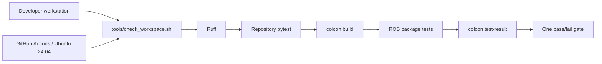

# Development workflow and repository history

| Field | Value |
|---|---|
| Document version | 1.4.0 |
| Last updated | 2026-07-27 |
| Local platform | Linux Mint 22.3, ROS 2 Jazzy, Python 3.12 |
| CI platform | Ubuntu 24.04, ROS 2 Jazzy, Python 3.12 |

## One verification path

Local development and GitHub Actions deliberately finish through the same
command:

```bash
bash tools/check_workspace.sh
```



The script runs Ruff, the repository pytest suite, a symlink-install colcon
build, the package tests, and `colcon test-result --verbose`. It sets
`PYTHONNOUSERSITE=1` and prepends the project venv to `PYTHONPATH` so system ROS
packages and pinned project wheels are visible without loading unrelated wheels
from `~/.local`.

The venv must be created with system packages enabled:

```bash
source /opt/ros/jazzy/setup.bash
python3 -m venv --system-site-packages .venv
.venv/bin/python -m pip install --upgrade pip
.venv/bin/python -m pip install -r requirements-dev.txt
```

This environment boundary matters because ROS Jazzy's Python extensions come
from Ubuntu packages, while `usd-core`, NumPy, pytest, and Ruff come from the
project requirements. Isaac Sim remains in `~/isaac/env_isaaclab` and is not
loaded by the ordinary test workflow.

## Continuous integration contract

The repository has one workflow, `.github/workflows/ci.yml`. It:

1. checks out the source with the Node 24-based `actions/checkout@v6`;
2. installs ROS 2 Jazzy with `ros-tooling/setup-ros@v0.7`;
3. creates the same Python 3.12 `--system-site-packages` venv used locally;
4. initializes rosdep if its source list is absent, then always refreshes the
   Jazzy index before resolving package dependencies;
5. calls `bash tools/check_workspace.sh` instead of duplicating test commands.

The workflow has read-only repository permissions. It does not run Isaac Sim,
require a GPU, publish artifacts, deploy software, or mutate external systems.
The installed Isaac smoke remains an explicit workstation activation check.

### Current verification snapshot

| Layer | Current local result | Where it runs |
|---|---|---|
| Ruff | Pass | Local and every GitHub push/PR |
| Repository pytest | 58 passed | Local and every GitHub push/PR |
| ROS build | 3 packages built | Local and every GitHub push/PR |
| ROS package tests | 47 passed, 0 failures | Local and every GitHub push/PR |
| Isaac stage and camera checks | Pass headless and visible | Qualified GPU workstation only |
| Last published camera-integration gate | [Run 30236111462](https://github.com/alexandergmzx/corridor-twin/actions/runs/30236111462) passed | GitHub Actions |

## CI recovery record

The first pushed workflow run,
[`30217884432`](https://github.com/alexandergmzx/corridor-twin/actions/runs/30217884432),
failed in `Install ROS dependencies` before any project test ran. The runner log
reported that rosdep had no local index and instructed the caller to run
`rosdep update`.

Commit `4befe64` (`ci: initialize rosdep and align Python environments`) made four
related corrections:

- conditionally initializes the rosdep source list and unconditionally refreshes
  its Jazzy cache before `rosdep install`;
- removes `actions/setup-python`, whose separate hosted interpreter would split
  pip-installed `usd-core` from Ubuntu's ROS Python packages;
- creates the project venv with `--system-site-packages`;
- replaces three duplicated validation steps with the tested local check script.

It also updated checkout from v4 to v6 to remove the runner's Node 20 deprecation
warning. `ros-tooling/setup-ros@v0.7` resolves to a current 0.7 release whose
action runtime is Node 24.

The replacement run,
[`30221388530`](https://github.com/alexandergmzx/corridor-twin/actions/runs/30221388530),
passed on Ubuntu 24.04 in 3m43s. It completed dependency resolution, lint, 17
repository pytest tests, the three-package colcon build, and 14 package tests.

## Why the baseline has separate commits

The project was initially assembled locally as one root commit, `7ac3bd8`. Before
the GitHub repository was created, that local-only commit was replaced by six
dependency-ordered commits. The final tree was compared by Git tree hash before
the rewrite was accepted, so only history organization changed.

| Commit | Label | Review boundary |
|---|---|---|
| `088fb7a` | `chore: scaffold ROS 2 and Python workspace` | Licencing, requirements, package metadata, and message interfaces |
| `73c0257` | `feat(scene): author parametric OpenUSD corridor` | USD generation, variants, colliders, manifest, occlusion, and scene tests |
| `4bb1ce0` | `feat(observer): estimate speed from camera fiducials` | Perception core, ROS adapter, synthetic publisher, launch, and tests |
| `d19889a` | `docs: record architecture decisions and activation plan` | README, design, feed contract, activation guide, and ADRs |
| `2dfc83d` | `test: add workspace and Isaac verification tools` | Repository contract, local check runner, and installed-version smoke |
| `d202f6d` | `ci: run lint and ROS workspace tests` | The single GitHub Actions workflow |

The split makes subsystem review, regression bisection, and the interview story
clearer than a 3,900-line root commit. It is a dependency narrative, not a claim
that every intermediate commit contains the final CI workflow; the workflow is
introduced by the last baseline commit.

The rewrite occurred before anyone else could base work on the repository. Now
that `main` is shared on GitHub, its published commits must not be rewritten.
Corrections are added as new, narrowly labelled commits.

## Why GPU qualification is split into two commits

The RTX 5070 Ti activation follows the same review-boundary rule without
rewriting the published baseline:

1. `443b1ee` (`test: add GPU qualification modes to Isaac smoke`) adds the
   reusable `nvidia-smi` snapshot and finite visible-viewport mode. That commit
   was exercised headless and with the GUI before it was recorded.
2. The following `docs:` commit records this workstation's measured results,
   the unsupported-Mint qualification, and the resulting design status.

This separation is intentional. The first commit can be reviewed as executable,
machine-independent test behavior; the second contains time- and host-specific
evidence. Future GPU or driver requalification should normally update the
evidence without changing the smoke tool.

## Why the first Isaac/ROS integration is split into three commits

The live camera step has three different review and rollback boundaries:

1. `feat(isaac): publish camera feed and simulation clock` contains only the
   installed-version adapter. It can be reviewed for graph topology, resource
   budget, topic exposure, and the Python 3.11/bundled-Jazzy boundary.
2. `test: add live ROS camera contract probe` adds the external black-box probe
   and CPU AST contract tests. It does not alter the publisher being measured.
3. `docs: record live Isaac ROS camera validation` records host-specific results,
   the rejected early ABI-mixed attempt, measured VRAM, and the architecture
   decision after both executable layers have passed.

This is intentionally not one integration dump. Publisher behavior, independent
verification, and time-specific evidence change for different reasons. The
commits are additive on published `main`; no history is rewritten.

## Why the diagram reconciliation is split into additive commits

The July 27 reconciliation is eight commits, not seven. Its boundaries follow
review and rollback concerns; they do not pretend that geometry, trajectory,
authoring, manifest generation, and visibility can build independently when they
share one coordinate model.

| Commit | Boundary | Why it stands alone |
|---|---|---|
| `77683b9` | Repository conventions | Establishes authorship, environment, and evidence rules before changing behavior |
| `cf632c6` | Supplied PDF | Preserves the interviewer's source independently from its interpretation |
| `9c17f04` | Scene geometry | Keeps the mutually dependent faces, actors, variants, manifest, trajectory, and visibility geometry atomic |
| `0f44da2` | Observer correction | Isolates path-speed conversion and the two-marker acceptance rule from scene authoring |
| `c10856b` | Information-flow contract | Makes A's software unawareness independently reviewable from physical occlusion |
| `ff76480` | Design and ADRs | Records decisions only after the executable geometry and tests exist |
| `e3c1818` | Synthetic truth semantics | Aligns the harness parameter and truth topic with actual path speed |
| `7ebf1ea` | Host-specific requalification | Records measurements separately from machine-independent implementation |

Review then found that the continuous checker enclosed the circular turn by its
endpoint chord. The correction remains additive rather than rewriting those
commits: `fix(scene): make curved-path visibility proof conservative` carries
the implementation and direct regression as `dbb020c`, followed by
`docs: correct visibility proof and requalification record` for ADR 0012,
terminology, evidence provenance, and this history. This leaves one behavioral
commit and one documentation commit with distinct rollback boundaries.

## Why static camera qualification uses separate commits

The static rendered-fiducial milestone has four review boundaries because the
GPU run was a falsification gate, not a predetermined documentation exercise:

| Commit | Boundary | Reason |
|---|---|---|
| `941e0a9 docs: record evidence artifact conventions` | Storage and provenance policy | Defines where nondeterministic output and curated evidence belong before results exist |
| `d3cf2db test(isaac): validate rendered fiducials through the ROS camera path` | Capture, evaluator, CPU controls, and truth isolation | Makes the production-path gate reviewable without claiming that the first GPU run will pass |
| `3f7fa37 fix(scene): mount camera-readable fiducial plates` | Physical target size, quiet zone, wall-relative survey, and direct regressions | Corrects scene defects exposed by real pixels; it can be reviewed or reverted independently of Kit lifecycle handling |
| `bb203c0 fix(isaac): verify the active render-product contract` | Installed Kit warm-up and observed renderer state | Records the mode that survives Hydra product creation rather than conflating requested and active settings |
| Following `docs:` commit | ADR 0013, curated result, diagrams, and measured status | Lands only after the positive gate and the actual-capture negative control pass |

The last two fixes are intentionally not one commit. A wall-intersecting plate is
a portable USD/survey defect; post-create renderer verification is specific to
the installed Isaac 5.1 lifecycle. Their tests and rollback risks differ. The
documentation commit then records measured consequences without hiding the
failed runs that motivated those corrections.

## Documentation growth discipline

| When this changes… | Update at minimum | Add a new ADR when… |
|---|---|---|
| Milestone status or next step | `docs/README.md` capability/growth map | The system boundary or strategy changes |
| Geometry, variants, frames, or scene prims | `docs/DESIGN.md` | The authoring/parameterization decision changes |
| Topics, messages, QoS, timestamps, or permissions | `docs/SENSOR-FEED.md` | A producer/consumer contract changes materially |
| GPU, driver, simulator, VRAM, or live gate result | `docs/ACTIVATION.md` | The supported runtime strategy changes |
| Environment, build, CI, or commit workflow | `docs/DEVELOPMENT.md` | A durable workflow trade-off is selected |
| Durable architectural decision | ADR index plus affected detailed document | Always; accepted ADRs are not edited into a new decision |

Diagrams show stable relationships; tables hold exact versions, measurements,
and statuses. A behavior change should update its diagram and precise table in
the same commit so the visual story cannot drift away from the executable one.

## Commit labels going forward

Use Conventional Commit-style subjects with one review concern per commit:

- `feat(scene):` OpenUSD geometry or scene behavior;
- `feat(observer):` perception or ROS observer behavior;
- `feat(isaac):` installed-version Isaac integration;
- `test:` verification and regression coverage;
- `ci:` automation and runner configuration;
- `docs:` design records, contracts, runbooks, and evidence;
- `fix:` a user-visible defect that does not fit a narrower component scope;
- `chore:` repository maintenance without behavior changes.

Generated `out/`, venv, colcon output, caches, and Isaac runtime state remain
ignored and must not be committed.

## References

- [Official `actions/checkout` releases](https://github.com/actions/checkout/releases)
- [`ros-tooling/setup-ros` releases](https://github.com/ros-tooling/setup-ros/releases)
- [ROS rosdep index behavior](https://docs.ros.org/en/rolling/How-To-Guides/Using-Custom-Rosdistro.html)
- [rosdep documentation](https://docs.ros.org/independent/api/rosdep/html/contents.html)
