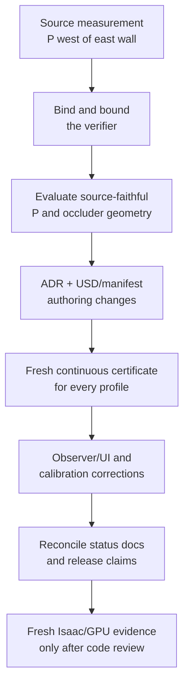

# Implementation handoff: police placement and audit corrections

Date: 2026-07-29  
Audit branch: `audit/police-placement-2026-07-29`  
Audited HEAD: `5c41da9`  
Review baseline: `ebdd9ec`  
Status: **open; release and GPU requalification are paused**

This is the active implementation handoff. It supersedes the older instruction
to requalify the static render immediately. That evidence would describe a
scene whose police placement does not match the supplied drawing, and the
current certificate is not bound to the police actor authored in the USD.

## Outcome Claude must deliver

Make the scene visibly and measurably communicate the supplied scenario:

1. P is on the side of the next-street wall shown in `ROBO_TASK.pdf`, not outside
   the east building.
2. A's one RGB camera cannot see any part of P anywhere on the complete delivery
   trajectory.
3. The occlusion command certifies the actual composed USD and fails if either
   the stage or manifest is independently altered.
4. P still receives only A's camera contract; no pose, odometry, TF, simulator
   truth, second camera, or police-side sensor is introduced.
5. The RViz state, calibration behavior, documentation, and regenerated evidence
   agree with the implementation.

This remains an interview-sized system. Prefer geometry and proof that an
interviewer can understand in a viewport over an elaborate hidden mechanism.

## Why the previous placement is wrong

The committed measurement already contains the decisive evidence:

| Feature in the 300 dpi source render | X range |
|---|---:|
| Next-street clear channel | 1428–1786 px |
| P label | 1651–1758 px |
| East wall | 1786–1850 px |

P is therefore inside the channel and immediately west of the east wall. The
current nominal authored bounds are approximately x=19.1–19.7 m while the east
wall occupies x=18.0–18.5 m, putting P outside/east of the wall.

The source is not metrically scaled, so those pixels do not dictate metres.
They do dictate topology: putting P through the east wall is not a permissible
interpretation of "east side of the junction."

[`ADR 0017`](adr/0017-relocate-p-to-diagram-east-corner.md) acknowledges that
the label is in the open channel, then calls the far side of the east wall "the
diagram's side." That conclusion is the defect. Do not edit the accepted ADR;
write a new ADR that supersedes its placement decision and update the ADR index
and decision graph.

### The real design tension

The prose requires A not to see P. A literal label-center placement in the
current geometry appears visible for part of the route. Do not solve that by
silently moving P outside the drawing again, and do not weaken the requirement
to "A's software ignores P."

Evaluate source-faithful candidates near the inside of the east wall. Use the
existing corner mass plus camera direction where that honestly suffices. If no
such placement can pass, add the smallest visually explicit opaque corner
return, screen, recess, or equivalent structure that can be defended as a demo
geometry choice. Record the choice and rejected alternatives in the new ADR.
Do not add an invisible collider or a verifier-only occluder.

The proof concerns **A-camera visibility**. Physical line of sight, camera
frustum, A's software awareness, and P's network access are distinct. Report
which route intervals are wall-occluded and which are outside the forward
camera frustum; do not relabel one as the other.

## Blocking findings

| ID | Severity | Finding | Required regression |
|---|---|---|---|
| A6-H1 | High | P is authored east of the east wall although the source places it west/inside | A topology test derived from the measured source fails for the old placement and passes for every profile after correction |
| A6-H2 | High | `scene.occlusion.verify()` takes P, route and camera values from the manifest without proving they match the USD | Moving only `/World/Actors/P` into view must make verification fail |
| A6-M1 | Medium | An in-channel/visible P drives recursive certification into pathological subdivision | A visible or frustum-excluded negative control must terminate within a deterministic test budget |
| A6-M2 | Medium | RViz clears a violation using raw speed while the detector uses conservative speed | A boundary measurement must rearm both detector and display identically |
| A6-M3 | Medium | The sensor contract says changed CameraInfo resets the estimator, but the node never detects that change | A K, D, dimensions, distortion-model, or frame change resets the observation window |
| A6-M4 | Medium | `CLAUDE.md`, the documentation map, and release document contain merged/stale state and conflicting evidence values | Repository citation/status tests cover the canonical generated facts or stale values are removed |
| A6-L1 | Low | Lane-width and finite-dimension validation fail late or with misleading errors | Non-finite dimensions and an impossibly narrow lane fail at the configuration boundary with specific messages |

## Required execution order



### 1. Lock the audit defects down with failing tests

Add focused tests before changing behavior:

- source topology: P must remain on the source-drawing side of the east wall for
  every authored USD variant;
- stage/manifest substitution: a stage-only P translation into A's view fails;
- selected variant and stage-derived P bounds agree with the manifest;
- a visible control finishes promptly instead of exhausting recursive depth;
- conservative compliance clears the display episode;
- a material CameraInfo change resets observations;
- NaN/infinity and impossible lane geometry fail at their input boundary.

Do not make a test pass by inspecting source text, pinning the current constant,
or asking the manifest to validate itself.

### 2. Repair the verifier before trusting a new geometry

At minimum, derive or compare these facts from the composed stage after selecting
the requested `corridorProfile` variant:

- `/World/Actors/P` world-space body bounds;
- camera world transform and horizontal field of view;
- the active variant;
- collision/opaque wall geometry used for the USD ray audit;
- route/camera mount facts that remain manifest-owned.

Reject a missing profile or any stage/manifest mismatch with a useful diagnostic.
A provenance hash may supplement these comparisons but must not replace checking
the critical authored values.

Separate the following certificate results:

- outside the camera frustum;
- inside the frustum but blocked by opaque geometry;
- visible or unresolved.

A proven frustum exclusion may terminate that camera-visibility branch. If a
stronger reciprocal wall-line-of-sight claim is retained, calculate and report
it separately instead of making camera certification recurse exponentially.

### 3. Reconcile P and the corner geometry

Generate candidate scenes under `out/`; do not overwrite committed evidence.
For each candidate, save a top view showing A's route, camera headings/frusta,
P's complete body box, and the blocking surface. Compare it with
`docs/evidence/source-diagram/measured-drawing.png`.

The selected geometry must satisfy all of these:

- P remains west of the east wall's inner face, on the side shown in the source;
- P does not intersect opaque geometry;
- P has a credible standing area and does not obstruct A's delivery route;
- no part of P is camera-visible over the continuous route for every profile;
- the negative visible control fails;
- visual inspection makes the concealment understandable without reading code;
- USD, manifest, YAML, tests, screenshots and prose use the same placement.

Write the superseding ADR in the same logical slice. Preserve ADR 0017 as an
immutable historical record and mark its supersession in the index.

### 4. Regenerate dependent scene artifacts

The geometry change may affect the route, marker visibility, reference plates,
policy-width stations, RViz walls, and saved viewpoints. Recompute them from the
single scenario model; do not introduce a second set of simulator-only numbers.

Run the portable scene, trajectory, synthetic observer, renderer-contract and
truth-isolation tests. Regenerate certificates for every authored profile. Do
not promote GPU screenshots or numerical evidence yet.

### 5. Correct observer/display contract drift

- Put the conservative compliance/rearm calculation in one shared function or
  value object used by both the detector and visualization.
- Preserve one event per continuous speeding episode.
- Define a stable calibration identity containing the delivered pixel model.
  A material change resets both station and gate history before processing the
  new frame. Timestamp-only changes do not count as calibration changes.
- Test a change between two gate crossings so mixed-calibration speed cannot be
  emitted.

### 6. Reconcile documentation and release state

Update `CLAUDE.md`, `docs/README.md`, `docs/DESIGN.md`, the ADR index,
`docs/REVIEW-LOG.md`, `docs/SENSOR-FEED.md`, and the release document where their
claims are affected. Remove obsolete instructions such as closing R17 or merging
an already merged pull request.

Prefer links to canonical generated summaries over copying volatile ray counts,
test counts, and VRAM values into several pages. Record this audit as a new review
round with each finding open, fixed, accepted, or explicitly deferred.

### 7. Requalify only after independent review

After the portable implementation is reviewed and stable:

1. rebuild the current USD and manifest;
2. run every-profile continuous certificates and negative controls;
3. run the paired static Isaac capture with renderer readback;
4. run the live camera-only observer and save exact estimator coverage/error;
5. capture the top/camera/RViz views that make P's placement and concealment clear;
6. record Isaac version, GPU, resolution, rate, renderer, VRAM method and output;
7. update release readiness from the new evidence only.

Old images and measurements may remain as historical evidence, but must be
labelled pre-correction and must not support the corrected-geometry claim.

## Suggested commit boundaries

Keep behavior and its regression test together. A defensible sequence is:

1. `test(scene): expose stage-manifest occlusion substitution`
2. `fix(scene): bind visibility proof to composed USD`
3. `fix(scene): bound visibility certification for visible controls`
4. `docs(adr): supersede the police placement decision`
5. `feat(scene): place police on the source-faithful side`
6. `fix(observer): share conservative episode rearm semantics`
7. `fix(observer): reset observations on calibration changes`
8. `fix(scene): reject invalid dimensions at configuration boundary`
9. `docs: reconcile audit findings and interview status`
10. `test(isaac): requalify corrected police geometry` — only when fresh GPU
    measurements exist

Combining adjacent commits is acceptable only when separating them would leave
the repository unbuildable. Explain any deviation in the final report. Do not
squash or rewrite the existing history, and do not add assistant attribution.

## Verification baseline and exit criteria

The audit baseline passed with:

```text
env ROS_LOG_DIR=/tmp/corridor-twin-ros-log bash tools/check_workspace.sh
portable pytest: 173 passed, 1 skipped
colcon: 112 tests, 0 errors, 0 failures, 0 skipped
```

The unredirected ROS test run can fail in a restricted environment when rclpy
cannot create `~/.ros/log`; that is environmental. Use a writable `ROS_LOG_DIR`
and do not weaken a repository test to hide it.

Work is ready for the next independent review only when:

- all blocking findings above have a recorded disposition;
- the old placement fails the new source-topology test;
- stage-only and manifest-only substitution controls fail verification;
- all profiles pass the corrected visibility proof;
- at least one intentionally visible scene fails promptly;
- full workspace checks pass from a clean tree;
- no observer-side subscription consumes truth;
- docs distinguish portable proof from fresh GPU evidence;
- commits are small, labelled, and listed in the handback; and
- the worktree is clean.

## Handback format

Return:

1. commit hash and subject for every new commit, in order;
2. finding-by-finding disposition and the regression proving it;
3. exact commands and test counts;
4. candidate geometry considered and why the selected one matches the source;
5. certificate interval counts split into frustum-excluded, wall-blocked and
   visible/unresolved results for every profile;
6. artifact paths and measured GPU facts, if GPU requalification was performed;
7. any deferred item and the interview claim that must remain provisional; and
8. confirmation that no assistant attribution or truth input was added.
