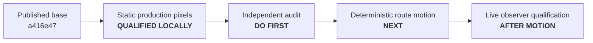

# Incoming review and continuation handoff

| Field | Value |
|---|---|
| Handoff version | 1.0.0 |
| Prepared | 2026-07-27 |
| Branch | `main` |
| Published base | `a416e47` on `origin/main` |
| Last behavior commit to audit | `391773b` |
| Current gate | Independent review of the static production-camera qualification |
| Next implementation slice | Deterministic continuous motion on the authored route |

## Instruction to the incoming reviewer

Independently audit the local commits after `origin/main` before implementing
motion. Treat committed tests and evidence as claims to challenge, not as proof
by themselves. Report findings first, ordered by severity and with file/line
references. If a defect is confirmed, correct it in a new focused commit with a
direct regression; do not rewrite or squash the existing history. If the audit
passes, continue with deterministic motion only, preserving the one-camera and
truth-isolation invariants in `CLAUDE.md`.



## Local commits awaiting review

These commits are local and have not been pushed. Review the actual range with
`git log --reverse origin/main..HEAD`; the documentation commit containing this
handoff will appear after the commits below.

| Commit | Boundary | Why it is separate |
|---|---|---|
| `2e3d1d3 docs: add live Isaac milestone handoff` | Milestone plan | Fixes the order and acceptance gates before implementation |
| `941e0a9 docs: record evidence artifact conventions` | Evidence policy | Defines scratch versus curated artifacts before producing results |
| `d3cf2db test(isaac): validate rendered fiducials through the ROS camera path` | Static capture and evaluator | Adds the production-path probe, CPU controls, and truth-isolation tests without claiming the first GPU run passed |
| `3f7fa37 fix(scene): mount camera-readable fiducial plates` | Portable scene correction | Enlarges codes, adds a quiet-zone backing, and solves wall-normal clearance after real pixels exposed buried and undersampled targets |
| `bb203c0 fix(isaac): verify the active render-product contract` | Installed Kit lifecycle | Checks the renderer state that is active after render-product creation and warm-up |
| `95a39bf docs: record static rendered-fiducial qualification` | Measured result | Records the accepted run, ADR 0013, diagrams, and curated evidence after the executable gates pass |
| `391773b test(observer): make single-marker regression deterministic` | Test-fixture correction | The 40 cm plate change made a hard-coded station expose two tags; the test now explicitly isolates one delivered tag before proving the production estimator rejects the ambiguous frame |

The last commit was discovered by rerunning the complete workspace check while
preparing this handoff. Before `391773b`, the observer behavior was still strict,
but `test_single_marker_frames_are_rejected` no longer constructed the condition
its name claimed and the suite failed. Keep this correction independent of the
earlier scene fix so the causal chain remains visible.

## What may and may not be claimed

| Claim | Current status | Important limit |
|---|---|---|
| One Isaac RGB product publishes synchronized pixels and calibration | Qualified | 640x360 `rgb8` at 15 Hz, nominal profile |
| Surveyed station can be recovered from production pixels | Qualified | Five static approach dwells; maximum accepted error 0.010563 m |
| Negative control detects a broken image/corner convention | Qualified | A mirrored copy of the actual capture produced zero passing frames |
| Observer receives no simulator truth | Covered by source/AST tests and capture topology | Runtime subscription audit belongs to the later live-observer slice |
| Fiducial mounts clear their walls | Covered for every authored profile | Only the nominal profile has been qualified through rendered pixels |
| GPU use is below the project ceiling | Qualified at the accepted checkpoint | 3,024 MiB is one `nvidia-smi` used-memory snapshot, not a time-series peak |
| P remains hidden from A | Qualified by the existing continuous proof and mesh audit | Re-run after any geometry, trajectory, camera, or actor-bound change |
| A follows the route in Isaac | Not implemented | The USD contains the trajectory and static actor pose only |
| Live Isaac pixels produce correct speed/violation output | Not implemented | Synthetic motion and static Isaac pixels are separate qualified layers so far |
| Host is an NVIDIA-supported deployment | False | Hardware gates pass, but Linux Mint remains unsupported; Ubuntu 24.04 is the fallback |

The accepted evidence is summarized in
[`evidence/static-fiducials/NOTES.md`](evidence/static-fiducials/NOTES.md) and
[`evidence/static-fiducials/qualification-summary.json`](evidence/static-fiducials/qualification-summary.json).
The full local capture, truth schedule, evaluator results, and ROS logs currently
remain under `out/evidence/static-fiducials/nominal-final/`. They are ignored
scratch evidence and are not available from a fresh clone.

## Audit checklist

### 1. Establish the exact tree

```bash
git status --short --branch
git log --reverse --format='%H %s' origin/main..HEAD
git diff --check origin/main..HEAD
git diff --stat origin/main..HEAD
```

Do not push, rebase, squash, or amend as part of the audit. Confirm every commit
uses the repository's configured Alexander Gomez identity and contains no
assistant attribution trailers.

### 2. Re-run the portable gate

```bash
bash tools/check_workspace.sh
```

The last clean run on 2026-07-27 produced:

| Layer | Expected result |
|---|---:|
| Ruff | Pass |
| Repository pytest | 74 passed |
| Colcon build | 3 packages built |
| ROS package tests | 52 tests, 0 errors, 0 failures, 0 skipped |

The ament test run currently prints deprecation warnings about implicit `None`
returns; they are not failures, but they should not be silently relabelled as a
clean stderr stream.

### 3. Challenge the recent behavior

Review these questions against implementation, not only prose:

1. Does `tools/ros_aruco_capture.py` receive only `Image`, `CameraInfo`, and
   `/clock`, with no commanded pose, configured speed, odometry, or TF?
2. Does `tools/aruco_render_gate.py` keep pixel-only estimation separate from
   the later file-only truth comparison?
3. Does `tools/isaac_5_1_ros_camera.py` still create exactly one 640x360 RGB
   render product and avoid depth, segmentation, LiDAR, or a police camera?
4. Are Image and CameraInfo stamps, optical frame, complete K matrix, encoding,
   and 15 Hz cadence checked from delivered messages?
5. Is the active renderer contract checked after Hydra product creation and at
   each dwell, rather than inferred from a requested pre-start value?
6. Do the marker corners in the manifest match the canted code plane, and does
   the full `9/7` backing clear the corresponding wall for every profile?
7. Do blank, mirror, phantom-ID, incorrect-calibration, and route-station
   controls fail through the public evaluator entry point?
8. Does the `391773b` fixture really deliver one detected surveyed tag, retain
   the low-residual/wrong-pose counterexample, and prove the default estimator
   rejects it?
9. Do the curated JSON, representative image, exact commands, and prose agree
   with the scratch artifacts and Kit log?

For a true independent GPU rerun, use a new timestamped directory under
`out/evidence/static-fiducials/` and follow the two-shell commands in the static
evidence notes. Do not overwrite `nominal-final`. Require both the fresh
positive gate and an actual-capture negative control. Record the selected GPU,
driver, Isaac build, Kit log, active renderer enum, rate, errors, and memory
snapshot.

### 4. Report the audit before continuing

The review report should contain:

1. findings first, ordered by severity with file/line references;
2. exact commands and observed test counts;
3. whether the GPU capture was rerun or only the saved artifacts were checked;
4. any correction commits, listed in dependency order;
5. claims that remain provisional; and
6. a clear go/no-go decision for deterministic motion.

## Next slice after a passing audit

Implement `PathSpeedProfile` as simulator-independent logic that maps simulation
time to route arc length, then make the installed-version adapter apply
`DeliveryTrajectory.pose_at()` to `/World/Actors/A` before rendering the frame
for the corresponding acquisition stamp.

| Motion acceptance gate | Required proof |
|---|---|
| Constant speed | Route arc length advances at the configured m/s independent of render/update cadence |
| Acceleration | Piecewise acceleration integrates continuously to speed and route station |
| Route joins | Position and yaw stay continuous across line-arc-line joins |
| Bounds | Motion clamps or finishes deterministically; it never wraps without an explicit reset |
| Stamp alignment | The image acquisition stamp corresponds to the pose already applied for that simulation time |
| Profile reset | Variant selection, A-prim reacquisition, trajectory rebuild, clock epoch, and estimator state reset form one paused transition |
| Information flow | Pose and commanded speed remain evaluator/file data and are never observer topics or parameters |
| Resource budget | One existing RGB product remains the only rendered sensor |

Check every new Isaac/Omniverse namespace against the installed 5.1 source. The
intended behavior commit is:

```text
feat(isaac): move robot along the delivery trajectory
```

Run the portable gate and a finite installed-Isaac motion probe before recording
measured documentation. Do not begin live observer qualification, visualization,
or demo hardening in the same commit.
