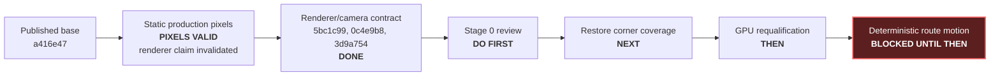

# Incoming review and continuation handoff

| Field | Value |
|---|---|
| Handoff version | 1.3.0 |
| Prepared | 2026-07-27 |
| Branch | `main` |
| Published base | `a416e47` on `origin/main` |
| Last behavior commit to audit | `61bd4c9` plus the corner-enforcement correction |
| Portable gate at this handoff | 117 repository tests, 72 ROS package tests |
| Current gate | Review of corner enforcement before GPU requalification |
| Next implementation slice | Runtime corridor-profile reload, then GPU requalification. **Not motion** |

## Status since handoff 1.1.0

| Commit | What it closed |
|---|---|
| `b81300c` | R6. Four interview-facing pages still called the invalidated run qualified, and the activation table labelled the anti-aliasing enum a renderer enum |
| `73d89de` | R7. `ViolationDetector` rearmed with no compliant measurement, so a steady over-limit run emitted an event every two measurements. ADR 0014 records one-event-per-episode |
| `d19d02f` | The reset defect that review found in `73d89de`: `GateSpeedEstimator` reset itself on a continuity break without telling the detector, so an episode survived a clock jump and suppressed the next offense. Both stages now run through `ObserverPipeline` |
| `61bd4c9` | Reference fiducials restore gates 8.0 and 10.0 with marker roles, schema-0.2 compatibility, and raycast-verified visibility |
| this commit | Corner enforcement made real: the strict zone now contains two gates so a corner-only violation can be confirmed, and the estimator rejects rank-deficient correspondence sets that reintroduced planar-PnP ambiguity past x = 11 |

## Status since handoff 1.0.0

An independent audit of `a416e47..f0f68a1` found three defects, all now closed
by additive commits, and a review of those commits raised five more.

| Commit | What it closed |
|---|---|
| `5bc1c99` | Renderer mode was echoed from the pre-start request into the truth schedule and reached committed evidence under a measured name. It is now read back from both settings trees |
| `0c4e9b8` | Delivered encoding was ungated; the synthetic camera used `cx=(width-1)/2` against production's `width/2`, a 0.5 px gap the gate's 0.5 px tolerance could never detect. Also re-measured synthetic figures that had been stale since the fiducials were enlarged in `3f7fa37` |
| `3d9a754` | The renderer acceptance policy is now a portable helper with direct coverage of every rejecting branch |

A live Isaac 5.1 readback subsequently reported `RaytracedLighting` with AA
enum 3 on both trees, the saved capture passed the tightened gate, and its
mirrored control failed. That observation belongs to a *later* run and does not
retroactively qualify the recorded one.

### Review findings R1–R5

| ID | Severity | Finding | State |
|---|---|---|---|
| R1 | High | The canonical static qualification presented renderer mode as measured although that run predated the readback fix | **Closed by this Stage 0.** Summary preserved byte-for-byte as `qualification-summary-v1-request-echo-invalidated.json`; no canonical qualification exists until the Stage 2 rerun |
| R2 | Medium | Exact synthetic speeds, station-error bands, and the principal-point comparison have no committed command or machine-readable result | **Open, deliberately.** Deferred until after the reference-fiducial geometry lands, because that change will move the figures again |
| R3 | Low | `DESIGN.md` and `SENSOR-FEED.md` metadata did not advance with the changed claims | **Closed by this Stage 0** |
| R4 | Low | This handoff and the `CLAUDE.md` pointer stopped at `391773b` and reported 74 tests | **Closed by this Stage 0** |
| R5 | Low | Renderer-evidence provenance was proved by AST checks that never exercised normalization or rejection | **Closed by `3d9a754`** |

### Gate: no motion yet

Deterministic motion must not begin. Two things block it:

1. There is no canonical static qualification (R1). Motion evidence built on an
   invalidated baseline would inherit the same defect.
2. Enforcement coverage does not reach the corner. Past camera x ≈ 7.5 the wall
   markers fall outside the 75° frustum, so gates 8.0 and 10.0 can never
   produce an estimate and the tightest speed rule — 0.8 m/s, applying at
   x ≥ 10 — cannot be exercised from camera evidence at all. This is a
   renderer-independent FOV obstruction. Stage 1 corrects it with reference
   fiducials on the north-wall extension and the east building face, which lie
   on perpendicular planes and therefore avoid reintroducing planar-PnP
   ambiguity.

Order: Stage 1 coverage, then the Stage 2 GPU requalification of the corrected
geometry, then motion with thresholds taken from that measurement.

## Instruction to the incoming reviewer

Independently audit the local commits after `origin/main`. Treat committed tests
and evidence as claims to challenge, not as proof by themselves. Report findings
first, ordered by severity and with file/line references. If a defect is
confirmed, correct it in a new focused commit with a direct regression; do not
rewrite or squash the existing history.

**Do not continue into motion even if this review passes.** Two gates sit
between here and motion: enforcement coverage must first reach the corner, and
the static qualification must be re-earned on the corrected geometry. Preserve
the one-camera and truth-isolation invariants in `CLAUDE.md` throughout.



## Local commits awaiting review

These commits are local and have not been pushed. Review the actual range with
`git log --reverse origin/main..HEAD`; the documentation commit containing this
handoff will appear after the commits below.

| Commit | Boundary | Why it is separate |
|---|---|---|
| `2e3d1d3 docs: add live Isaac milestone handoff` | Milestone plan | Fixes the order and acceptance gates before implementation |
| `941e0a9 docs: record evidence artifact conventions` | Evidence policy | Defines scratch versus curated artifacts before producing results |
| `d3cf2db test(isaac): validate rendered fiducials through the ROS camera path` | Static capture and evaluator | Adds the production-path probe, CPU controls, and truth-isolation tests without claiming the first GPU run passed |
| `3f7fa37 fix(scene): mount camera-readable fiducial plates` | Portable scene correction | Enlarges codes, adds a quiet-zone backing, and solves wall-normal clearance after real pixels exposed buried and undersampled targets |
| `bb203c0 fix(isaac): verify the active render-product contract` | Installed Kit lifecycle | Checks the renderer state that is active after render-product creation and warm-up |
| `95a39bf docs: record static rendered-fiducial qualification` | Measured result | Records the accepted run, ADR 0013, diagrams, and curated evidence after the executable gates pass |
| `391773b test(observer): make single-marker regression deterministic` | Test-fixture correction | The 40 cm plate change made a hard-coded station expose two tags; the test now explicitly isolates one delivered tag before proving the production estimator rejects the ambiguous frame |
| `f0f68a1 docs: hand off static camera audit and motion slice` | Handoff 1.0.0 | The document this one supersedes |
| `5bc1c99 fix(isaac): measure active renderer mode instead of echoing the request` | Renderer measurement | Closes audit F1. The requested mode had reached evidence under a measured name; the AST regression inspects the serialized dictionary rather than searching for a getter |
| `0c4e9b8 fix(observer): enforce the production camera convention` | Camera contract | Closes F2 and F3, and F4 which they exposed: encoding gated at wire and offline, principal point aligned behind a named 0.05 px criterion, and synthetic figures re-measured after being stale since `3f7fa37` |
| `3d9a754 test(isaac): cover renderer-state enforcement` | Portable policy coverage | Closes R5. The acceptance policy is now Isaac-free and every rejecting branch is exercised without a GPU |

`391773b` was discovered by rerunning the complete workspace check while
preparing handoff 1.0.0. Before it, the observer behavior was still strict, but
`test_single_marker_frames_are_rejected` no longer constructed the condition its
name claimed and the suite failed. Keep this correction independent of the
earlier scene fix so the causal chain remains visible.

## What may and may not be claimed

| Claim | Current status | Important limit |
|---|---|---|
| One Isaac RGB product publishes synchronized pixels and calibration | Qualified | 640x360 `rgb8` at 15 Hz, nominal profile |
| The recorded run used a ray-traced renderer | **Not qualified** | Requested, never read back. Invalidated by R1; a fresh paired run is required |
| Surveyed station can be recovered from production pixels | Qualified | Five static approach dwells; maximum accepted error 0.010563 m |
| Negative control detects a broken image/corner convention | Qualified | A mirrored copy of the actual capture produced zero passing frames |
| Every surveyed gate can be measured from camera evidence | **False** | Gates 8.0 and 10.0 are outside the frustum; the 0.8 m/s corner rule is unreachable until Stage 1 |
| Exact synthetic speed and error figures are reproducible | **Not yet** | R2 open: prose and test bounds only, no committed command or machine-readable result |
| Observer receives no simulator truth | Covered by source/AST tests and capture topology | Runtime subscription audit belongs to the later live-observer slice |
| Fiducial mounts clear their walls | Covered for every authored profile | Only the nominal profile has been qualified through rendered pixels |
| GPU use is below the project ceiling | Qualified at the accepted checkpoint | 3,024 MiB is one `nvidia-smi` used-memory snapshot, not a time-series peak |
| P remains hidden from A | Qualified by the existing continuous proof and mesh audit | Re-run after any geometry, trajectory, camera, or actor-bound change |
| A follows the route in Isaac | Not implemented | The USD contains the trajectory and static actor pose only |
| Live Isaac pixels produce correct speed/violation output | Not implemented | Synthetic motion and static Isaac pixels are separate qualified layers so far |
| Host is an NVIDIA-supported deployment | False | Hardware gates pass, but Linux Mint remains unsupported; Ubuntu 24.04 is the fallback |

The recorded run is described in
[`evidence/static-fiducials/NOTES.md`](evidence/static-fiducials/NOTES.md),
which opens with its invalidation notice, and its summary is preserved
unmodified as
[`evidence/static-fiducials/qualification-summary-v1-request-echo-invalidated.json`](evidence/static-fiducials/qualification-summary-v1-request-echo-invalidated.json).
There is intentionally no `qualification-summary.json`. The full local capture,
truth schedule, evaluator results, and ROS logs remain under
`out/evidence/static-fiducials/nominal-final/`; they are ignored scratch
evidence and are not available from a fresh clone.

## Audit checklist

### 1. Establish the exact tree

```bash
git status --short --branch
git log --reverse --format='%H %s' origin/main..HEAD
git diff --check origin/main..HEAD
git diff --stat origin/main..HEAD
```

Do not push, rebase, squash, or amend as part of the audit. Confirm every commit
uses the repository's configured Alexander Gomez identity and contains no
assistant attribution trailers.

### 2. Re-run the portable gate

```bash
bash tools/check_workspace.sh
```

The last clean run on 2026-07-27 produced:

| Layer | Expected result |
|---|---:|
| Ruff | Pass |
| Repository pytest | 117 passed |
| Colcon build | 3 packages built |
| ROS package tests | 72 tests, 0 errors, 0 failures, 0 skipped |

The ament test run currently prints deprecation warnings about implicit `None`
returns; they are not failures, but they should not be silently relabelled as a
clean stderr stream.

### 3. Challenge the recent behavior

Review these questions against implementation, not only prose:

1. Does `tools/ros_aruco_capture.py` receive only `Image`, `CameraInfo`, and
   `/clock`, with no commanded pose, configured speed, odometry, or TF?
2. Does `tools/aruco_render_gate.py` keep pixel-only estimation separate from
   the later file-only truth comparison?
3. Does `tools/isaac_5_1_ros_camera.py` still create exactly one 640x360 RGB
   render product and avoid depth, segmentation, LiDAR, or a police camera?
4. Are Image and CameraInfo stamps, optical frame, complete K matrix, encoding,
   and 15 Hz cadence checked from delivered messages?
5. Is the active renderer contract checked after Hydra product creation and at
   each dwell, rather than inferred from a requested pre-start value?
6. Do the marker corners in the manifest match the canted code plane, and does
   the full `9/7` backing clear the corresponding wall for every profile?
7. Do blank, mirror, phantom-ID, incorrect-calibration, and route-station
   controls fail through the public evaluator entry point?
8. Does the `391773b` fixture really deliver one detected surveyed tag, retain
   the low-residual/wrong-pose counterexample, and prove the default estimator
   rejects it?
9. Do the curated JSON, representative image, exact commands, and prose agree
   with the scratch artifacts and Kit log?

For a true independent GPU rerun, use a new timestamped directory under
`out/evidence/static-fiducials/` and follow the two-shell commands in the static
evidence notes. Do not overwrite `nominal-final`. Require both the fresh
positive gate and an actual-capture negative control. Record the selected GPU,
driver, Isaac build, Kit log, active renderer enum, rate, errors, and memory
snapshot.

### 4. Report the audit before continuing

The review report should contain:

1. findings first, ordered by severity with file/line references;
2. exact commands and observed test counts;
3. whether the GPU capture was rerun or only the saved artifacts were checked;
4. any correction commits, listed in dependency order;
5. claims that remain provisional; and
6. a clear go/no-go decision for deterministic motion.

## Next slice after a passing review: coverage, not motion

Stage 1 restores enforcement-gate coverage. Near the corner the corridor is
3.0 m wide, so wall markers sit ±1.5 m from the centreline and a marker 2 m
ahead subtends 37°, at the 37.5° half-FOV edge. Denser or larger wall markers
cannot help — the limit is angular, not resolution. Coverage for x ∈ [8, 12]
needs targets 3–8 m ahead, so reference fiducials go on the north-wall
extension and the east building face. Those two planes are perpendicular, which
keeps their combined correspondences non-coplanar and avoids reintroducing the
planar-PnP ambiguity the two-marker minimum exists to prevent.

Marker roles must split at the same time: `MarkerMap.gate_stations_m` is
`sorted({marker.station_m})` today, so a reference plate would silently become
an enforcement gate the robot never crosses.

Because geometry changes, the occlusion certificate re-runs for all three
profiles, and the synthetic figures are re-measured again.

Stage 2 then requalifies on GPU, adding dwells that sample the weak two-tag band
and the previously unreachable region. Only after that does a canonical static
qualification exist again.

## Motion slice, blocked until both gates above pass

Implement `PathSpeedProfile` as simulator-independent logic that maps simulation
time to route arc length, then make the installed-version adapter apply
`DeliveryTrajectory.pose_at()` to `/World/Actors/A` before rendering the frame
for the corresponding acquisition stamp.

| Motion acceptance gate | Required proof |
|---|---|
| Constant speed | Route arc length advances at the configured m/s independent of render/update cadence |
| Acceleration | Piecewise acceleration integrates continuously to speed and route station |
| Route joins | Position and yaw stay continuous across line-arc-line joins |
| Bounds | Motion clamps or finishes deterministically; it never wraps without an explicit reset |
| Stamp alignment | The image acquisition stamp corresponds to the pose already applied for that simulation time |
| Profile reset | Variant selection, A-prim reacquisition, trajectory rebuild, clock epoch, and estimator state reset form one paused transition |
| Information flow | Pose and commanded speed remain evaluator/file data and are never observer topics or parameters |
| Resource budget | One existing RGB product remains the only rendered sensor |

Check every new Isaac/Omniverse namespace against the installed 5.1 source. The
intended behavior commit is:

```text
feat(isaac): move robot along the delivery trajectory
```

Run the portable gate and a finite installed-Isaac motion probe before recording
measured documentation. Do not begin live observer qualification, visualization,
or demo hardening in the same commit.
