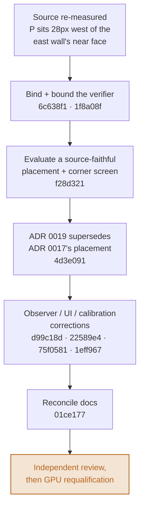
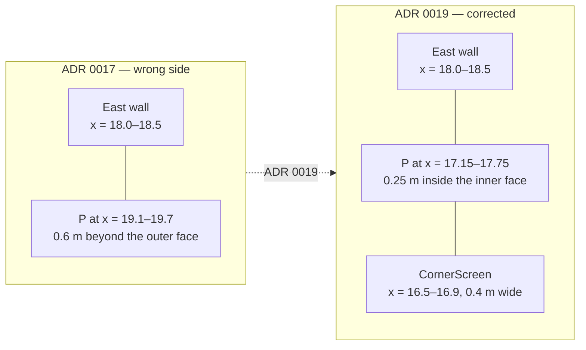

# Police placement audit — resolution

Companion to the checklist in
[`HANDOFF-2026-07-29-POLICE-PLACEMENT-AUDIT.md`](HANDOFF-2026-07-29-POLICE-PLACEMENT-AUDIT.md):
this records what was actually done in response, with the diagrams the
checklist itself doesn't carry. The checklist stays the requirements
document; [ADR 0019](adr/0019-relocate-p-inside-the-east-wall-with-a-corner-screen.md)
stays the durable technical record; [`REVIEW-LOG.md`](REVIEW-LOG.md) stays the
disposition ledger. This page is the walkthrough that ties them together.

| | |
|---|---|
| Branch | `audit/police-placement-2026-07-29` |
| Audited | 2026-07-29 |
| Resolved | 2026-07-30, pending independent review |
| Commits | 9, additive, no rewrites |
| Findings closed | 7 (2 High, 4 Medium, 1 Low) |
| Attribution | none — sole author, no AI trailers, per `CLAUDE.md` |

> **This page describes the round 6 work above the table only.** Independent
> review of that work found five further issues in the implementation itself
> (camera orientation unbound from the certificate, an unreachable validation
> check, a display/detector rearm inconsistency, an incomplete documentation
> fix, and a cosmetic geometry gap) — all fixed; see
> [`REVIEW-LOG.md`](REVIEW-LOG.md)'s Round 7 table for the disposition of
> each. The diagrams and figures below were re-checked against the round 7
> commits and are unaffected by them, except where a round 7 commit is cited
> directly.

## What was wrong

Two defects were severe enough to pause release and GPU work:

1. **P was authored on the wrong side of the wall.** The source drawing places
   P's label 28 px west of the next street's east wall — inside the open
   channel. The committed geometry ([ADR 0017](adr/0017-relocate-p-to-diagram-east-corner.md))
   put P's body beyond the wall's *outer* face instead.
2. **The occlusion verifier trusted the manifest, not the stage.**
   `scene.occlusion.verify()` took P's bounds from the JSON manifest and never
   checked them against `/World/Actors/P` in the composed USD. A stage-only
   translation of P into an open, camera-visible spot passed certification
   unchanged — confirmed by running that exact mutation against the pre-fix
   verifier, which reported `passed=True`.

## Fix pipeline



Six commits close five stages. The sixth — independent review, then fresh GPU
evidence — is deliberately not started here; see "Still open" below.

## Geometry, before and after



| | ADR 0017 (wrong side) | ADR 0019 (corrected) |
|---|---|---|
| P bounds (min–max, m) | x 19.10–19.70 · y 1.50–2.10 | x 17.15–17.75 · y 2.10–2.70 |
| Position | 0.6 m east of the wall's **outer** face | 0.25 m west of the wall's **inner** face, inside the channel |
| Witness | `EastBuilding`, single X-plane | `CornerScreen` (new, 0.4 m wide) + frustum exclusion past the turn |
| Verifier | trusted manifest bounds, unchecked against the stage | derives bounds from `/World/Actors/P`, rejects any mismatch |

The corner screen is the smallest shape the search converged on: 0.4 m wide is
already enough, because the ray from any camera position on the approach or
the early turn crosses the screen's height band within well under a metre of
P's own position. Candidates rejected before it, and why, are in
[ADR 0019](adr/0019-relocate-p-inside-the-east-wall-with-a-corner-screen.md#candidates-measured-before-this-one).

## Findings ledger

| ID | Sev | Finding | Fix | Regression |
|---|---|---|---|---|
| A6-H1 | High | P authored east of the east wall, opposite the measured source | `f28d321` | `test_p_stands_on_the_source_drawing_side_of_the_east_wall` |
| A6-H2 | High | `verify()` took P's bounds from the manifest, never checked against the composed stage | `1f8a08f` | `test_stage_only_police_substitution_is_rejected` |
| A6-M1 | Med | An in-channel/visible P drove recursive certification into pathological subdivision | `6c638f1` | `test_a_genuinely_visible_placement_fails_promptly` |
| A6-M2 | Med | RViz cleared a violation on raw speed while the detector rearmed on conservative speed | `d99c18d` | `test_a_boundary_measurement_rearms_the_display_like_the_detector` |
| A6-M3 | Med | Sensor contract said changed CameraInfo resets the estimator; nothing detected the change | `22589e4` | `test_a_distortion_model_change_resets_the_observation_window` |
| A6-M4 | Med | `CLAUDE.md`, the documentation map, and the release document carried stale/conflicting state | `01ce177` | `test_repository_contract.py` link + figure checks |
| A6-L1 | Low | Lane-width and finite-dimension validation failed late or with misleading errors | `75f0581` | `test_a_non_finite_top_level_dimension_is_rejected_by_name` (+8 more) |

Full narrative per finding, including the false-passes reproduced before each
fix, is in [`REVIEW-LOG.md`](REVIEW-LOG.md)'s Round 6 table.

## Occlusion certificate, per profile

`camera_visible_intervals == ()` on every profile — the written requirement
holds without exception. The stronger claim, that a wall does *all* the
hiding, now holds for the approach and the turn; the legs where A drives away
from P are reported separately as frustum-excluded rather than folded into the
same pass/fail bit ([why](adr/0019-relocate-p-inside-the-east-wall-with-a-corner-screen.md#decision),
point 4).

| Profile | Certificate | Wall-blocked legs | Frustum-only legs | Blocking prim | Nearest (m) | Mesh rays / fail |
|---|---|---|---|---|---:|---:|
| `nominal_m6_n3` | Passed | approach, arc¹ | arc¹, departure, delivery_arc, delivery | `CornerScreen` | 4.144 | 396 / 0 |
| `wide_corner_m6_n4_5` | Passed | approach, arc, departure¹ | departure¹, delivery_arc, delivery | `CornerScreen` | 4.545 | 400 / 0 |
| `uniform_m6_n6` | Passed | approach, arc, departure, delivery_arc¹ | delivery_arc¹, delivery | `CornerScreen` | 4.818 | 406 / 0 |

¹ partial — the screen covers the risky start of that leg, frustum exclusion covers its tail.

## Commits

| Commit | Subject | Why |
|---|---|---|
| `6c638f1` | fix(scene): bound visibility certification for visible controls | 40.7 s / 327,719 entries → a total call budget |
| `1f8a08f` | fix(scene): bind visibility proof to composed USD | `verify()` now derives P's bounds from `/World/Actors/P` |
| `f28d321` | feat(scene): place police on the source-faithful side | P moved inside the wall; `CornerScreen` added |
| `4d3e091` | docs(adr): supersede the police placement decision | ADR 0019, with measured candidates + rejected alternatives |
| `d99c18d` | fix(observer): share conservative episode rearm semantics | one shared function for the detector and RViz |
| `22589e4` | fix(observer): reset observations on calibration changes | K/D/frame/distortion-model change now resets the window |
| `75f0581` | fix(scene): reject invalid dimensions at configuration boundary | NaN/inf now rejected by field name, not late and misleading |
| `1eff967` | fix(observer): update the RViz P label for the corner screen | "hidden by the corner mass" → "...corner screen" |
| `01ce177` | docs: reconcile audit findings and interview status | README, REVIEW-LOG, handoff, release plan, ACTIVATION |

## Workspace check

```bash
env ROS_LOG_DIR=/tmp/corridor-twin-ros-log bash tools/check_workspace.sh
```

| | Baseline | This branch |
|---|---:|---:|
| Portable pytest | 173 passed, 1 skipped | 185 passed, 1 skipped |
| Colcon test | 112 tests, 0 failures | 127 tests, 0 errors, 0 failures, 0 skipped |
| Ruff | clean | clean |
| Working tree | — | clean |

## Still open

Unchanged by this branch, carried forward as recorded in
[`REVIEW-LOG.md`](REVIEW-LOG.md)'s known-open table:

- Independent review of this correction has not run yet — GPU requalification
  stays paused until it does.
- Every GPU/VRAM figure in [`ACTIVATION.md`](ACTIVATION.md) and the
  certificate figures in [`RELEASE-v1.0-interview.md`](RELEASE-v1.0-interview.md)
  predate ADR 0019 and are marked pending-refresh rather than rewritten.
- No canonical static qualification exists; the recorded dwell run predates
  the renderer-readback fix.
- Pose-to-render latency is uncharacterised.
- Live coverage is one corridor profile at one speed.
