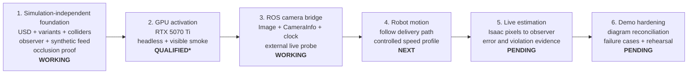
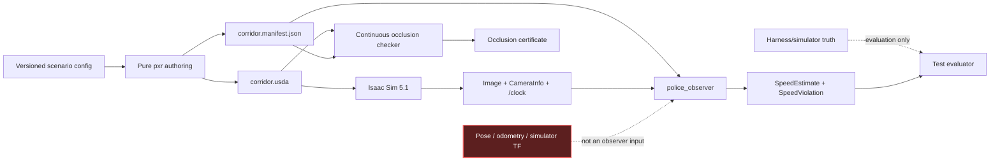

# corridor-twin documentation map

This page is the visual entry point for the project. It shows the current
integration boundary, the evidence behind each completed claim, and the next
increments without requiring a reader to reconstruct status from commit history.

| Field | Value |
|---|---|
| Map version | 1.0.0 |
| Last updated | 2026-07-26 |
| Current milestone | Live Isaac camera contract validated |
| Next milestone | Move A on the authored path and measure speed from live pixels |

## Read the documentation in this order

| If you need to understand… | Start here | Typical reading time |
|---|---|---:|
| What exists and what comes next | This page | 3 minutes |
| Why the system is divided this way | [System design](DESIGN.md) | 8 minutes |
| Exactly what P may consume | [Sensor-feed contract](SENSOR-FEED.md) | 6 minutes |
| Whether the workstation is demo-ready | [Activation record](ACTIVATION.md) | 5 minutes |
| How to build, test, commit, and recover CI | [Development workflow](DEVELOPMENT.md) | 7 minutes |
| Why a technical choice was accepted | [ADR index](adr/README.md) | 2 minutes plus selected ADR |
| How to run the demo | [Top-level README](../README.md) | 10 minutes |

## Project growth map

`QUALIFIED*` means all hardware gates passed, but NVIDIA's checker still rejects
Linux Mint as an unsupported operating system. Ubuntu 24.04 remains the fallback.

## Capability and evidence matrix

| Capability | State | Evidence now | Next proof needed |
|---|---|---|---|
| Parametric tapered corridor | Working; dimensions still provisional | Composed-stage width tests for every USD variant | Reconcile A/B/P and policy with supplied diagram |
| Static physics geometry | Working | Ground/building collider schema tests and Isaac smoke | Exercise motion and collision behavior |
| Camera-only speed estimator | Working on synthetic pixels | 1.8 m/s case measured within 0.0026 m/s; below-limit case stays quiet | Measure error from live Isaac images |
| P occlusion | Working | Continuous interval proof plus 226 composed-mesh rays and a failing control | Re-run after any geometry/path change |
| GPU and real-time scene | Conditionally qualified | Hardware gates, headless/visible stage smokes, measured VRAM | Retain Ubuntu fallback because Mint is unsupported |
| Isaac ROS camera contract | Working | Headless and visible external probes: 640×360 RGB, 15 Hz, paired calibration, `/clock` | Connect the moving robot without adding sensors |
| Robot delivery motion | Next | Authored delivery path exists | Deterministic path follower and speed profile |
| Live end-to-end violation | Pending | Synthetic end-to-end path already works | Isaac camera → observer → estimate/violation comparison |

## Evidence boundary

The dashed red relationship is a prohibition, not a data path. The observer is
allowed camera pixels, matching calibration, the surveyed manifest, and time;
truth is available only to evaluation code.

## Current resource envelope

| Resource | Current choice | Growth rule |
|---|---|---|
| RGB render products | 1 | Do not add another until a documented requirement and new VRAM measurement exist |
| Resolution and rate | 640×360 at 15 Hz | Increase only after live estimator accuracy is measured |
| Renderer | Real-time `RaytracedLighting` | No interactive path tracing |
| Sensors | RGB only | No depth, LiDAR, radar, or segmentation in the interview scope |
| Live visible GPU memory | 2,591 MiB total | Remain below the 14,336 MiB soft ceiling |
| Clock sources | Exactly 1 per time mode | Never run competing `/clock` publishers |

## Keeping this map current

Update the milestone, capability matrix, and affected detailed document in the
same change that alters a project claim. Measurements belong in the activation
record, interface changes in the sensor contract, system boundaries in the
design, and durable trade-offs in a new ADR.
