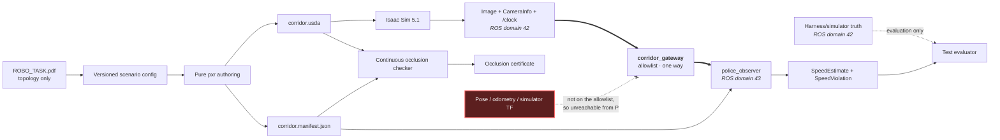

# corridor-twin documentation map

This page is the visual entry point for the project. It shows the current
integration boundary, the evidence behind each completed claim, and the next
increments without requiring a reader to reconstruct status from commit history.

| Field | Value |
|---|---|
| Map version | 1.10.0 |
| Last updated | 2026-08-14 |
| Scenario source | [`ROBO_TASK.pdf`](ROBO_TASK.pdf) |
| Current milestone | **Bring-up is reliable, watched, and half as long.** The deaf-lens failure that cost 2 of 4 runs is gone: corridor sessions run DDS over UDP only (ADR 0040, accepted on a 10-run batch; **0 deaf of 18 runs** on 2026-08-14), the banner's gate demands scan-count *progress* so a burst cannot buy it (ADR 0041), and every fixed wait in bring-up is now its measured event — command → first motion fell **≈131 s → ≈101 s** corridor-side (≈76 s in a 2-run spot-check with the unreviewed fleet branch). Every run now records per-phase durations, DDS matching, and a `/dev/shm` census. [Evidence](evidence/bringup-rework/NOTES.md). *Prior milestone, still standing:* A delivers autonomously and perceives B — governed Nav2 on a live SLAM map, no authored route, 0.061–0.129 m of the standoff on three consecutive runs; robot A = robot1 (ADR 0027); isolation verified (ADR 0026) |
| Next milestone | **Close the map divergence, still the one thing keeping the arrival gate red.** Duplicate-wall extent reads 1.00–1.56 m against a 0.20 m limit, now scored on a masked map whose perfect-SLAM oracle reads 0.000 (ADR 0030). The LINEAR channel is no longer a suspect — calibrated 2026-08-12, 6.3% short on straight driving across seven bags — but the fusion still reports rotation its own input does not contain (0.14×–23.4×, IMU at 0.987–0.993 of truth), and that fix is outside this repo. See [ADR 0029](adr/0029-map-divergence-at-the-corner.md), [`NOTES-fusion-anomaly.md`](evidence/robot-a-gate/NOTES-fusion-anomaly.md), [`NOTES-odometry-scale.md`](evidence/robot-a-gate/NOTES-odometry-scale.md) |
| Phase 3 opener | **P cannot see the corridor from P's own height** — ADR 0019's screen blocks all five enforcement stations. A 1.5 m mast on P's own footprint clears all five in 3-D. Awaiting Alexander's choice: [decision memo](evidence/p_cam_candidates/NOTES.md) |

> Every Isaac Sim and GPU/VRAM figure in the capability matrix and resource
> envelope below predates the 2026-07-29 police-placement correction (ADR
> 0019): the scene P and the camera looked at has since changed shape. None of
> those measurements were retaken against the corrected geometry, matching
> [`ACTIVATION.md`](ACTIVATION.md)'s and
> [`RELEASE-v1.0-interview.md`](RELEASE-v1.0-interview.md)'s own pending-refresh
> banners. Portable, geometry-independent facts (topology, trajectory
> continuity, occlusion certificate results) are current.
>
> Since ADR 0021 a stronger caveat sits above that one: every v1 estimator,
> route, and VRAM figure on this page describes the pre-v2 architecture (A's
> camera as the evidence source) and is **not quotable for v2** — ADR 0022
> retires all v1 certificate numbers. The figures stay because they are true
> of the v1 runs they describe.

## Read the documentation in this order

| If you need to understand… | Start here | Typical reading time |
|---|---|---:|
| The scenario as supplied | [Source task and diagram](ROBO_TASK.pdf) | 2 minutes |
| What exists and what comes next | This page | 3 minutes |
| The active v2 sequence: verified facts, corrections, Day 0–3 plan | [v2 plan](v2-plan.md) | 12 minutes |
| The completed police-placement audit (historical record) | [Police-placement handoff](HANDOFF-2026-07-29-POLICE-PLACEMENT-AUDIT.md) | 8 minutes |
| What earlier reviews found, and how each was dispositioned | [Review log](REVIEW-LOG.md) | 6 minutes |
| Why the system is divided this way | [System design](DESIGN.md) | 8 minutes |
| Exactly what P may consume | [Sensor-feed contract](SENSOR-FEED.md) | 6 minutes |
| Whether the workstation is demo-ready | [Activation record](ACTIVATION.md) | 5 minutes |
| How to build, test, commit, and recover CI | [Development workflow](DEVELOPMENT.md) | 7 minutes |
| Why a technical choice was accepted | [ADR index](adr/README.md) | 2 minutes plus selected ADR |
| What measured evidence supports a claim | [Evidence index](evidence/README.md) | 2 minutes plus selected topic |
| How to run the demo | [Top-level README](../README.md) | 10 minutes |

## Project growth map

```mermaid
flowchart LR
    P1["1. Simulation-independent foundation<br/>USD + variants + colliders<br/>observer + synthetic feed<br/>occlusion proof<br/><b>WORKING</b>"]
    P2["2. GPU activation<br/>RTX 5070 Ti<br/>headless + visible smoke<br/><b>QUALIFIED*</b>"]
    P3["3. Production camera gate<br/>pixels valid, renderer claim<br/>invalidated<br/><b>REQUALIFY</b>"]
    P3b["3b. Corner coverage<br/>gates 8 and 10 restored<br/>reference fiducials<br/><b>WORKING</b>"]
    P4["4. Robot motion<br/>follows the authored route<br/>driven from simulation time<br/><b>WORKING</b>"]
    P5["5. Live estimation<br/>Isaac pixels to observer<br/>4 gates, 1 violation, measured<br/><b>WORKING</b>"]
    P6["6. Demo hardening<br/>one launch path + RViz<br/>rehearsed, fallback recorded<br/><b>WORKING</b>"]
    P3c["3c. GPU requalification<br/>retired by ADR 0022:<br/>no v1 number is quotable for v2<br/><b>RETIRED</b>"]
    P7["7. Latency + remaining profiles<br/>pose-to-render offset<br/>other (m,n) variants<br/><b>RETIRED</b>"]
    V2["8. v2 corrections<br/>ADRs 0021&ndash;0025 recorded<br/>fleet gate, Nav2, detector ahead<br/><b>DONE</b>"]
    V3["9. Isolation + robot A<br/>certificate green, mutation red<br/>A = robot1, gate failed for robot2<br/><b>DONE</b>"]
    V4["10. Autonomous delivery<br/>emergent route to B&apos;s standoff<br/>0.244 m, world frame from truth<br/><b>WORKING</b>"]
    V5["11. A perceives B<br/>geometric landmark, laser frame<br/>2.4&ndash;2.8 m, 3 frames to confirm<br/><b>WORKING</b>"]
    V6["12. Map divergence<br/>fusion reports 0.14&ndash;23.4x its input<br/>arrival gate RED until fixed<br/><b>BLOCKER</b>"]
    V6b["12b. Bring-up rework<br/>0 deaf of 18 (UDP-only, ADR 0040)<br/>command&rarr;motion 131&rarr;~101 s<br/><b>DONE</b>"]
    V7["13. Learned enforcement detector<br/>ADR 0024, synthetic-first<br/><b>NEXT</b>"]

    P1 --> P2 --> P3 --> P3b --> P4 --> P5 --> P6 --> P3c
    P6 --> V2 --> V3 --> V4 --> V5 --> V6 --> V7
    V6 --> V6b --> V7
    P3c -.-> P7

    classDef blocked fill:#5c1f1f,color:#ffffff,stroke:#ff6b6b,stroke-width:2px;
    class P3c blocked;
    class P7 blocked;
    class V6 blocked;
```

`QUALIFIED*` means all hardware gates passed, but NVIDIA's checker still rejects
Linux Mint as an unsupported operating system. Ubuntu 24.04 remains the fallback.

## Capability and evidence matrix

| Capability | State | Evidence now | Next proof needed |
|---|---|---|---|
| Parametric tapered corridor | Working; topology reconciled | One-sided taper measured from the composed stage for every USD variant | None; metric scale stays a declared demo choice |
| Next street, junction, corner mass, corner screen | Working | Convex collider prims per variant; B placed from the wall faces, P from the east wall's inner face and the corner screen (ADR 0019) | Drive A through the junction |
| Continuous delivery trajectory | Working | Position and yaw continuous at both joins; every arc sample in drivable space | Follow it in Isaac |
| Static physics geometry | Working | Ground/building collider schema tests and Isaac smoke | Exercise motion and collision behavior |
| Camera-only station/speed estimator | **Working on live Isaac pixels** | All four gates measured in a live run; max speed error 0.0369 m/s at 1.0 m/s truth; one violation at the corner. [Evidence](evidence/live-demo/NOTES.md) | Repeat across the other `(m,n)` profiles |
| P occlusion | Working; verifier bound to the composed USD | Conservative arc enclosure over P's full volume, curved-source false-pass regression, a bounded recursion search (A6-M1), stage/manifest substitution negative controls (A6-H2), and the corner screen closing the approach and the risky part of the turn (ADR 0019). 396 composed-mesh rays on the nominal profile, zero failures. `camera_visible_intervals == ()` on every profile; the stronger wall-only claim now holds for the approach and the turn, with the remaining legs reported separately as frustum-excluded | Independent review, then re-run after any further geometry/path change |
| GPU and real-time scene | Conditionally qualified | Hardware gates, headless/visible stage smokes, measured VRAM | Retain Ubuntu fallback because Mint is unsupported |
| Isaac ROS camera contract | Pixels qualified; **renderer claim invalidated** | 640×360 RGB at 15 Hz; paired calibration; five static dwells pass; mirrored actual capture fails. The run's renderer mode was requested, never read back | Fresh paired requalification with measured renderer state |
| Corner enforcement coverage | **Confirmed on rendered Isaac pixels** | Height-staggered reference plates carry the pose through the strict zone in a real render; gates 8.0 and 10.0 both measured, so the corner rule is confirmable. [Frame](evidence/live-demo/corner-references.png) | Repeat after any geometry change |
| Robot delivery motion | **Working** | A completes the 24.601 m five-piece route in 24.617 s of simulation time, driven from `/clock`; `reached_end=True` | Measure the pose-to-render latency, which is still uncharacterised |
| Live end-to-end violation | **Working** | One command runs Isaac → camera → observer → RViz; exactly one violation at station 10.0 m, exceedance 0.191 m/s, 3354 MiB VRAM, one render product | Rehearse the GUI path and the recorded fallback on the presentation machine |
| **Autonomous delivery to B** | **Working; arrival gate RED** | Governed Nav2 on a live SLAM map with **no authored route**. A leaves the corridor mouth, turns the corner and reaches the delivery standoff beside B on every run that got a goal: closest approach **0.244 / 0.404 / 0.574 / 0.647 / 0.774 m**, measured in **world frame from simulator truth** because the map-frame number is not trustworthy. The goal is a standoff, never B's centre — the RTX lidar sees render geometry, so B is a costmap obstacle and its centre is unreachable at any tolerance. [ADR 0028](adr/0028-goal-directed-navigation-on-a-live-map.md) | Pass the unchanged arrival gate (Nav2 `SUCCEEDED`, ≤ 0.15 m map-frame). Blocked on the map |
| **A perceives B** | **Working** | **B *is* the cylinder** since [ADR 0031](adr/0031-b-is-the-cylinder.md) — one object at the delivery point, detected **geometrically**: cluster, fit a circle, require both a small residual and the manifest's authored radius. Taken in the **laser frame**, so it is true whatever the map believes. Never intensity-based: sim-vs-real intensity fidelity is unowned here. The figures below were measured against the superseded beside-B post (authored radius 0.063 at the old scale) and are kept as the record of that geometry, not quoted for this one: acquired at **2.763 m** and **2.409 m**, confirmed in **exactly 3 frames** (the 3-of-5 minimum), tracked to **0.309 m**, fitted radius 0.0665/0.0723 m. [Evidence](evidence/robot-a-gate/NOTES-landmark.md) | Re-measure acquisition against the merged B, and log distance-to-B at `DELIVERED` |
| **SLAM map through the corridor** | **Working** | `slam_lens`, attached from the first transform: scan-to-map fit **0.752–1.000**, SLAM-pose-vs-truth divergence **0.000–0.022 m**. Two centimetres | Hold it past the corner |
| **SLAM map at the far end** | **BROKEN — the one open blocker** | Duplicate wall extent **0.740–2.680 m** against an authored "perfect SLAM" reference that scores **0.000 m**. Seven causes eliminated by measurement (motion sources, calibration, rate, sign, simulator slowdown, system load, corridor shape); loop closure **falsified** by test. What remains: `robot_localization` reports **0.14×–23.4×** its own input's rotation, from an IMU measuring 0.987–0.993 of truth, and it never jumps — continuous over-integration. [ADR 0029](adr/0029-map-divergence-at-the-corner.md) | A fleet-side fix: IMU covariances or the filter's config. Not reachable from this repo |
| Local controller | DWB, on numbers | MPPI arm built and tested to differ in exactly one block; it aborted after ~0.5 m with its control loop at **4.8–11.8 Hz against a configured 20 Hz**. DWB reached B on five transits of five. [Evidence](evidence/robot-a-gate/NOTES-u3-controllers.md) | Retry MPPI at a smaller batch before drawing an algorithmic conclusion |
| Communication-domain isolation | **Working** | A on ROS domain 42, P on 43, crossed only by a three-topic one-way allowlist. Proved with no GPU and no Isaac: the police domain cannot discover A's camera topic, no message crosses unbridged, and every negative is paired with a positive control that skips rather than passes. Forcing both probes onto one domain fails 2 of 3 DDS tests. [ADR 0020](adr/0020-communication-domain-isolation.md) | Confirm on the live Isaac path, which this branch does not requalify |
| **Reliable, watched bring-up** | **Working** | Deafness **0 of 18 runs** under UDP-only (ADR 0040; baseline 2 of 4), the seeing gate demands count **progress** across two reads (ADR 0041 — the old rate gate passed a burst-then-dead lens), and every run records per-phase durations, per-topic DDS matching, and a `/dev/shm` census. Fixed waits replaced by their events: contract sampled in parallel, settle on first-map, Nav2's manager on `get_state` discoverability (0.1 s measured vs the 5 s timer). Command → first motion **≈131 → ≈101 s** corridor-side; **≈76 s** with the fleet simctl branch (2-run spot-check, unreviewed). The synthetic churn repro did **not** reproduce the deafness — mechanism bounded, fix empirical. [Evidence](evidence/bringup-rework/NOTES.md) | Merge review of fleet `simctl-events-2026-08-14`, then an 8-run batch before quoting ≈76 s; lens∥simctl overlap decision |

## Evidence boundary

The diagram shows the **v1** boundary as implemented and running today. ADR
0021 supersedes the crossing — in v2 the feed through the gateway is P's own
camera (`/p_cam/*`), A is camera-less, and the requirement gate is the
isolation certificate; the diagram is redrawn when that bridge is rebuilt
(v2 plan task T2.1).

The dashed red relationship is a prohibition, and since ADR 0020 it is also an
impossibility: those producers sit on A's ROS domain and are absent from the
gateway allowlist, so they never appear in P's graph. The observer is allowed
camera pixels, matching calibration, the surveyed manifest, and time; truth is
available only to evaluation code. The manifest reaches P as a file, so it
crosses no domain boundary at all.

## Current resource envelope

| Resource | Current choice | Growth rule |
|---|---|---|
| RGB render products | 1 | Do not add another until a documented requirement and new VRAM measurement exist |
| Resolution and rate | 640×360 at 15 Hz | Increase only after live estimator accuracy is measured |
| Renderer | Real-time `RaytracedLighting` | No interactive path tracing |
| Sensors | RGB only (v1) | No depth, radar, or segmentation in the interview scope. In v2 the one RGB render product becomes P's enforcement camera and A navigates on the fleet twin's contract lidar — a sensor, never an evidence source (ADRs 0021/0023) |
| Current one-product GPU memory | 3,354 MiB headless, the live demonstration's own recorded figure (see the banner above: this predates ADR 0019 and needs a fresh capture). A later R17 plate relocation measured 3,486 MiB headless on the *pre-ADR-0019* geometry only; that number describes neither the live-demo run cited elsewhere on this page nor the corrected geometry, and is not carried here to avoid implying either | Remain below the 14,336 MiB soft ceiling |
| Clock sources | Exactly 1 per time mode | Never run competing `/clock` publishers |

## Keeping this map current

Update the milestone, capability matrix, and affected detailed document in the
same change that alters a project claim. Measurements belong in the activation
record, interface changes in the sensor contract, system boundaries in the
design, and durable trade-offs in a new ADR.
