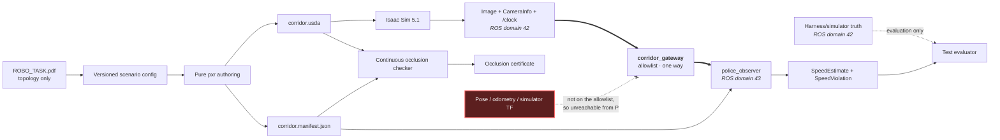

# corridor-twin documentation map

This page is the visual entry point for the project. It shows the current
integration boundary, the evidence behind each completed claim, and the next
increments without requiring a reader to reconstruct status from commit history.

| Field | Value |
|---|---|
| Map version | 1.7.0 |
| Last updated | 2026-08-11 |
| Scenario source | [`ROBO_TASK.pdf`](ROBO_TASK.pdf) |
| Current milestone | v2 decisions recorded: ADRs 0021–0025 land the three interview corrections — P owns the camera and the isolation certificate gates, robot A is selected by a measured fleet-twin gate, autonomy is governed Nav2 on live SLAM at robot-scale policy, enforcement perception is a learned detector with an ArUco baseline, and the repo joins the fleet workspace. See the [v2 plan](v2-plan.md) |
| Next milestone | v2 Day 1: fleet membership executed (symlink, pin, ledger, arena composer) and the isolation verification measured — ADR 0026. See the [v2 plan](v2-plan.md) §4–§5 |

> Every Isaac Sim and GPU/VRAM figure in the capability matrix and resource
> envelope below predates the 2026-07-29 police-placement correction (ADR
> 0019): the scene P and the camera looked at has since changed shape. None of
> those measurements were retaken against the corrected geometry, matching
> [`ACTIVATION.md`](ACTIVATION.md)'s and
> [`RELEASE-v1.0-interview.md`](RELEASE-v1.0-interview.md)'s own pending-refresh
> banners. Portable, geometry-independent facts (topology, trajectory
> continuity, occlusion certificate results) are current.

## Read the documentation in this order

| If you need to understand… | Start here | Typical reading time |
|---|---|---:|
| The scenario as supplied | [Source task and diagram](ROBO_TASK.pdf) | 2 minutes |
| What exists and what comes next | This page | 3 minutes |
| What must be corrected before requalification | [Active implementation handoff](HANDOFF-2026-07-29-POLICE-PLACEMENT-AUDIT.md) | 8 minutes |
| What earlier reviews found, and how each was dispositioned | [Review log](REVIEW-LOG.md) | 6 minutes |
| Why the system is divided this way | [System design](DESIGN.md) | 8 minutes |
| Exactly what P may consume | [Sensor-feed contract](SENSOR-FEED.md) | 6 minutes |
| Whether the workstation is demo-ready | [Activation record](ACTIVATION.md) | 5 minutes |
| How to build, test, commit, and recover CI | [Development workflow](DEVELOPMENT.md) | 7 minutes |
| Why a technical choice was accepted | [ADR index](adr/README.md) | 2 minutes plus selected ADR |
| What measured evidence supports a claim | [Evidence index](evidence/README.md) | 2 minutes plus selected topic |
| How to run the demo | [Top-level README](../README.md) | 10 minutes |

## Project growth map

```mermaid
flowchart LR
    P1["1. Simulation-independent foundation<br/>USD + variants + colliders<br/>observer + synthetic feed<br/>occlusion proof<br/><b>WORKING</b>"]
    P2["2. GPU activation<br/>RTX 5070 Ti<br/>headless + visible smoke<br/><b>QUALIFIED*</b>"]
    P3["3. Production camera gate<br/>pixels valid, renderer claim<br/>invalidated<br/><b>REQUALIFY</b>"]
    P3b["3b. Corner coverage<br/>gates 8 and 10 restored<br/>reference fiducials<br/><b>WORKING</b>"]
    P4["4. Robot motion<br/>follows the authored route<br/>driven from simulation time<br/><b>WORKING</b>"]
    P5["5. Live estimation<br/>Isaac pixels to observer<br/>4 gates, 1 violation, measured<br/><b>WORKING</b>"]
    P6["6. Demo hardening<br/>one launch path + RViz<br/>rehearsed, fallback recorded<br/><b>WORKING</b>"]
    P3c["3c. GPU requalification<br/>measured renderer state<br/>paired dwell capture<br/><b>NEXT</b>"]
    P7["7. Latency + remaining profiles<br/>pose-to-render offset<br/>other (m,n) variants<br/><b>PENDING</b>"]

    P1 --> P2 --> P3 --> P3b --> P4 --> P5 --> P6 --> P3c --> P7

    classDef blocked fill:#5c1f1f,color:#ffffff,stroke:#ff6b6b,stroke-width:2px;
    class P3c blocked;
```

`QUALIFIED*` means all hardware gates passed, but NVIDIA's checker still rejects
Linux Mint as an unsupported operating system. Ubuntu 24.04 remains the fallback.

## Capability and evidence matrix

| Capability | State | Evidence now | Next proof needed |
|---|---|---|---|
| Parametric tapered corridor | Working; topology reconciled | One-sided taper measured from the composed stage for every USD variant | None; metric scale stays a declared demo choice |
| Next street, junction, corner mass, corner screen | Working | Convex collider prims per variant; B placed from the wall faces, P from the east wall's inner face and the corner screen (ADR 0019) | Drive A through the junction |
| Continuous delivery trajectory | Working | Position and yaw continuous at both joins; every arc sample in drivable space | Follow it in Isaac |
| Static physics geometry | Working | Ground/building collider schema tests and Isaac smoke | Exercise motion and collision behavior |
| Camera-only station/speed estimator | **Working on live Isaac pixels** | All four gates measured in a live run; max speed error 0.0369 m/s at 1.0 m/s truth; one violation at the corner. [Evidence](evidence/live-demo/NOTES.md) | Repeat across the other `(m,n)` profiles |
| P occlusion | Working; verifier bound to the composed USD | Conservative arc enclosure over P's full volume, curved-source false-pass regression, a bounded recursion search (A6-M1), stage/manifest substitution negative controls (A6-H2), and the corner screen closing the approach and the risky part of the turn (ADR 0019). 396 composed-mesh rays on the nominal profile, zero failures. `camera_visible_intervals == ()` on every profile; the stronger wall-only claim now holds for the approach and the turn, with the remaining legs reported separately as frustum-excluded | Independent review, then re-run after any further geometry/path change |
| GPU and real-time scene | Conditionally qualified | Hardware gates, headless/visible stage smokes, measured VRAM | Retain Ubuntu fallback because Mint is unsupported |
| Isaac ROS camera contract | Pixels qualified; **renderer claim invalidated** | 640×360 RGB at 15 Hz; paired calibration; five static dwells pass; mirrored actual capture fails. The run's renderer mode was requested, never read back | Fresh paired requalification with measured renderer state |
| Corner enforcement coverage | **Confirmed on rendered Isaac pixels** | Height-staggered reference plates carry the pose through the strict zone in a real render; gates 8.0 and 10.0 both measured, so the corner rule is confirmable. [Frame](evidence/live-demo/corner-references.png) | Repeat after any geometry change |
| Robot delivery motion | **Working** | A completes the 24.601 m five-piece route in 24.617 s of simulation time, driven from `/clock`; `reached_end=True` | Measure the pose-to-render latency, which is still uncharacterised |
| Live end-to-end violation | **Working** | One command runs Isaac → camera → observer → RViz; exactly one violation at station 10.0 m, exceedance 0.191 m/s, 3354 MiB VRAM, one render product | Rehearse the GUI path and the recorded fallback on the presentation machine |
| Communication-domain isolation | **Working** | A on ROS domain 42, P on 43, crossed only by a three-topic one-way allowlist. Proved with no GPU and no Isaac: the police domain cannot discover A's camera topic, no message crosses unbridged, and every negative is paired with a positive control that skips rather than passes. Forcing both probes onto one domain fails 2 of 3 DDS tests. [ADR 0020](adr/0020-communication-domain-isolation.md) | Confirm on the live Isaac path, which this branch does not requalify |

## Evidence boundary

The dashed red relationship is a prohibition, and since ADR 0020 it is also an
impossibility: those producers sit on A's ROS domain and are absent from the
gateway allowlist, so they never appear in P's graph. The observer is allowed
camera pixels, matching calibration, the surveyed manifest, and time; truth is
available only to evaluation code. The manifest reaches P as a file, so it
crosses no domain boundary at all.

## Current resource envelope

| Resource | Current choice | Growth rule |
|---|---|---|
| RGB render products | 1 | Do not add another until a documented requirement and new VRAM measurement exist |
| Resolution and rate | 640×360 at 15 Hz | Increase only after live estimator accuracy is measured |
| Renderer | Real-time `RaytracedLighting` | No interactive path tracing |
| Sensors | RGB only | No depth, LiDAR, radar, or segmentation in the interview scope |
| Current one-product GPU memory | 3,354 MiB headless, the live demonstration's own recorded figure (see the banner above: this predates ADR 0019 and needs a fresh capture). A later R17 plate relocation measured 3,486 MiB headless on the *pre-ADR-0019* geometry only; that number describes neither the live-demo run cited elsewhere on this page nor the corrected geometry, and is not carried here to avoid implying either | Remain below the 14,336 MiB soft ceiling |
| Clock sources | Exactly 1 per time mode | Never run competing `/clock` publishers |

## Keeping this map current

Update the milestone, capability matrix, and affected detailed document in the
same change that alters a project claim. Measurements belong in the activation
record, interface changes in the sensor contract, system boundaries in the
design, and durable trade-offs in a new ADR.
