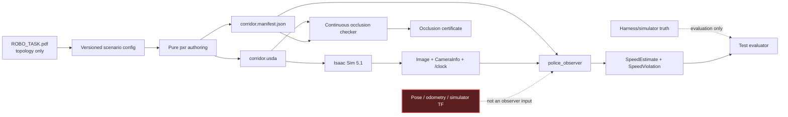

# corridor-twin documentation map

This page is the visual entry point for the project. It shows the current
integration boundary, the evidence behind each completed claim, and the next
increments without requiring a reader to reconstruct status from commit history.

| Field | Value |
|---|---|
| Map version | 1.4.1 |
| Last updated | 2026-07-27 |
| Scenario source | [`ROBO_TASK.pdf`](ROBO_TASK.pdf) |
| Current milestone | Renderer/camera contract corrected; static renderer claim invalidated, so no canonical qualification exists |
| Next milestone | Corner coverage, then GPU requalification, then motion |

## Read the documentation in this order

| If you need to understand… | Start here | Typical reading time |
|---|---|---:|
| The scenario as supplied | [Source task and diagram](ROBO_TASK.pdf) | 2 minutes |
| What exists and what comes next | This page | 3 minutes |
| What the incoming reviewer must verify | [Current handoff](HANDOFF.md) | 6 minutes |
| Why the system is divided this way | [System design](DESIGN.md) | 8 minutes |
| Exactly what P may consume | [Sensor-feed contract](SENSOR-FEED.md) | 6 minutes |
| Whether the workstation is demo-ready | [Activation record](ACTIVATION.md) | 5 minutes |
| How to build, test, commit, and recover CI | [Development workflow](DEVELOPMENT.md) | 7 minutes |
| Why a technical choice was accepted | [ADR index](adr/README.md) | 2 minutes plus selected ADR |
| What measured evidence supports a claim | [Evidence index](evidence/README.md) | 2 minutes plus selected topic |
| How to run the demo | [Top-level README](../README.md) | 10 minutes |

## Project growth map

```mermaid
flowchart LR
    P1["1. Simulation-independent foundation<br/>USD + variants + colliders<br/>observer + synthetic feed<br/>occlusion proof<br/><b>WORKING</b>"]
    P2["2. GPU activation<br/>RTX 5070 Ti<br/>headless + visible smoke<br/><b>QUALIFIED*</b>"]
    P3["3. Production camera gate<br/>pixels valid, renderer claim<br/>invalidated<br/><b>REQUALIFY</b>"]
    P3b["3b. Corner coverage<br/>gates 8 and 10 restored<br/>reference fiducials<br/><b>WORKING</b>"]
    P3c["3c. GPU requalification<br/>measured renderer state<br/>on corrected geometry<br/><b>NEXT</b>"]
    P4["4. Robot motion<br/>follow delivery path<br/>controlled speed profile<br/><b>BLOCKED</b>"]
    P5["5. Live estimation<br/>Isaac pixels to observer<br/>error and violation evidence<br/><b>PENDING</b>"]
    P6["6. Demo hardening<br/>failure cases + evidence pack<br/>launch path + rehearsal<br/><b>PENDING</b>"]

    P1 --> P2 --> P3 --> P3b --> P3c --> P4 --> P5 --> P6

    classDef blocked fill:#5c1f1f,color:#ffffff,stroke:#ff6b6b,stroke-width:2px;
    class P4 blocked;
```

`QUALIFIED*` means all hardware gates passed, but NVIDIA's checker still rejects
Linux Mint as an unsupported operating system. Ubuntu 24.04 remains the fallback.

## Capability and evidence matrix

| Capability | State | Evidence now | Next proof needed |
|---|---|---|---|
| Parametric tapered corridor | Working; topology reconciled | One-sided taper measured from the composed stage for every USD variant | None; metric scale stays a declared demo choice |
| Next street, junction, corner mass | Working | Convex collider prims per variant; B and P placed from the wall faces | Drive A through the junction |
| Continuous delivery trajectory | Working | Position and yaw continuous at both joins; every arc sample in drivable space | Follow it in Isaac |
| Static physics geometry | Working | Ground/building collider schema tests and Isaac smoke | Exercise motion and collision behavior |
| Camera-only station/speed estimator | **Working on live Isaac pixels** | All four gates measured in a live run; max speed error 0.0371 m/s at 1.0 m/s truth; one violation at the corner. [Evidence](evidence/live-demo/NOTES.md) | Repeat across the other `(m,n)` profiles |
| P occlusion | Working | Conservative arc enclosure over P's full volume, curved-source false-pass regression, 204 composed-mesh rays, and a visible control | Re-run after any geometry/path change |
| GPU and real-time scene | Conditionally qualified | Hardware gates, headless/visible stage smokes, measured VRAM | Retain Ubuntu fallback because Mint is unsupported |
| Isaac ROS camera contract | Pixels qualified; **renderer claim invalidated** | 640×360 RGB at 15 Hz; paired calibration; five static dwells pass; mirrored actual capture fails. The run's renderer mode was requested, never read back | Fresh paired requalification with measured renderer state |
| Corner enforcement coverage | **Confirmed on rendered Isaac pixels** | Height-staggered reference plates carry the pose through the strict zone in a real render; gates 8.0 and 10.0 both measured, so the corner rule is confirmable. [Frame](evidence/live-demo/corner-references.png) | Repeat after any geometry change |
| Robot delivery motion | **Working** | A completes the 23.851 m route in 23.867 s of simulation time, driven from `/clock`; `reached_end=True` | Measure the pose-to-render latency, which is still uncharacterised |
| Live end-to-end violation | **Working** | One command runs Isaac → camera → observer → RViz; exactly one violation at station 10.0 m, exceedance 0.194 m/s, 3411 MiB VRAM, one render product | Rehearse the GUI path and the recorded fallback on the presentation machine |

## Evidence boundary

The dashed red relationship is a prohibition, not a data path. The observer is
allowed camera pixels, matching calibration, the surveyed manifest, and time;
truth is available only to evaluation code.

## Current resource envelope

| Resource | Current choice | Growth rule |
|---|---|---|
| RGB render products | 1 | Do not add another until a documented requirement and new VRAM measurement exist |
| Resolution and rate | 640×360 at 15 Hz | Increase only after live estimator accuracy is measured |
| Renderer | Real-time `RaytracedLighting` | No interactive path tracing |
| Sensors | RGB only | No depth, LiDAR, radar, or segmentation in the interview scope |
| Current one-product GPU memory | 3,024 MiB in the static rendered-fiducial gate | Remain below the 14,336 MiB soft ceiling |
| Clock sources | Exactly 1 per time mode | Never run competing `/clock` publishers |

## Keeping this map current

Update the milestone, capability matrix, and affected detailed document in the
same change that alters a project claim. Measurements belong in the activation
record, interface changes in the sensor contract, system boundaries in the
design, and durable trade-offs in a new ADR.
