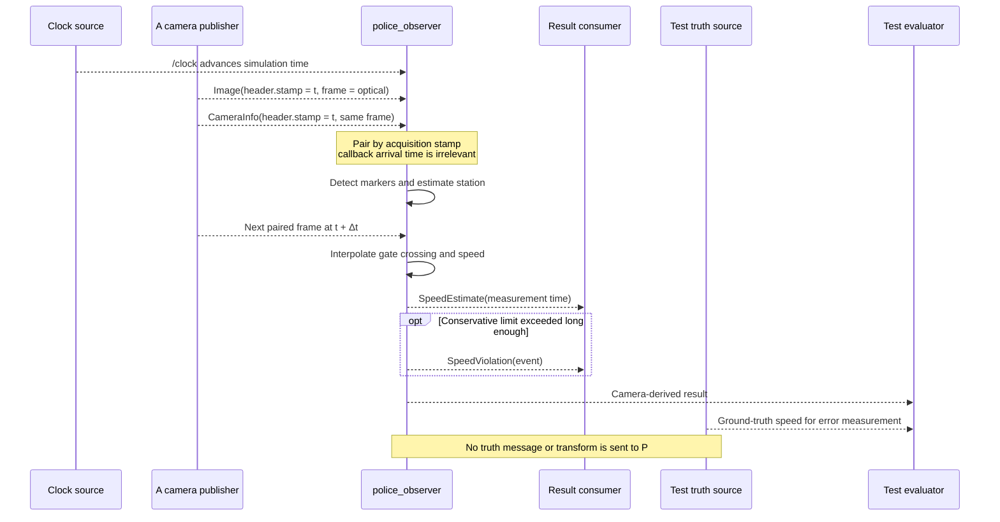

# Robot camera to police observer contract

| Field | Value |
|---|---|
| Contract version | 0.3.1 |
| Status | Implemented by synthetic and Isaac 5.1 publishers; live Isaac contract validated |
| Last updated | 2026-07-26 |

## Scope

P may read A's front-camera image and calibration data. P has no direct line of
sight and the `police_observer` must not consume ground-truth pose, odometry,
simulator transforms, or test truth.

Topic names in node code should be relative and remappable. The table shows the
resolved demo names.

## Evidence access matrix

| Evidence | Producer/source | `police_observer` may consume? | Test evaluator may consume? | Why |
|---|---|:---:|:---:|---|
| RGB image | A's camera publisher | Yes | Yes | Primary indirect observation |
| Camera calibration | Same publisher/render product | Yes | Yes | Converts pixels into geometric rays |
| Surveyed marker map and width policy | Versioned scenario manifest | Yes | Yes | Known infrastructure, not robot truth |
| `/clock` in simulated-time mode | Single active harness or Isaac source | Yes | Yes | Aligns acquisition timestamps |
| Robot ground-truth pose | Simulator/harness | **No** | Yes | Would bypass camera perception |
| Robot odometry | Robot/simulator | **No** | Yes | Would turn the observer into a direct speed reader |
| Simulator-derived robot TF | Simulator | **No** | Yes | Equivalent truth shortcut through another interface |
| Harness truth speed | Synthetic publisher/test harness | **No** | Yes | Used only to quantify estimator error |

The observer's permission boundary is enforced in source/topic contract tests,
not only described here.

## Topics

| Direction | Resolved topic | Type | QoS | Purpose |
|---|---|---|---|---|
| A → P | `/robot/front_camera/image_raw` | `sensor_msgs/msg/Image` | sensor data | Rectified or distortion-described color image |
| A → P | `/robot/front_camera/camera_info` | `sensor_msgs/msg/CameraInfo` | sensor data | Intrinsics and distortion matching the image |
| P → consumers | `/police/speed_estimate` | `corridor_interfaces/msg/SpeedEstimate` | reliable, volatile, depth 10 | Validity, speed, uncertainty, width, and limit |
| P → consumers | `/police/speed_violation` | `corridor_interfaces/msg/SpeedViolation` | reliable, volatile, depth 10 | Debounced event, not a latched alarm |
| harness only | `/test/ground_truth/speed` | `geometry_msgs/msg/TwistStamped` | reliable, volatile, depth 10 | Evaluator reference in `twist.linear.x`; forbidden to observer |
| time source | `/clock` | `rosgraph_msgs/msg/Clock` | best effort, volatile, keep-last depth 1 | Present only in simulated-time modes |

The initial local demo uses raw images. A compressed transport may be added only
after measuring bandwidth and confirming installed Isaac/ROS support; lossy
compression must then be included in estimator accuracy tests.

The installed Isaac adapter maps one render product to separate current-version
`ROS2CameraHelper` and `ROS2CameraInfoHelper` nodes. A single
`ROS2PublishClock` node is the only simulator clock publisher. The graph does not
publish pose, odometry, TF, depth, segmentation, or harness truth.

## Image requirements

- Initial format: `rgb8` or `bgr8`; the configured value must be handled
  explicitly rather than guessed.
- Initial resolution: 640×360.
- Initial rate: 15 Hz.
- `header.stamp`: image acquisition/simulation time.
- `header.frame_id`: `robot_front_camera_optical_frame`.
- Optical axes: X right, Y down, Z forward.
- Empty or zero timestamps are invalid in simulated-time mode.

## CameraInfo requirements

- `header.frame_id` must equal the image frame.
- Width and height must match the image.
- `K`, distortion model, and coefficients describe the delivered pixels.
- For a per-frame publisher, the CameraInfo timestamp must equal the image
  timestamp. A static/transient calibration design requires a separate accepted
  contract revision.
- Changed calibration clears the estimator observation window.

## Estimate semantics

`SpeedEstimate.header.stamp` is the measurement time, normally the later
interpolated gate-crossing time, not publication time. Its frame is
`corridor_map`.

- `station_m`: longitudinal position on the surveyed centerline.
- `speed_mps`: camera-derived longitudinal speed.
- `speed_stddev_mps`: estimated one-sigma uncertainty.
- `corridor_width_m`: width evaluated at the measurement station.
- `speed_limit_mps`: active demonstration limit at that width.
- `gate_from_id` / `gate_to_id`: surveyed gates used for the interval.
- `observation_count`: image observations contributing to the estimate.
- `valid`: false until all timing, geometry, and confidence conditions pass.
- `corridor_profile`: profile whose marker map and width model were used.

Gate IDs are zero-based indices into the manifest's sorted unique marker-station
list. They are not ArUco IDs; north/south markers at one station form one gate.

Invalid estimates may be published for observability but can never produce a
violation.

## Violation semantics

A violation is a reliable, volatile event with a monotonically increasing
process-local event ID. It embeds the complete triggering estimate. The event is
emitted only after the conservative configured comparison and confirmation
duration/consecutive-estimate requirement pass.

Restarting the node may reset the event ID; consumers must combine it with the
header timestamp and publisher identity if global uniqueness is required.

## QoS

Image and CameraInfo use the ROS sensor-data profile: best effort, volatile, and a
small keep-last depth. The observer must not request reliable input from a
best-effort publisher because that pairing is incompatible.

Output estimates and events use reliable, volatile, keep-last depth 10. They are
not transient-local: a late subscriber must not mistake an old violation for a
new one.

## Time modes

### Isaac simulation

- Isaac publishes `/clock`.
- Camera helpers use simulation time, not system time.
- Observer and all launch participants set `use_sim_time=true`.

### Synthetic deterministic playback

- One harness component publishes `/clock` from a steady wall-driven scheduler.
- Synthetic publisher and observer set `use_sim_time=true`.
- Frame headers use the same synthetic timeline.

### Wall-time or hardware

- No `/clock` publisher.
- All participants set `use_sim_time=false`.
- The camera stamps acquisition as close to capture as the driver permits.

The observer clears all temporal state on backward jumps, non-monotonic image
stamps, profile changes, and clock initialization transitions.

The synthetic-clock integration test produced a violation stamped at 4.368859941
seconds on the generated timeline, rather than host wall time. Its camera-derived
speed was 1.7858 m/s for a 1.8 m/s truth input.

## Message timing sequence

## Forbidden dependencies

Production observer code and launch files must not subscribe to:

- `/ground_truth/*` or `/test/ground_truth/*`;
- pose or model-state topics from a simulator;
- odometry used as a speed shortcut;
- a TF transform whose source is simulated robot truth.

TF may eventually express a surveyed static marker map only if an ADR and test
make that distinction explicit. Phase 1 uses the versioned manifest directly.

## Contract acceptance tests

- Image and CameraInfo frames, dimensions, and stamps agree.
- Best-effort camera publishers communicate with the observer.
- Callback arrival jitter does not change an estimate for identical header
  stamps.
- Observer topic introspection shows no truth subscription.
- Backward `/clock` jumps clear gate/debounce history.
- Late violation subscribers do not receive historical events.

The live external probe passed against Isaac Sim 5.1 in both headless and visible
modes on 2026-07-26. Each run observed 12 exactly timestamp-paired RGB
`Image`/`CameraInfo` messages at 640×360 and 15.000 Hz, a monotonic simulation
clock that reached the image stamps, valid zero-distortion pinhole intrinsics,
the required optical frame, best-effort/volatile publishers, and exactly one
publisher on each of the three input/time topics.
