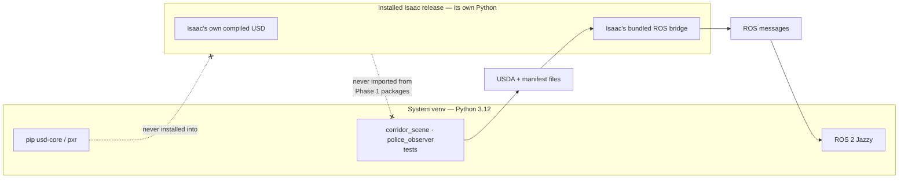

# ADR 0008: Separate ROS/OpenUSD and Isaac runtime environments

- Status: Accepted
- Date: 2026-07-24

## Context

ROS 2 Jazzy uses the system Python 3.12 environment. Pip `usd-core` and Isaac Sim
ship their own compiled USD components. Mixing compiled `pxr` builds or ROS
installations in one interpreter can cause ABI and plugin conflicts.

## Decision

Use a system-Python venv with `--system-site-packages` for ROS, standalone
OpenUSD, and tests. Use the installed Isaac release's own Python/launcher for
Isaac integration. Never install pip `usd-core` into the Isaac environment, and
never import Isaac namespaces from Phase 1 packages.

Data crosses the boundary only as files and messages, drawn as solid arrows.
The two dotted arrows are the prohibitions: no compiled `pxr` and no Isaac
namespace ever spans the line, because that is exactly where the ABI and plugin
conflicts this record exists to avoid would occur.

## Consequences

- Two activation procedures must be documented and kept distinct.
- Data crosses the boundary through USDA/manifest files and ROS messages.
- Version-specific Isaac imports live in a future narrow adapter and are verified
  from the installed release documentation.

## Alternatives considered

- One universal venv: rejected due to compiled library and extension conflicts.
- Conda for ROS binaries: rejected because its interpreter/library stack may not
  match the binary ROS installation.
