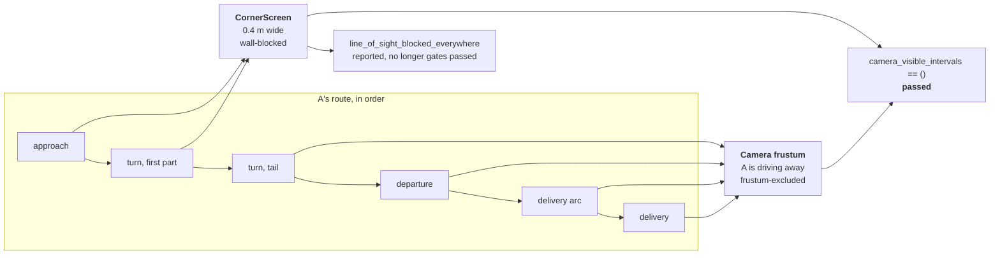

# ADR 0019: Relocate P inside the east wall, behind a purpose-built corner screen

- Status: Accepted
- Date: 2026-07-29
- Source: [`ROBO_TASK.pdf`](../ROBO_TASK.pdf)
- Supersedes the placement decision in
  [ADR 0017](0017-relocate-p-to-diagram-east-corner.md) on new evidence.
  ADR 0017 remains an immutable historical record; this ADR does not edit it.
  Extends [ADR 0010](0010-supplied-diagram-geometry.md) and
  [ADR 0011](0011-visibility-semantics.md), which remain accepted in full.

## Context

An independent audit on 2026-07-29 re-measured the committed source figure
against the committed geometry and found they disagree about which side of the
next street's east wall P stands on:

| Feature in the 300 dpi source render | X range |
|---|---:|
| Next-street clear channel | 1428–1786 px |
| P label | 1651–1758 px |
| East wall | 1786–1850 px |

P's label sits **28 px west of the east wall's near face, inside the clear
channel** — not beyond the wall's far face. ADR 0017 recorded this same
measurement and then concluded the far side was "the diagram's side," which is
the defect this ADR corrects: the drawing places P west of the wall, on the
same side as the whole rest of the scene.

ADR 0017's underlying reasoning is not in question. Read literally, the
drawing puts P in the open street channel where A would see it, and the
written requirement — *the robot cannot see the traffic police* — outranks an
unscaled drawing's exact position, exactly as ADR 0011 already established.
What ADR 0017 got wrong was the specific alternative it chose: it paid for a
simpler proof by moving P to the wall's *outer* face, which is not "the
diagram's side" — it is the side the diagram's own topology rules out.

A second, independent defect compounded the first: `scene.occlusion.verify()`
took P's body bounds from the manifest and never checked them against
`/World/Actors/P` in the composed stage, so a stage-only substitution of P
into an open, camera-visible spot passed certification unchanged (confirmed by
running that exact mutation against the pre-fix verifier: it reported
`passed=True`). That defect is fixed independently in
`fix(scene): bind visibility proof to composed USD` and
`fix(scene): bound visibility certification for visible controls`, both
committed before this placement change, so the geometry decided here is
checked by a verifier that can no longer be fooled by exactly the kind of
placement mistake ADR 0017 made.

## The real design tension

Moving P inside the channel reopens the tension ADR 0017 thought it had
closed for free: P is now on the *same* side of the east wall as A's entire
route, so that wall can no longer separate them with one clean plane. Measured
against the corridor's actual geometry:

- A's approach is aimed almost directly at the corner P now occupies — the
  bearing from A's start to a corner-level target is under 1° off the
  approach heading — so **P is in frustum for the whole approach**. No amount
  of repositioning P within the channel changes this; the corridor points at
  the corner because that is where the street is.
- A's camera reaches as far east as 16.79 m (driving to B), only about a
  metre short of P's own position, so a wall separating "all of A's route"
  from P from a single distant plane would have to reach almost the whole way
  back to A's start to catch the flattest-angle rays — while also reaching
  down close to the ground to catch rays from A's most distant, lowest
  camera positions. That combination has no reasonably sized solution.
- Once A has turned enough that its camera faces away from the corner
  (roughly the last third of the turn onward), P falls outside the 75°
  half-angle by 55° or more at every sampled point — a wide, robust margin,
  not a borderline case.

## Decision

Split the proof by what is actually true of each part of the route, rather
than forcing one mechanism to cover all of it:

1. **Move P inside the channel.** `east_wall_clearance_m` replaces
   `east_offset_m`: P's east face now sits a clearance margin *west* of the
   east wall's inner face, so the body stands inside the street the drawing
   draws it in. `north_offset_m` drops from 1.20 m to 0.60 m — closer to the
   wall, which is *more* faithful to the drawing's "only 20 px south of the
   inner line," and is also what leaves room for the corner screen below it
   to clear A's own driving margin.
2. **Add a corner screen** (`CornerScreen`) that hangs a purpose-built wall
   panel from just above the highest point A's own path (with its 0.3 m
   driving margin) reaches, up to just below P's own body, and reaches east
   from a point close to P's west edge. It is the smallest shape that
   resolved the search: **0.4 m wide** in X is already enough, because the
   ray from any camera position on the endangered legs to P crosses the
   screen's height band within well under a metre of P's own position — the
   crossing point is pulled toward whichever end of the ray is closer to that
   height, and P's end is close. The screen covers the whole approach and the
   dangerous first part of the turn.
3. **Let camera frustum exclusion cover the rest.** Once A has turned away
   (the tail of the turn, the straight lane, the delivery turn, and the final
   run to B), P falls outside the frustum by a wide margin without needing
   any wall at all. This is reported as a separate, weaker claim — see
   "Certificate semantics" below — not folded into the same result as the
   wall-blocked portion.
4. **`Certificate.passed` now means the written requirement alone.**
   `camera_visible_intervals == ()`, full stop. `line_of_sight_blocked_everywhere`
   is still computed and still reported, but it no longer gates `passed`.
   This is a correction, not a new weakening: the module's own occlusion
   proof already distinguished "wall-blocked" from "frustum-excluded" as
   materially different claims, and conflating them into one pass/fail bit
   was a latent defect that happened to never matter while every accepted
   scene achieved full wall coverage. It matters now that a scene can be
   fully compliant with the written requirement while relying on frustum
   exclusion, with a wide margin, for the legs where A is provably driving
   away from P.

Two mechanisms, split by what is actually true of each leg rather than forced
into one. The screen covers the legs where A looks toward the corner; once A
has turned away, no wall is needed and claiming one would be dishonest. The
right-hand column is decision point 4: the written requirement is the pass
bit, and the stronger wall-only claim is reported beside it instead of being
folded into it.

### Why the screen only needs to be 0.4 m wide

The intuition, and the reason the search converged so quickly once framed
this way: for a witness plane at some X between camera and target, the
crossing height is a linear interpolation weighted by how far the plane sits
from each end. A's camera is always well below the screen's band and P is
always just inside it, so as the plane's X approaches P's own X, the crossing
height converges to P's own height regardless of where the camera started.
The screen therefore does not need to reach back toward A to do its job; it
only needs to stand immediately beside P. That also keeps it clear of the
north-wall and east-face reference fiducials mounted a few metres further
back, which a wider screen reaching into their X range would otherwise have
occluded (see "Fiducial relocation" below).

### Candidates measured before this one

| Candidate | Result |
|---|---|
| Screen spanning the whole corridor length (x=[0, P−clearance], y=[corridor-centreline-proxy, north face]) | Passes occlusion, but reaches the north-wall reference plates' X range and occludes them; also the widest, least "smallest defensible" option |
| Screen narrowed to x=[9, P−clearance] (matches the approach's own extent) | Same occlusion result as the full-length version — confirms the west extent was already unnecessary — but still reaches the reference plates at along_m 13 and 15 |
| Screen top face raised to the true north wall | No occlusion benefit over stopping at P's own ceiling (measured identical `visible=()` either way); reaching the wall additionally occludes the reference plates mounted near it |
| **Selected: 0.4 m wide, from just above A's driving-margin envelope to just below P's own body, ending just short of P's west edge** | Passes occlusion on every profile checked; clears every reference fiducial with margin |
| P kept at the drawing's literal label position, in the open channel | Rejected per ADR 0011: A would see it there. Not re-litigated here |
| Reduce P's `minimum_clearance_m` to squeeze a wider gap for the screen | Rejected: clearance protects against floating-point-adjacent placement, not a knob to trade against occlusion geometry |

### Screen height band: a proxy, checked, not proven

`corridor_centerline(profile, length, length) + 0.4` stands in for the
highest point A's own path (with driving margin) actually reaches at the
corner. It is a closed-form quantity available in `geometry.py`; the true
peak requires the full trajectory solve, which `geometry.py` cannot reach
without importing `trajectory.py` and creating an import cycle (`trajectory.py`
already imports from `geometry.py`). Measured against the true, densely
sampled margin envelope, this proxy clears it by 0.10–0.30 m on every
authored and requested profile checked, up to m=10. It is a proxy, not a
proof: `validate_layout` checks the screen against the *built* profile's
`is_clear()`, which now excludes the screen's own footprint, so
`validate_trajectory`'s existing margin-sampling loop is the actual gate
against A's driving margin clipping the screen — not this constant alone.

### Fiducial relocation

Both problems above — screen width and screen height — were each independently
tried against the full reference-fiducial coverage test
(`test_corner_coverage_uses_unoccluded_non_coplanar_references`) before being
accepted, and each first attempt occluded a plate:

| Plate | Old `along_m` | New `along_m` | Why |
|---|---:|---:|---|
| North-wall reference (id 82) | 17.0 | 15.9 | 17.0 sat inside the screen's shadow from the approach on the widened first attempt |
| East-face reference (id 83) | 1.8 | -0.6 | At 1.8 the plate's own top edge (measured 2.3–2.4) sat inside the screen's height band on the least-tapered profiles |
| East-face reference (id 84) | 0.75 | 0.05 | Same conflict, smaller margin — moving 83 down without moving 84 left 84's top edge inside the band on the uniform profile |

The east-face plates' relocation relies on the existing
`max(along_m, band_floor)` clamp (added for a different reason — clearing the
corner mass — before this ADR): a low nominal value lets that mechanism place
each plate correctly per profile rather than pinning one number that only
clears one specific profile's screen. `test_the_band_clamp_moved_no_configured_profile`
is repinned to the three configured profiles' actual resulting positions.

## Certificate results per profile

All measured on the corrected geometry, `verify()` bound to the composed
stage:

| Profile | `passed` | `camera_visible_intervals` | `frustum_only` legs | Blocking prim | Nearest blocking (m) | Mesh audit |
|---|---|---|---|---|---:|---|
| `nominal_m6_n3` | True | `()` | arc (tail), departure, delivery_arc, delivery | `CornerScreen` | 4.144 | 396 rays, 0 failures |
| `wide_corner_m6_n4_5` | True | `()` | departure, delivery_arc, delivery | `CornerScreen` | 4.545 | 400 rays, 0 failures |
| `uniform_m6_n6` | True | `()` | delivery_arc, delivery | `CornerScreen` | 4.818 | 406 rays, 0 failures |

`camera_visible_intervals == ()` on every profile: the written requirement
holds without exception. `CornerScreen` is the sole analytic witness on every
profile; `EastBuilding` remains authored, audited by the mesh raycast, and
retained in the analytic slab list, but is no longer load-bearing for this
placement (`test_removing_the_corner_screen_fails_the_certificate` and the
mesh audit both cover this directly).

## Consequences

- **The proof is no longer a single clean plane.** ADR 0017 prized the east
  wall's single-X-plane witness as "an argument that fits on a whiteboard."
  This placement trades that away because the source topology does not admit
  it: P and A's route are on the same side of the true east wall. The
  replacement argument is two sentences instead of one — a screen for the
  part of the route aimed at the corner, frustum exclusion for the part
  driving away from it — which is still short enough to defend in the
  interview, and it is the one the actual geometry supports.
- **`Certificate.passed` and `line_of_sight_blocked_everywhere` are now
  genuinely different fields.** Any future scene that needs to rely on
  frustum exclusion for part of its route can do so without silently failing
  a stronger bar it was never asked to clear; any caller that wants the
  stronger claim must check `line_of_sight_blocked_everywhere` explicitly.
- **East-face reference fiducials moved substantially** (83: 1.8→-0.6 m,
  84: 0.75→0.05 m along the face) and one north-wall reference moved modestly
  (82: 17.0→15.9 m). Every profile's coverage was re-measured against the
  actual composed meshes, not assumed; see the table above and
  `test_corner_coverage_uses_unoccluded_non_coplanar_references`.
- No change to the speed policy, the enforcement gates, or the estimator. P's
  position and the corner screen are not observer inputs.
- The live-demo evidence under `docs/evidence/live-demo/` describes the ADR
  0017 geometry and is not yet re-measured against this placement; see the
  active handoff for what remains provisional until fresh GPU evidence is
  captured.

## Alternatives considered

- **Keep P behind the east wall's outer face and document the deviation from
  the drawing.** Rejected for the reason the audit raised it: the side is one
  of the few things the drawing states unambiguously, and departing from it
  is not the kind of metric-scale choice ADR 0010 legitimises.
- **A screen spanning the corridor's full length or reaching the true north
  wall.** Rejected: measured to add no occlusion benefit over the selected
  0.4 m, narrow-band design, while occluding reference fiducials the wider
  and taller versions both reach into.
- **Relax the reference fiducials' position instead of the screen's shape.**
  Considered and partially adopted — the fiducials did move — but the screen
  was minimised first because it is new, single-purpose geometry with no
  other consumer, whereas the fiducials carry existing, measured accuracy
  figures that a large move would have invalidated. Moving both a little,
  driven by the actual conflict measured between them, kept both changes
  smaller than moving either alone to satisfy an unnecessarily large screen.
- **Give up the stronger `line_of_sight_blocked_everywhere` claim for the
  approach and turn too, accepting frustum-only reliance everywhere P is
  off-screen.** Rejected: P is genuinely in frustum for the whole approach
  and the first part of the turn — frustum exclusion is not available there
  at any placement, so accepting it would have meant asserting a false claim,
  not a weaker true one.
- **Shrink P's `minimum_clearance_m` to buy more room for the screen.**
  Rejected: clearance exists to keep P off a wall face by a margin that
  survives floating-point rounding, not as a free parameter to trade against
  unrelated occlusion geometry.
