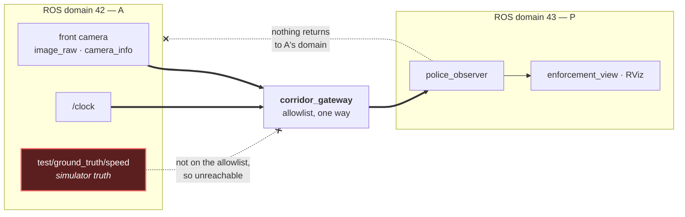

# ADR 0020: Isolate A and P on separate ROS communication domains

- Status: Accepted
- Date: 2026-08-04
- Source: [`ROBO_TASK.pdf`](../ROBO_TASK.pdf), and post-submission interview
  feedback clarifying what its visibility constraint was intended to mean.
- **Amends** one row of [ADR 0011](0011-visibility-semantics.md)'s concept table
  by new record, as required by the immutability rule. ADR 0011's decision — that
  `camera_visible` must be false over every trajectory interval — is untouched,
  still enforced, and still passing.
- Extends [ADR 0003](0003-ros-time-and-clock-discipline.md) and
  [ADR 0008](0008-runtime-environment-boundaries.md).
- **Supersedes nothing.** ADR 0017, 0018 and 0019 decide where P physically
  stands; this record decides nothing about geometry.

## Context

The supplied task states that *the robot cannot see the traffic police, but the
police can read the data from the robot*.

[ADR 0011](0011-visibility-semantics.md) took that sentence as a statement about
what A's camera can image, and rejected reducing it to software information flow
on the grounds that P could stand in plain view while A's code ignored it. The
whole occlusion apparatus follows from that reading: continuous certification
over the turn, the `CornerScreen` of ADR 0019, the relocations of ADR 0017 and
0018.

On 2026-08-04, in the technical interview for this submission, the interviewer
clarified the intended meaning: the constraint was about **ROS 2 / DDS
communication-domain isolation**. A and P were meant to operate on separate
communication planes with no topic-level visibility between them. Not occlusion.

This record exists because that is a reinterpretation, not a discovery, and the
repository should say so plainly rather than retroactively implying the
communication reading was always intended. The geometric reading was a reasonable
construction of an ambiguous English sentence, it was implemented thoroughly, and
it was wrong about the author's intent.

### What the audit found before anything was changed

The reinterpretation turned out to be cheap at the content layer and absent at
the transport layer:

| Question | Finding |
|---|---|
| Does P subscribe to pose, odometry, TF or sim state? | No. The estimate path constructs exactly two subscriptions, `Image` and `CameraInfo`, and `test_estimate_path_subscribes_only_to_the_camera_contract` already enforced it by AST walk |
| Does P read simulator truth by any other route? | No. `test/ground_truth/speed` is published for an evaluator and never subscribed; the evaluator itself is offline and uses no ROS at all |
| Were the two halves ever isolated? | No. No `ROS_DOMAIN_ID`, no partitions, no SROS2 anywhere. Both ran on default domain 0 |
| What breaks under isolation? | `/clock`. See below |

So nothing had to be taken away from P. What had to be added was a boundary.

### The `/clock` trap

Under `use_sim_time`, rclpy's `TimeSource` calls
`node.create_subscription(..., CLOCK_TOPIC, ...)` on the observer's behalf. No
line in `police_observer` constructs it, which is precisely why the AST guard in
`test_repository_contract.py` cannot enumerate it — that file records the gap in
a comment beside its permitted-types set.

Split the domains without carrying `/clock` and the failure is silent: the
observer's clock never advances, `node.py`'s `timestamp_s <= 0.0` branch resets
the pipeline on every frame, and the demonstration publishes zero estimates while
every process stays up and every log looks ordinary.

### Why a crossing is mandatory

Strict isolation with nothing crossing would end the demonstration, because P has
no sensor of its own and cannot be given one:

- `CLAUDE.md`'s one-camera invariant bars a police-side sensor outright.
- [ADR 0002](0002-camera-only-speed-observation.md) derives speed from *A's*
  images against surveyed fiducials.
- The source prose says P reads the data from the robot.

The honest claim is therefore not "nothing crosses." It is "exactly three message
types cross, one way, through a component owned by neither party, and everything
else is unreachable because it was never listed."

## Decision

1. **A and P run on separate ROS domains.** A's publisher (Isaac adapter or
   synthetic stand-in) on `ROBOT_DOMAIN_ID`, default 42; the observer, the
   enforcement display and RViz on `POLICE_DOMAIN_ID`, default 43. DDS discovery
   does not cross a domain boundary, so P cannot discover, list, or subscribe to
   anything A publishes — including topics nobody thought to forbid.
2. **Neither default is 0.** An unconfigured ROS process joins the default
   domain, so a fallback there would silently reunite the halves while every test
   still passed. `tools/run_demo.sh` additionally refuses equal domain ids.
3. **One sanctioned crossing, by allowlist.** The `corridor_gateway` package
   configures the upstream `domain_bridge` to carry exactly
   `/robot/front_camera/image_raw`, `/robot/front_camera/camera_info` and
   `/clock`, one way, A to P, at the QoS `docs/SENSOR-FEED.md` specifies. No
   `reversed`, no `bidirectional`, no `remap`.
4. **Simulator truth stays on A's domain.** `test/ground_truth/speed` is
   published where it originates and is not on the allowlist, so P's inability to
   read truth stops being a policy enforced by source audit and becomes a
   property of the transport.
5. **The geometric gate is retained unchanged.** ADR 0011's `camera_visible`
   requirement, the occlusion certificate, and the `CornerScreen` all stand. They
   are now understood as *physical-scenario realism* — P is concealed in the
   world — rather than as the implementation of the assignment's constraint. Both
   claims are true of the shipped system, and they are separate claims.

The thick arrows are the entire sanctioned surface. Truth is not blocked by a
rule that could be forgotten; it is unreachable because it was never listed, and
a topic added to A tomorrow is invisible to P for the same reason.

## Amendment to ADR 0011

ADR 0011's concept table has four rows. Three are unchanged. The fourth read:

> | P data access | Does P subscribe to A's Image, CameraInfo, and the survey? | Yes |

That describes a mechanism that no longer exists. As amended by this record:

| Concept | Question | Directional? | Enforced by |
|---|---|---|---|
| P data access | Does P **receive a bridged copy** of A's Image and CameraInfo, and hold the survey? | Yes | The gateway allowlist; P cannot subscribe to A directly |
| Communication-domain isolation | Can P discover or subscribe to *any* topic A publishes, other than through the gateway? | Yes | Separate `ROS_DOMAIN_ID`s, proved by `test/test_domain_isolation.py` |

ADR 0011 is not edited. Its file remains the immutable historical record, and its
binding decision is unaffected: `camera_visible` must still be false over every
interval, and the certificate still proves it.

## Verification

| Claim | How it is checked |
|---|---|
| P's domain cannot discover A's camera topic | `test/test_domain_isolation.py`, a node stood up in each domain, asked what it can see |
| No message crosses unbridged | Same file; discovery and delivery asserted separately, because they are separate mechanisms |
| The result is not vacuous | Every negative is paired with a positive control in the same environment and **skips rather than passes** when discovery is unavailable. Forcing both probes onto one domain fails 2 of the 3 DDS tests while the control still passes |
| The shipped config actually carries the feed | `test/integration/test_bridged_camera_delivery.py` runs the committed YAML: 0 images cross before the bridge starts, more than 0 after, one publisher throughout |
| The allowlist has not widened | `src/corridor_gateway/test/test_gateway_config.py` restates the expected topics, types, QoS and direction rather than reading them back out of the file under test |
| The split survives in the real demo | A two-domain fallback run: domain 42 shows the camera topics and `test/ground_truth/speed`; domain 43 shows the bridged camera topics and P's own output, and **no truth topic** |

Domains in tests are allocated by `domain_coordinator` rather than fixed at 42
and 43, so two concurrent jobs on one network cannot collide and produce a
cross-talk failure that reads as a real leak.

## Consequences

- **The assignment's constraint is now implemented as intended, and the previous
  reading is retained rather than deleted.** A reader gets both: P is concealed
  in the world, and P is unreachable on the network. Neither is presented as the
  other.
- **Truth isolation is stronger than it was.** It used to rest on source audits
  asserting the observer never subscribes to truth. Those audits still run, but
  they are now backed by a transport on which the truth topic is not discoverable
  at all.
- **The demonstration has a third process.** `tools/run_demo.sh` still starts
  everything with one command, but a failure mode was added: with
  `--wait-for-publisher` at its upstream default, a dead A looks exactly like
  working isolation. The script prints the two `ros2 topic list` invocations that
  distinguish them.
- **A new runtime dependency.** `ros-jazzy-domain-bridge` must be present on the
  presentation machine. CI resolves it through rosdep from `corridor_gateway`'s
  `package.xml`; the isolation proof itself deliberately does not import it, so
  the core guarantee still runs on a machine without it.
- **The workspace test suite is slower**, roughly 15 s to 39 s, because the
  isolation tests wait on real DDS discovery rather than reading source.
- **No performance figure is affected.** This branch changes no measured result,
  and the pre-correction live-run figures keep their existing caveat flags.

## Alternatives considered

- **A hand-written two-context relay node.** Working prototype measured before
  this decision: 10/10 messages relayed with payload intact. Rejected in favour
  of the upstream package — a maintained implementation with a declarative
  allowlist beats bespoke code doing the same job, and `domain_bridge` is the
  ROS 2 project's own answer to exactly this problem. The cost is real and
  recorded: one-way becomes a property of configuration rather than of program
  structure, so `test_no_topic_is_bridged_back_toward_the_robot` checks for
  `reversed` and `bidirectional` explicitly.
- **DDS partitions.** Rejected: partitions live *inside* one domain. Shipping
  them while describing the result as communication-domain isolation would
  misrepresent what was built.
- **SROS2 access control.** Rejected for this deliverable: it is a stronger
  guarantee, but it needs keystore generation in every launch path and in CI, and
  it answers a different question — who is authorised — than the one the feedback
  asked about, which is which communication plane each actor is on. Worth
  revisiting if the demonstration ever needs authenticated participants.
- **Give P its own camera and cross nothing.** Rejected: barred by the
  one-camera invariant, contradicted by ADR 0002, and contrary to the source
  prose, which has P reading the robot's data.
- **Withdraw the occlusion work as superseded.** Rejected: the geometric gate is
  true of the shipped scene, it is independently proved, and P being physically
  hidden is a property worth keeping and demonstrating. It is reframed, not
  retracted.
