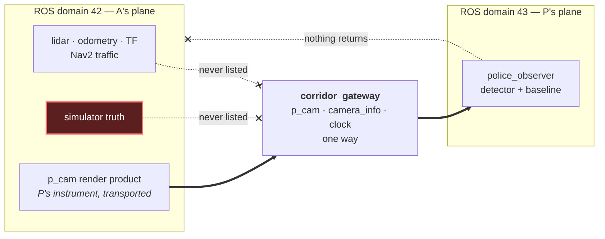

# ADR 0021: Move the camera to P and gate the scenario on the isolation certificate

- Status: Accepted
- Date: 2026-08-11
- Source: recorded interview feedback of 2026-08-04, corrections 2 and 3 — A
  must navigate **autonomously**, and the enforcement pipeline must use
  **AI/ML actively** — which [ADR 0020](0020-communication-domain-isolation.md),
  written the same day against correction 1 alone, had not yet incorporated.
  Verified against the fleet and corridor code in
  [`docs/v2-plan.md`](../v2-plan.md).
- **Supersedes, surgically, three clauses of ADR 0020** by new record; 0020's
  file remains the immutable account of the day the domain split was built:
  1. its crossing contents (decision 3's allowlist of A's camera topics);
  2. its camera-ownership stance ("P has no sensor of its own and cannot be
     given one", and the rejected alternative *Give P its own camera and cross
     nothing*); and
  3. the gating status of the geometric program (its decision 5 kept ADR
     0011's `camera_visible` requirement binding; under this record it is
     computed and reported but no longer gates the scenario requirement).
- **Extends ADR 0020's** domain separation itself (decision 1), the non-zero
  42/43 defaults (decision 2), truth staying on A's plane (decision 4), and
  the `/clock` discipline — all retained and built on.
- **Supersedes the requirement reading of
  [ADR 0011](0011-visibility-semantics.md)** as amended by 0020: the
  visibility concepts remain true, distinct statements about the scene; none
  of them is the assignment's constraint.
- **Supersedes the ownership premise of
  [ADR 0002](0002-camera-only-speed-observation.md)** — the evidence camera is
  P's, not A's. 0002's discipline (evidence is camera pixels only; simulator
  pose, odometry, and TF are forbidden shortcuts) carries over to P's camera
  unchanged. The estimation *method* is decided in ADR 0024.
- Amends CLAUDE.md architectural invariant 3 in the same change: **one render
  product = P's enforcement instrument.**

## Context

The task author's feedback contained three corrections. ADR 0020 answered the
first — "cannot see" means communication-domain isolation — within hours, and
deliberately kept everything else fixed: A's camera remained the only sensor,
bridged to P, because the one-camera invariant barred a police-side sensor and
the source prose says P reads the robot's data.

Corrections 2 and 3 change what the system is *for*. If A navigates
autonomously, nothing about A's motion is scripted, and if enforcement must use
AI/ML actively, P must *perceive* A — detect and track the robot in camera
frames — rather than read geometry off surveyed wall plates through A's own
lens. The natural architecture is a roadside enforcement camera owned by P,
watching A.

Four facts, verified in `docs/v2-plan.md`, make P-owned sensing the honest
configuration rather than a concession:

1. A's autonomy stack needs no camera. The selected fleet twin navigates on
   lidar and scan-matching odometry; its governed Nav2 goal succeeded in
   simulation camera-free (fleet session 6).
2. Both fleet robot contracts are camera-less today. An A without a camera is
   the truthful twin of the robots this scenario now borrows, not a
   simplification.
3. The detector of correction 3 must watch A from outside. A's own camera is
   useless to it.
4. It makes the isolation story airtight: zero image topics exist in A's
   plane, so there is nothing tempting to bridge back.

## Decision

1. **P owns the single camera.** The one RGB render product is P's roadside
   enforcement instrument. A carries no camera; A's plane holds only the
   navigation contract (lidar, scan-matching odometry, TF, Nav2 traffic) and
   simulator truth, none of which crosses. The one-camera budget is reworded,
   not weakened: exactly one render product exists, as before.
2. **The crossing becomes `/p_cam/image_raw`, `/p_cam/camera_info`, and
   `/clock`** — one way, A's plane to P's plane, through the same
   `corridor_gateway` allowlist mechanism ADR 0020 shipped. The `/clock` entry
   is load-bearing for the same reason 0020 recorded: rclpy's `TimeSource`
   subscribes implicitly, and a P-plane without `/clock` publishes zero
   estimates while looking healthy.
3. **The scenario requirement gate is the isolation certificate.** Graph
   introspection executed inside P's plane must observe a topic set equal to
   the declared allowlist exactly, with live positive controls that skip
   rather than pass; and a mutation test in the 0005 tradition must show the
   certificate go red when an A-plane topic is deliberately relayed across.
   The enforceable phrasing is certificate equality — not "no A-side topic in
   P's plane", which the relay architecture cannot literally satisfy, since
   P's camera originates in the Isaac process on A's plane.
4. **The geometric program is retained as scenario realism and stops
   gating.** `camera_visible_intervals` remains computable and reportable for
   the authored scene; P's concealment, the CornerScreen, and the ray proofs
   stand as true properties worth demonstrating. Where P's *camera* must
   stand to see every enforcement gate — body move or mast — is a measured
   scene change recorded in its own ADR; ADR 0019's placement is retained as
   authored scenery until then.
5. **Mechanism verification, not selection, is the next measured step.** ADR
   0020 already shipped and tested the bridge; what remains is verifying it
   under this record's crossing rules — the protocol in `docs/v2-plan.md` §5,
   recorded as ADR 0026 when its evidence exists. The dual-ROS2Context
   alternative (one Isaac process, one graph per plane, per-graph
   `domain_id`) is recorded as viable on the evidence and not pursued; it
   re-enters only if the bridge fails the resolution measurement.

## Consequences

- A's plane contains no image topic at all. The strongest statement of the
  boundary is now structural: there is nothing camera-shaped on A's side to
  leak.
- `police_observer` consumes `/p_cam/*` in P's plane; the stamp-pairing
  discipline of ADR 0003 carries over unchanged, read as one `/clock`
  publisher *per domain* exactly as the 0020-era contract documented.
- The wall-mounted fiducial program (0013, 0015) loses its enforcement
  consumer. Disposition of the plates — scenery or retirement — lands with
  ADR 0024's baseline decision, which moves the fiducial to A's body.
- All v1 occlusion and live-demo evidence is relabeled historical
  (pre-correction reading); no v1 figure is quotable for v2. The v2
  requalification table in the pack replaces the v1 invariants wholesale.
- P's camera resolution becomes a measured parameter (ADR 0024), and the VRAM
  budget is re-measured at the chosen setting; the crossing's throughput
  ceiling is measured in the ADR 0026 session.
- One production-hardening sentence is recorded so it is not overclaimed in
  the interview: DDS partitions or SROS2 access control would enforce the
  same boundary cryptographically; domain separation is the mechanism the
  task author named, so it is the one built.

## Alternatives considered

- **Keep A's camera as the evidence source, bridged to P** — the committed
  0020 architecture. Rejected for v2: it leaves corrections 2 and 3 unmet, an
  A with a camera is not the honest twin of the camera-less fleet robots, and
  a detector that must perceive A cannot do it through A's own lens. Retained
  in full as the v1 record.
- **A keeps a camera alongside P's.** Rejected for v2: two render products
  break the apples-to-apples budget comparison and add a sensor no consumer
  needs. Recorded as a future-variant ADR if a use appears.
- **Enforce the geometric reading and the communication reading as joint
  requirements.** Rejected: under this architecture P's camera must see A to
  measure it, so the symmetric visual claim is not coherent for P→A;
  A-cannot-image-P is vacuous once A is camera-less. The geometric program is
  kept as scenery, not as the constraint.
- **DDS partitions or SROS2 instead of domains.** Rejected for v2, as in
  0020: domains are the author's own words; the alternatives are the recorded
  production extension.
