# Architecture decision records

ADRs are immutable once accepted. A changed decision receives a new ADR that
supersedes the old record.

Immutability covers the **decision text**. Several ADRs carry an illustrative
diagram added after acceptance; those diagrams restate what the record already
decided and never introduce, soften, or re-argue a conclusion. If a diagram and
the prose above it ever disagree, the prose is the record.

Three status strings differ between a file and this index, each deliberately:

| ADR | In the file | In this index | Why |
|---|---|---|---|
| 0002 | `Accepted` | `Superseded by 0021 + 0024` | The file is immutable. 0021 moved camera ownership to P; 0024 replaced the estimation method. The camera-only discipline is retained and restated by both |
| 0007 | `Accepted for demonstration policy` | `Demo accepted` | Same status, abbreviated to fit the column |
| 0017 | `Accepted` | `Superseded by 0019` | The file is immutable, so its own header is never rewritten. Supersession is recorded here and in 0019 |

| ADR | Status | Decision |
|---|---|---|
| [0001](0001-standalone-openusd-authoring.md) | Accepted | Author USD outside Isaac Sim |
| [0002](0002-camera-only-speed-observation.md) | Superseded by [0021](0021-police-owned-sensing-and-isolation-gate.md) + [0024](0024-learned-enforcement-perception.md) | Derive speed only from camera evidence |
| [0003](0003-ros-time-and-clock-discipline.md) | Accepted | Use acquisition timestamps and one clock source |
| [0004](0004-corridor-profile-variants.md) | Accepted | Represent finite `(m,n)` profiles as variants |
| [0005](0005-continuous-occlusion-verification.md) | Accepted | Prove occlusion continuously and audit the USD |
| [0006](0006-scenario-manifest.md) | Accepted | Share one generated scenario manifest |
| [0007](0007-speed-policy-and-violation.md) | Demo accepted | Configure policy and conservative event semantics |
| [0008](0008-runtime-environment-boundaries.md) | Accepted | Separate ROS/OpenUSD and Isaac runtimes |
| [0009](0009-installed-isaac-ros-camera-adapter.md) | Accepted | Isolate one installed-version camera/clock adapter |
| [0010](0010-supplied-diagram-geometry.md) | Accepted | Take topology from the supplied diagram, keep scale a project choice |
| [0011](0011-visibility-semantics.md) | Accepted | Keep "A cannot see P" a geometric gate over the continuous turn |
| [0012](0012-conservative-curved-path-visibility.md) | Accepted | Enclose curved camera motion conservatively before certifying visibility |
| [0013](0013-size-fiducials-from-delivered-camera.md) | Accepted | Size and mount fiducials from the delivered production camera |
| [0014](0014-violation-episode-semantics.md) | Accepted | Emit one violation per continuous speeding episode |
| [0015](0015-reference-fiducials-for-corner-coverage.md) | Accepted | Restore corner enforcement coverage with reference fiducials |
| [0016](0016-corner-enforcement-policy-boundary.md) | Accepted | Move the strict speed zone to 4.0 m clear width |
| [0017](0017-relocate-p-to-diagram-east-corner.md) | Superseded by [0019](0019-relocate-p-inside-the-east-wall-with-a-corner-screen.md) | Relocate P to the junction's east corner, behind the east wall |
| [0018](0018-model-the-east-wall-stub.md) | Accepted | Model the east-wall stub, recess B behind it, extend the route |
| [0019](0019-relocate-p-inside-the-east-wall-with-a-corner-screen.md) | Accepted | Relocate P inside the east wall, behind a purpose-built corner screen |
| [0020](0020-communication-domain-isolation.md) | Accepted | Isolate A and P on separate ROS domains, bridged by one allowlist |
| [0021](0021-police-owned-sensing-and-isolation-gate.md) | Accepted | Move the camera to P and gate on the isolation certificate |
| [0022](0022-robot-a-selection-gate.md) | Accepted | Select robot A by a measured corridor-odometry gate |
| [0023](0023-governed-nav2-live-slam.md) | Accepted | Autonomy is governed Nav2 on a live SLAM map, policy re-pinned to robot scale |
| [0024](0024-learned-enforcement-perception.md) | Accepted | Synthetic-data detector with an ArUco-on-A baseline for P's camera |
| [0025](0025-fleet-workspace-membership.md) | Accepted | Join the fleet workspace by symlink and pin; domains 42/43 stand, 44 reserved |
| [0026](0026-isolation-verification.md) | Accepted | Verify the committed isolation mechanism: producer + crossing gates, certificate green, mutation red |
| [0027](0027-robot-a-selection-outcome.md) | Accepted | **Corridor gate FAILED on both gated profiles; robot A stays robot1** (ADR 0022 fallback) |
| [0028](0028-goal-directed-navigation-on-a-live-map.md) | Accepted | A is told B's address, never the route; goal is a standoff beside B. **Method validated in world frame; the arrival gate stays red** |
| [0029](0029-map-divergence-at-the-corner.md) | Accepted | Corridor clean (2.2 cm), map dies at the far end; **fusion reports 23.4x its own input, unexplained**. B carries a geometric landmark |
| [0030](0030-the-committed-scale-and-what-is-measured-against-it.md) | Accepted | Scale **0.30** committed and the as-run scenario is the build default; prior factors superseded; corner screen authored not coded; map scored on a **masked** map with the 0.20 m limit unmoved |
| [0031](0031-b-is-the-cylinder.md) | Accepted | **B is one cylinder at the delivery point**; radius is the sensor's and height is the person's; final approach derived from the governor's floor, never bypassed |
| [0033](0033-arrival-is-contact.md) | Accepted | **Arrival is CONTACT** — A bumps B and the encoders witness it; map-frame gate retired to ungated report; transit is Nav2, terminal is a governed docking creep; the governor is informed by a 15&deg; mask, never bypassed; the stub is the standing negative control |
| [0034](0034-the-mask-is-the-target.md) | Accepted | **The mask is the TARGET'S SHAPE, not a cone** — a fixed 15&deg; cone cannot admit a contact, since B subtends 33.5&deg; there; the clamped creep is exempt from the slow zone; the bump needs TWO witnesses (governor-permitted AND laser-stationary), never the wheels alone; testing is cheapest-first and no fixture may model the target as one beam |
| [0035](0035-the-lens-is-the-first-instrument.md) | Accepted; **decision 1 superseded by [0037](0037-the-banner-means-seeing.md)** | **The lens starts before the run, and outlives it** — ten of twelve rerun() exits preceded it, so bring-up was unwatchable by construction and three runs wrote no lens.log at all; it is not a `resident`; a lens that cannot serve refuses the run; it freezes 60 s after the data stops; and the banner is a port the lens reported and the runner verified, never a literal. **Its own rollback clause fired:** 0037 moves the block below `simctl start` on the measured cost 0035 left open. Decisions 2–5 stand |
| [0036](0036-the-handoff-has-two-triggers.md) | Accepted | **Nav2 finishing the refined goal is also a handoff** — `GOAL_TOLERANCE_M` and Nav2's `xy_goal_tolerance` are both 0.15, so the SUCCEEDED envelope and the handoff radius are the same number and no standoff creates margin; run 031922 succeeded at 0.6621 m and the terminal phase was skipped in silence. Four guards, SUCCEEDED only, never ABORTED. **Recovers a measurement, not a delivery** |
| [0037](0037-the-banner-means-seeing.md) | Accepted | **The banner means the lens is SEEING, not that it is serving** — 2 of 6 runs were watched by a lens that answered `/healthz` all run and resolved nothing (500 rows, 100.4 s, every metric null), so "zero faux launches" measured the wrong thing. `/healthz` now reports per-topic rates; the banner is gated on a non-zero scan rate; a deaf lens is restarted once and then refuses the run. The gate is only askable after `/scan` exists, so the block moves below `simctl start` — 0035 decision 1 rolled back by its own clause, the rest untouched. **Its placement rationale is corrected by [0039](0039-the-lens-is-asked-twice.md)**: a lens created after `simctl start` went deaf the same day |
| [0038](0038-the-speed-policy-pinned-to-a-measured-profile.md) | Accepted | **The speed policy is pinned to A's MEASURED profile, not to the scale factor** — robot1's band is 0.056-0.207 m/s and every scaled-v1 tier sits above it, so no violation could ever arise. Widest first **0.30 / 0.25 / 0.04 m/s**, one rule applied three times: a permissive tier above the fastest measurement in its zone, a strict tier below the slowest. Zone boundaries untouched — 0016 stays closed. Owner-ratified per 0007. **Verifying it found ADR 0016's two-gate floor had been void since 0030**: `width_at(2.4)` is 1.2000000000000002, so the strict zone held one gate and a corner violation could never be confirmed |
| [0039](0039-the-lens-is-asked-twice.md) | Accepted | **The lens is asked twice, because the placement does not prevent deafness** — run `20260814-125254` was created 71 s AFTER `simctl start`, passed the seeing gate, printed its banner and went deaf within seconds (300 samples, 60.2 s of a 250 s run, every metric null) while delivering normally at 0.2251 m. **0037's correlation has a counterexample**: the placement keeps its conclusion and loses its reason. One `lens_is_seeing` function, two call sites — at the lens and again before the robot moves — so a lens that dies in bring-up refuses instead of producing an unwatchable success. **Its open mechanism is supplied by [0040](0040-corridor-sessions-are-udp-only.md)** |
| [0040](0040-corridor-sessions-are-udp-only.md) | Accepted | **Corridor sessions run DDS over UDP only** — the deafness 0039 could not explain matches Fast DDS's documented SHM-after-churn family; the synthetic repro did NOT reproduce it (three clean arms, recorded against the hypothesis), so the decision stands on fleet **OI-13**'s precedent and the batch: **10/10 runs lens-healthy under UDP-only** (baseline 2 deaf of 4), odom_laser FASTER (13.5–13.9 vs 10.6 Hz), EKF unchanged, `/dev/shm` at zero. `CORRIDOR_DDS_PROFILE=` (empty) is the A/B control arm; `run.json` records `dds_profile`. The P-plane demo is NOT switched: ADR 0026's crossing ratios would need re-measuring first |
| [0041](0041-seeing-means-progress.md) | Accepted | **The seeing gate demands PROGRESS, not a rate** — run `20260814-133559` heard its last message at t≈0.25 s and still cleared the gate at t≈6 s, because `rates` is a 10 s trailing window and a burst echoes through it. `lens_is_seeing` now reads the monotonic scan count twice, 0.6 s apart, and passes only if it moved (~7 messages at contract rate). Amends 0037 decision 2 and 0039's second call; both conclusions stand |

0026 and 0027 have since landed with their evidence and are listed above; the
line that reserved them is retired rather than left to read as pending.

## Decision map

```mermaid
flowchart LR
    A1["0001<br/>Standalone USD"] --> A4["0004<br/>Profile variants"]
    A4 --> A6["0006<br/>Scenario manifest"]

    A2["0002<br/>Camera-only evidence"] --> A7["0007<br/>Violation semantics"]
    A7 --> A14["0014<br/>Violation episodes"]
    A3["0003<br/>Clock discipline"] --> A9["0009<br/>Isaac camera adapter"]
    A8["0008<br/>Runtime separation"] --> A9
    A2 --> A9
    A6 --> A9

    A1 --> A5["0005<br/>Continuous occlusion"]

    Task["ROBO_TASK.pdf"] --> A10["0010<br/>Diagram geometry"]
    A4 --> A10
    A10 --> A11["0011<br/>Visibility semantics"]
    A5 --> A11
    A2 --> A11

    A11 --> A12["0012<br/>Curved-path enclosure"]
    A2 --> A13["0013<br/>Camera-sized fiducials"]
    A6 --> A13
    A9 --> A13
    A13 --> A15["0015<br/>Reference fiducials"]
    A7 --> A16["0016<br/>Corner policy boundary"]
    A15 --> A16

    A10 --> A18["0018<br/>East-wall stub"]
    A11 --> A17["0017<br/>P at the east corner<br/><b>SUPERSEDED</b>"]:::superseded
    A10 --> A17
    A17 -. "superseded by, on<br/>measured source evidence" .-> A19["0019<br/>P inside the east wall,<br/>behind a corner screen"]
    A18 --> A19
    A12 --> A19
    A5 --> A19

    Feedback["Interview feedback<br/>2026-08-04"] --> A20["0020<br/>Communication-domain<br/>isolation"]
    A2 --> A20
    A3 --> A20
    A8 --> A20
    A11 -. "one row amended by" .-> A20

    Feedback --> A21["0021<br/>P-owned sensing,<br/>isolation gate"]
    A20 -. "three clauses<br/>superseded by" .-> A21
    A2 -. "camera ownership<br/>superseded by" .-> A21
    A11 -. "requirement reading<br/>superseded by" .-> A21

    Feedback --> A22["0022<br/>Robot-A selection gate"]
    A4 --> A22

    A22 --> A23["0023<br/>Governed Nav2,<br/>live SLAM"]
    A3 --> A23
    A10 --> A23
    A7 --> A23
    A16 -. "policy values<br/>re-pinned by" .-> A23

    A21 --> A24["0024<br/>Learned enforcement<br/>perception"]
    A13 -. "placement inverted by" .-> A24
    A2 -. "method superseded by" .-> A24
    A7 --> A24
    A14 --> A24

    A8 --> A25["0025<br/>Fleet workspace<br/>membership"]
    A22 --> A27["0027<br/>Robot A outcome<br/>GATE FAILED"]
    A23 --> A28["0028<br/>Address not route<br/>goal = standoff beside B"]
    A27 --> A28
    A28 --> A29["0029<br/>Map dies at the corner<br/>B carries a landmark"]
    A29 --> A30["0030<br/>Scale 0.30 committed<br/>masked map score"]
    A30 --> A31["0031<br/>B is the cylinder<br/>contact from the governor"]
    A29 -. "beside-B geometry<br/>superseded by" .-> A31
    A28 --> A31
    A31 --> A33["0033<br/>Arrival is CONTACT<br/>encoders are the bumper<br/>governor informed, not bypassed"]
    A28 -. "map-frame arrival gate<br/>superseded by" .-> A33
    A29 -. "arrival clause<br/>superseded by" .-> A33
    A31 -. "0.470 m demo win<br/>superseded by" .-> A33
    A33 --> A34["0034<br/>the mask is the TARGET<br/>silhouette, not a cone<br/>two witnesses for the bump"]
    A33 -. "15&deg; cone and the<br/>encoder bumper<br/>superseded by" .-> A34
    A31 -. "authored radius<br/>sizes the mask" .-> A34
    A34 --> A35["0035<br/>the lens is the<br/>FIRST instrument<br/>and outlives the run"]
    A35 --> A36["0036<br/>the handoff has<br/>TWO triggers<br/>the radius has no margin"]
    A33 -. "handoff radius<br/>extended by" .-> A36
    A36 --> A37["0037<br/>the banner means<br/>SEEING, not serving<br/>2 of 6 lenses were blind"]
    A35 -. "placement<br/>rolled back by<br/>its own clause" .-> A37
    A37 --> A38["0038<br/>the speed policy is<br/>pinned to a MEASURED<br/>profile, not the scale"]
    A23 -. "left the table<br/>to pin; this is it" .-> A38
    A16 -. "zone boundaries<br/>untouched" .-> A38
    A38 --> A39["0039<br/>the lens is asked TWICE<br/>the placement does not<br/>prevent deafness"]
    A37 -. "correlation<br/>has a counterexample" .-> A39
    A39 --> A40["0040<br/>corridor sessions are<br/>UDP-ONLY<br/>the mechanism, named"]
    A39 -. "open mechanism<br/>supplied by" .-> A40
    A40 --> A41["0041<br/>seeing means PROGRESS<br/>a burst cannot echo<br/>through a count"]
    A37 -. "gate semantics<br/>amended by" .-> A41
    A41 --> Demo
    A19 --> A30
    A18 --> A30
    A23 --> A29
    A20 --> A26["0026<br/>Isolation<br/>VERIFIED"]
    A21 --> A26
    A20 --> A25
    A25 --> A22

    A12 --> Demo["Defensible interview demo"]
    A13 --> Demo
    A16 --> Demo
    A7 --> Demo
    A9 --> Demo
    A18 --> Demo
    A19 --> Demo
    A20 --> Demo
    A21 --> Demo
    A22 --> Demo
    A23 --> Demo
    A24 --> Demo
    A25 --> Demo
    A26 --> Demo
    A27 --> Demo
    A28 --> Demo
    A29 --> Demo

    classDef source fill:#1f3d5c,color:#ffffff,stroke:#6bb6ff,stroke-width:2px;
    classDef superseded fill:#5c1f1f,color:#ffffff,stroke:#ff6b6b,stroke-width:2px;
    class Task source;
    class Feedback source;
```

The solid arrows mean “constrains or enables,” not “supersedes.” For example, the
live Isaac adapter is shaped simultaneously by the camera-only rule, clock rule,
scenario manifest, and Python-runtime boundary. The **dotted** arrows are the
exceptions, and they mean different things:

| Dotted arrow | Meaning |
|---|---|
| 0017 → 0019 | A full **supersession**: 0019 replaces 0017's placement decision on measured source evidence |
| 0011 → 0020 | An **amendment** to one row of 0011's concept table. 0011's binding decision is unchanged and still enforced |
| 0020 → 0021 | A **partial supersession**: 0021 replaces 0020's crossing contents, its camera-ownership stance, and the gating status of the geometric program. 0020's domain split, 42/43 defaults, truth placement, and `/clock` discipline are extended, not replaced |
| 0002 → 0021 | 0021 moves camera **ownership** to P. 0002's camera-only evidence discipline carries onto P's camera; its estimation method is addressed by 0024 |
| 0011 → 0021 | 0021 supersedes 0011's **requirement reading** (as amended by 0020): the isolation certificate is the assignment's constraint. 0011's index status stays Accepted because its geometric gate remains computed, reported, and asserted for the authored scene — demoted to scenario realism, not deleted |
| 0016 → 0023 | An **amendment of values**: 0023 re-pins the width→limit numbers to robot scale; final numbers land with the first measured profile run under ADR 0007's owner-approval rule and 0016's two-gate no-spare constraint. Zone structure and policy semantics are unchanged |
| 0002 → 0024 | Completes the supersession 0021 began: 0024 replaces the surveyed-wall-marker estimation method with a detector plus an ArUco-on-A baseline. Camera-only evidence and truth isolation are retained by both pipelines |
| 0013 → 0024 | An **inversion of placement and supersession of the render-product contract**: the fiducial moves from the walls to A's body, sized by 0013's own delivered-camera method, and 0013's 640×360/15 Hz keep-decision (with its resolution-increase rejection) gives way to a measured resolution. The second-camera rejection is upheld |

ADR 0011 **extends** ADR 0005 rather than replacing it: the decision to prove
occlusion continuously and audit composed USD still stands, and 0011 carries it
onto the reconciled topology and the continuous turn.

ADR 0012 corrects the implementation detail that initially represented a turn
interval by its endpoint chord. It extends 0005 and 0011 without weakening their
continuous-coverage decision.

ADR 0015 **extends** ADR 0013. Sizing fiducials from the delivered camera still
stands; 0015 adds a second class of plate on perpendicular far-field surfaces
because the corner limit turned out to be angular — the wall markers leave the
frustum entirely — and no amount of resizing reaches an out-of-frame target.

ADR 0016 **extends** ADR 0007 and depends on 0015. It moves a policy value that
ADR 0007 requires the owner to approve, and it is only implementable because
0015 made two gates measurable inside the strict zone. ADR 0007's decision, that
violations are confirmed conservatively over consecutive measurements, is
unchanged and was deliberately not weakened to make the corner rule fire.

ADR 0017 **supersedes one rejected alternative** in ADR 0011 rather than the
decision itself. ADR 0011 rejected placing P at the drawing's literal label
position because A would see it; that reasoning stands. 0017 takes the third
option 0011 did not consider — the diagram's *side*, with the body behind the
east wall — which satisfies the same visibility gate that rejection was
protecting.

ADR 0019 **supersedes ADR 0017's placement decision itself**, on new evidence:
a 2026-07-29 audit found the measured source places P on the wall's inner
side, not its outer one. ADR 0017's own reasoning — the written requirement
outranks an unscaled drawing's literal position — is not disturbed; only the
specific alternative it chose is replaced with one that keeps the correct
side. ADR 0011 and ADR 0010 remain accepted in full.

ADR 0020 **amends one row of ADR 0011 and supersedes nothing.** It is the only
record in this set prompted by feedback rather than by measurement: interview
feedback on 2026-08-04 clarified that the task's visibility constraint was meant
as ROS communication-domain isolation, not visual occlusion. The geometric
reading ADR 0011 chose is therefore reframed — it remains true of the scene and
its gate still passes, but it is scenario realism rather than the assignment's
constraint. Only ADR 0011's "P data access" row, which described P subscribing to
A directly, is amended; under 0020 P receives a bridged copy instead. The
occlusion chain 0005 → 0011 → 0012 → 0019 is untouched.

ADR 0021 **supersedes three clauses of ADR 0020 and extends the rest.** The
same interview carried two further corrections — autonomous navigation and
active AI/ML use — that 0020, written the same day against the first
correction alone, never saw. Under 0021 the single render product becomes P's
enforcement camera, the crossing becomes `/p_cam/*` plus `/clock`, and the
scenario requirement gate becomes the isolation certificate with its mutation
test. 0020's domain split, its non-zero 42/43 defaults, truth staying on A's
plane, and the `/clock` lesson are all retained and built on. The geometric
program keeps passing as scenario realism; it stops gating the requirement.
ADR 0011's index status stays Accepted for the same reason 0020's does: its
gate is still computed and asserted for the authored scene; only the claim
that it implements the assignment's constraint is superseded.

ADRs 0022–0025 are the v2 execution set, and every load-bearing claim in them
was verified against fleet and corridor code before acceptance
([`docs/v2-plan.md`](../v2-plan.md)). 0022 decides a *procedure* whose outcome
lands as 0027 and is not edited by it; 0023 amends only the *values* of the
0016/0007 policy table, deliberately after a measured profile run; 0024
completes the supersession of 0002 that 0021 began; 0025 makes the fleet the
second build home without displacing this repository's own gate, and records
the domain allocation (42/43 standing, 44 reserved, 70 dirty) on the fleet's
ledger.

ADR 0026 is a **verification** record, not a mechanism choice: 0020 shipped the
domain split and stated that it changed no measured result, and 0026 supplies
that measurement under 0021's recast crossing. It also decomposes the v2 plan's
single delivery gate into a producer gate and a crossing gate, because the
combined number produced two wrong conclusions before it was split -- once
blaming the transport for a source that had stopped early, once blaming the
publisher for loss that belonged to the measuring subscriber.

ADR 0027 is 0022's **outcome**, and it is a negative one: the RaspTank twin
failed the corridor gate on both gated profiles, so robot A stays robot1 under
0022's fallback clause. 0022 is not edited by it -- a procedure ADR and its
outcome are separate records, which is exactly why the procedure was written
before the measurement was taken.
