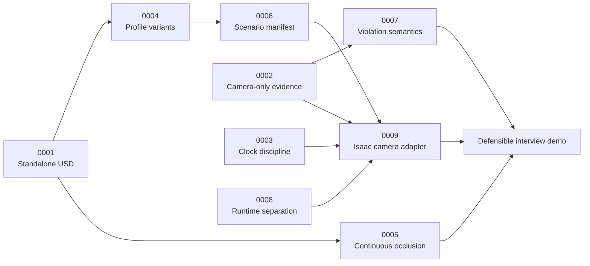

# Architecture decision records

ADRs are immutable once accepted. A changed decision receives a new ADR that
supersedes the old record.

| ADR | Status | Decision |
|---|---|---|
| [0001](0001-standalone-openusd-authoring.md) | Accepted | Author USD outside Isaac Sim |
| [0002](0002-camera-only-speed-observation.md) | Accepted | Derive speed only from camera evidence |
| [0003](0003-ros-time-and-clock-discipline.md) | Accepted | Use acquisition timestamps and one clock source |
| [0004](0004-corridor-profile-variants.md) | Accepted | Represent finite `(m,n)` profiles as variants |
| [0005](0005-continuous-occlusion-verification.md) | Accepted | Prove occlusion continuously and audit the USD |
| [0006](0006-scenario-manifest.md) | Accepted | Share one generated scenario manifest |
| [0007](0007-speed-policy-and-violation.md) | Demo accepted | Configure policy and conservative event semantics |
| [0008](0008-runtime-environment-boundaries.md) | Accepted | Separate ROS/OpenUSD and Isaac runtimes |
| [0009](0009-installed-isaac-ros-camera-adapter.md) | Accepted | Isolate one installed-version camera/clock adapter |

## Decision map

The arrows mean “constrains or enables,” not “supersedes.” For example, the live
Isaac adapter is shaped simultaneously by the camera-only rule, clock rule,
scenario manifest, and Python-runtime boundary.
