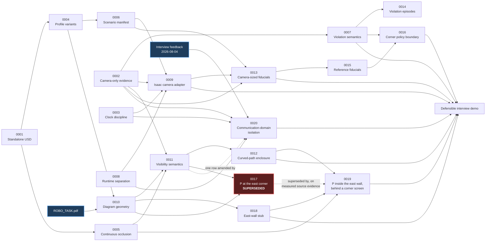

# Architecture decision records

ADRs are immutable once accepted. A changed decision receives a new ADR that
supersedes the old record.

Immutability covers the **decision text**. Several ADRs carry an illustrative
diagram added after acceptance; those diagrams restate what the record already
decided and never introduce, soften, or re-argue a conclusion. If a diagram and
the prose above it ever disagree, the prose is the record.

Two status strings differ between a file and this index, both deliberately:

| ADR | In the file | In this index | Why |
|---|---|---|---|
| 0007 | `Accepted for demonstration policy` | `Demo accepted` | Same status, abbreviated to fit the column |
| 0017 | `Accepted` | `Superseded by 0019` | The file is immutable, so its own header is never rewritten. Supersession is recorded here and in 0019 |

| ADR | Status | Decision |
|---|---|---|
| [0001](0001-standalone-openusd-authoring.md) | Accepted | Author USD outside Isaac Sim |
| [0002](0002-camera-only-speed-observation.md) | Accepted | Derive speed only from camera evidence |
| [0003](0003-ros-time-and-clock-discipline.md) | Accepted | Use acquisition timestamps and one clock source |
| [0004](0004-corridor-profile-variants.md) | Accepted | Represent finite `(m,n)` profiles as variants |
| [0005](0005-continuous-occlusion-verification.md) | Accepted | Prove occlusion continuously and audit the USD |
| [0006](0006-scenario-manifest.md) | Accepted | Share one generated scenario manifest |
| [0007](0007-speed-policy-and-violation.md) | Demo accepted | Configure policy and conservative event semantics |
| [0008](0008-runtime-environment-boundaries.md) | Accepted | Separate ROS/OpenUSD and Isaac runtimes |
| [0009](0009-installed-isaac-ros-camera-adapter.md) | Accepted | Isolate one installed-version camera/clock adapter |
| [0010](0010-supplied-diagram-geometry.md) | Accepted | Take topology from the supplied diagram, keep scale a project choice |
| [0011](0011-visibility-semantics.md) | Accepted | Keep "A cannot see P" a geometric gate over the continuous turn |
| [0012](0012-conservative-curved-path-visibility.md) | Accepted | Enclose curved camera motion conservatively before certifying visibility |
| [0013](0013-size-fiducials-from-delivered-camera.md) | Accepted | Size and mount fiducials from the delivered production camera |
| [0014](0014-violation-episode-semantics.md) | Accepted | Emit one violation per continuous speeding episode |
| [0015](0015-reference-fiducials-for-corner-coverage.md) | Accepted | Restore corner enforcement coverage with reference fiducials |
| [0016](0016-corner-enforcement-policy-boundary.md) | Accepted | Move the strict speed zone to 4.0 m clear width |
| [0017](0017-relocate-p-to-diagram-east-corner.md) | Superseded by [0019](0019-relocate-p-inside-the-east-wall-with-a-corner-screen.md) | Relocate P to the junction's east corner, behind the east wall |
| [0018](0018-model-the-east-wall-stub.md) | Accepted | Model the east-wall stub, recess B behind it, extend the route |
| [0019](0019-relocate-p-inside-the-east-wall-with-a-corner-screen.md) | Accepted | Relocate P inside the east wall, behind a purpose-built corner screen |
| [0020](0020-communication-domain-isolation.md) | Accepted | Isolate A and P on separate ROS domains, bridged by one allowlist |

## Decision map

The solid arrows mean “constrains or enables,” not “supersedes.” For example, the
live Isaac adapter is shaped simultaneously by the camera-only rule, clock rule,
scenario manifest, and Python-runtime boundary. The two **dotted** arrows are the
exceptions, and they mean different things:

| Dotted arrow | Meaning |
|---|---|
| 0017 → 0019 | The only **supersession** in the set. 0019 replaces 0017's placement decision on measured source evidence |
| 0011 → 0020 | An **amendment** to one row of 0011's concept table. 0011's binding decision is unchanged and still enforced |

ADR 0011 **extends** ADR 0005 rather than replacing it: the decision to prove
occlusion continuously and audit composed USD still stands, and 0011 carries it
onto the reconciled topology and the continuous turn.

ADR 0012 corrects the implementation detail that initially represented a turn
interval by its endpoint chord. It extends 0005 and 0011 without weakening their
continuous-coverage decision.

ADR 0015 **extends** ADR 0013. Sizing fiducials from the delivered camera still
stands; 0015 adds a second class of plate on perpendicular far-field surfaces
because the corner limit turned out to be angular — the wall markers leave the
frustum entirely — and no amount of resizing reaches an out-of-frame target.

ADR 0016 **extends** ADR 0007 and depends on 0015. It moves a policy value that
ADR 0007 requires the owner to approve, and it is only implementable because
0015 made two gates measurable inside the strict zone. ADR 0007's decision, that
violations are confirmed conservatively over consecutive measurements, is
unchanged and was deliberately not weakened to make the corner rule fire.

ADR 0017 **supersedes one rejected alternative** in ADR 0011 rather than the
decision itself. ADR 0011 rejected placing P at the drawing's literal label
position because A would see it; that reasoning stands. 0017 takes the third
option 0011 did not consider — the diagram's *side*, with the body behind the
east wall — which satisfies the same visibility gate that rejection was
protecting.

ADR 0019 **supersedes ADR 0017's placement decision itself**, on new evidence:
a 2026-07-29 audit found the measured source places P on the wall's inner
side, not its outer one. ADR 0017's own reasoning — the written requirement
outranks an unscaled drawing's literal position — is not disturbed; only the
specific alternative it chose is replaced with one that keeps the correct
side. ADR 0011 and ADR 0010 remain accepted in full.

ADR 0020 **amends one row of ADR 0011 and supersedes nothing.** It is the only
record in this set prompted by feedback rather than by measurement: interview
feedback on 2026-08-04 clarified that the task's visibility constraint was meant
as ROS communication-domain isolation, not visual occlusion. The geometric
reading ADR 0011 chose is therefore reframed — it remains true of the scene and
its gate still passes, but it is scenario realism rather than the assignment's
constraint. Only ADR 0011's "P data access" row, which described P subscribing to
A directly, is amended; under 0020 P receives a bridged copy instead. The
occlusion chain 0005 → 0011 → 0012 → 0019 is untouched.
