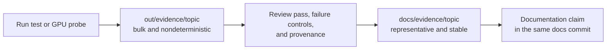

# Evidence artifact index

Versioned evidence supports measured project claims without requiring every
reviewer to install Isaac Sim. This directory contains curated results, not
build output.

## Storage contract

| Location | Tracked | Purpose |
|---|---:|---|
| `out/evidence/<topic>/` | No | Default destination for generated frames, intermediate JSON, and logs |
| `docs/evidence/<topic>/` | Yes | Selected frames, stable result summaries, and provenance for an accepted claim |
| `docs/evidence/<topic>/NOTES.md` | Yes | Exact command, Isaac version, GPU, settings, and pass/fail interpretation |

Each topic directory must contain `NOTES.md`. Rerunning a probe must write to
`out/evidence/` unless the operator explicitly chooses a different scratch
location; it must not silently replace the reviewed artifact.

## Recorded topics

| Topic | Status | Evidence |
|---|---|---|
| Static production-camera fiducials | **Renderer claim invalidated; no canonical qualification** | [Notes and preserved v1 summary](static-fiducials/NOTES.md) |
| Live camera-only enforcement demonstration | Qualified for `nominal_m6_n3` at 1.0 m/s | [Notes, frames, and per-message summary](live-demo/NOTES.md) |
| Supplied-diagram source fidelity | Topology confirmed; proportions recorded, not adopted | [Notes, annotated drawing, and measurements](source-diagram/NOTES.md) |
| Corridor arena composition and twin smoke (v2 T1.2/T1.4) | Three arenas composed and gated; `nominal_m6_n3` smoked under simctl | [Notes, arena report, and contract JSON](corridor-smoke/NOTES.md) |
| Live crossing and isolation certificate (v2 T2.2/T2.3) | Certificate green, mutation red; producer 0.9995, crossing 0.954 at 640x360 | [Notes, crossing JSON, and certificate pair](crossing/NOTES.md) |
| Robot-A corridor gate and degeneracy study (v2 T3.3) | **Both gated profiles FAILED; matcher blind for the first ~5 m** | [Notes, per-profile gate JSON, covariance traces](robot-a-gate/NOTES.md) |

The static topic's pixel, calibration, rate, and station-error results remain
valid historical evidence, but its renderer mode was requested rather than
observed, so the run is not the current qualification. Its summary is preserved
unmodified under a name that says so, and no replacement is published until the
planned rerun passes. A topic in this state must not be cited as current proof.

See [repository conventions](../../CLAUDE.md) for the evidence and authorship
rules.
