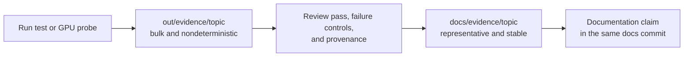

# Evidence artifact index

Versioned evidence supports measured project claims without requiring every
reviewer to install Isaac Sim. This directory contains curated results, not
build output.

## Storage contract

| Location | Tracked | Purpose |
|---|---:|---|
| `out/evidence/<topic>/` | No | Default destination for generated frames, intermediate JSON, and logs |
| `docs/evidence/<topic>/` | Yes | Selected frames, stable result summaries, and provenance for an accepted claim |
| `docs/evidence/<topic>/NOTES.md` | Yes | Exact command, Isaac version, GPU, settings, and pass/fail interpretation |

Each topic directory must contain `NOTES.md`. Rerunning a probe must write to
`out/evidence/` unless the operator explicitly chooses a different scratch
location; it must not silently replace the reviewed artifact.

## Recorded topics

| Topic | Accepted claim | Evidence |
|---|---|---|
| Static production-camera fiducials | The one-product Isaac ROS feed supports surveyed station recovery at all five nominal approach dwells; a mirror control fails | [Notes and stable summary](static-fiducials/NOTES.md) |

See [repository conventions](../../CLAUDE.md) for the evidence and authorship
rules.
