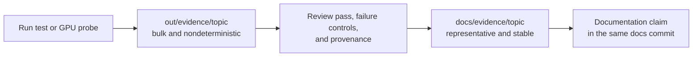

# Evidence artifact index

Versioned evidence supports measured project claims without requiring every
reviewer to install Isaac Sim. This directory contains curated results, not
build output.

## Storage contract

| Location | Tracked | Purpose |
|---|---:|---|
| `out/evidence/<topic>/` | No | Default destination for generated frames, intermediate JSON, and logs |
| `docs/evidence/<topic>/` | Yes | Selected frames, stable result summaries, and provenance for an accepted claim |
| `docs/evidence/<topic>/NOTES.md` | Yes | Exact command, Isaac version, GPU, settings, and pass/fail interpretation |

Each topic directory must contain `NOTES.md`. Rerunning a probe must write to
`out/evidence/` unless the operator explicitly chooses a different scratch
location; it must not silently replace the reviewed artifact.

## Recorded topics

| Topic | Status | Evidence |
|---|---|---|
| Static production-camera fiducials | **Renderer claim invalidated; no canonical qualification** | [Notes and preserved v1 summary](static-fiducials/NOTES.md) |
| Live camera-only enforcement demonstration | Qualified for `nominal_m6_n3` at 1.0 m/s | [Notes, frames, and per-message summary](live-demo/NOTES.md) |
| Supplied-diagram source fidelity | Topology confirmed; proportions recorded, not adopted | [Notes, annotated drawing, and measurements](source-diagram/NOTES.md) |
| Corridor arena composition and twin smoke (v2 T1.2/T1.4) | Three arenas composed and gated; `nominal_m6_n3` smoked under simctl | [Notes, arena report, and contract JSON](corridor-smoke/NOTES.md) |
| Live crossing and isolation certificate (v2 T2.2/T2.3) | Certificate green, mutation red; producer 0.9995, crossing 0.954 at 640x360 | [Notes, crossing JSON, and certificate pair](crossing/NOTES.md) |
| Robot-A corridor gate and degeneracy study (v2 T3.3) | **Both gated profiles FAILED; matcher blind for the first ~5 m** | [Notes, per-profile gate JSON, covariance traces](robot-a-gate/NOTES.md) |
| P-camera placement candidates (Phase 3 opener) | **P cannot see the corridor from where P stands** — ADR 0019's screen blocks it; one wall pose covers 4/5 stations; the mast is unmeasured in 2-D | [Decision memo and per-candidate geometry](p_cam_candidates/NOTES.md) |
| Lens render loop (debugging instrument) | **Had never rendered live**; one undefined identifier killed the loop after a single frame. Fixed, with a headless stub + probe so a regression is catchable in seconds | [Notes, before/after screenshots, probe verdicts](lens/NOTES.md) |
| Learned enforcement detector (Phase 3, ADR 0024) | **Correction 3 has a first result**: 3000 paired Replicator frames from P's mast, RT-DETR at **99.3%** detection on held-out synthetic. Resolution deliberately **not pinned** — detection rate cannot discriminate 640×360 from 1280×720 | [Notes, dataset summary, training curves, label overlays](detector/NOTES.md) |
| robot1 in the corridor + scale finding (2026-08-11) | **Scaling the corridor to the robot removes the degeneracy; Nav2 still aborts; twin misses its own scan contract in the stock arena too** | [Notes, gate JSON, stock-arena control](robot1-corridor/NOTES.md) |
| Creep bench — why A could not touch B (2026-08-14) | Offline closed loop, 13 s against a 25-minute Isaac cycle. Disc mask + slow-zone exemption reach contact within 0.6 mm; the ±15° cone stays RED as a permanent negative control. **The bag reproduction misses its own ±0.03 m bar by 0.057 m** | [Notes, scenario matrix](creep-bench/NOTES.md) |
| The bump, live (2026-08-14) | **A TOUCHES B** — truth 0.2146 m against a 0.2175 m contact, 2.9 mm *past* it, governor permitting 100% of the creep. But the witness never sees it, and **2 of 5 runs reached the creep at all**: SLAM double-walling, `slam_toolbox` non-activation, and a handoff that never triggers when Nav2 succeeds outside 0.620 m | [Notes, nav artifacts, lens-liveness records](bump-live/NOTES.md) |
| SLAM readiness oracle (2026-08-14) | The launch log classifies activation exactly: **81/81 ready, 3/3 failed, 0 ambiguous** across 85 archived launches, against a daemon poll that returned nothing and burned the full 110 s deadline. Healthy activation is 1.26 s. One case is silent on both markers — the orphan hang, which only the process-group reap can prevent | [Notes and six promoted logs](robot-a-gate/slam-lifecycle-logs/NOTES.md) |
| The lens is the first instrument (2026-08-14, ADRs 0035 + 0037) | Six runs: **6/6 reached the creep** (against 2/5 before), A→B spread 3.5 mm, lens announced at +0 s, survives teardown, freeze proved over 3.5 h. **Two claims made here were wrong and are withdrawn in the notes:** a map-degradation trend reported after four runs was refuted by the next two, and **"zero faux launches" measured serving, not seeing — 2 of the 6 lenses resolved nothing all run** while answering `/healthz`, which is what ADR 0037 fixes | [Notes, liveness records, six-run series](lens/first-instrument/NOTES.md) |
| A's measured speed profile, and the policy pinned from it (2026-08-14, ADR 0038) | Six runs, ground truth, secant over ±0.30 m: **0.197 / 0.196 / 0.169 / 0.129 / 0.081 m/s** at the five gates — a band entirely below every scaled-v1 tier, so **no violation could ever have arisen**. Pinned to **0.30 / 0.25 / 0.04**, verified by the shipped detector: one violation on the mean, slowest and fastest cases alike. **Verifying it found ADR 0016's two-gate floor void since 0030** — `width_at(2.4)` is 1.2000000000000002. Isaac's ground truth publishes zero twist | [Notes, per-gate crossings](speed-profile/NOTES.md) |
| **Speed from P's camera — correction 3's first number** (2026-08-14) | **5/5 gates from pixels alone, exactly one confirmed violation.** Speed error **−10.59%** measured, of which **−11.20%** is a newly-measured recording-path timing defect, leaving the estimator's own contribution at **+0.62%**. Projection accurate to **+0.023 m** on 412 labelled frames. **The detector fails grossly on 19.5% of frames and its confidence cannot tell you which** (0.945 vs 0.936). v1's "pose-to-render latency uncharacterised" is now characterised, and it is a rate deficit, not a one-frame lag | [Notes, table, lag probes, the diagnostic frame](estimator/NOTES.md) |
| Delivery day: the runs, and verifying the launch (2026-08-14) | Arena probe **PASS first attempt**; violation and compliant passes recorded from domain 43; certificate green with mutation red; the autonomous delivery reached **0.2251 m** inside the six-run band while FAILING two known gates. **The delivery run broke ADR 0037's correlation hours after it was accepted** — a lens created 71 s after `simctl start` went deaf anyway, which ADR 0039 answers. **Two verification runs then exercised that fix live**: one lens went deaf, the restart-once replaced it, and the replacement recorded **0.861** coverage — the highest measured on any run — with 0.886 on the second | [Notes, per-run outcomes, the bring-up breakdown](ship-day/NOTES.md) |

The static topic's pixel, calibration, rate, and station-error results remain
valid historical evidence, but its renderer mode was requested rather than
observed, so the run is not the current qualification. Its summary is preserved
unmodified under a name that says so, and no replacement is published until the
planned rerun passes. A topic in this state must not be cited as current proof.

See [repository conventions](../../CLAUDE.md) for the evidence and authorship
rules.
