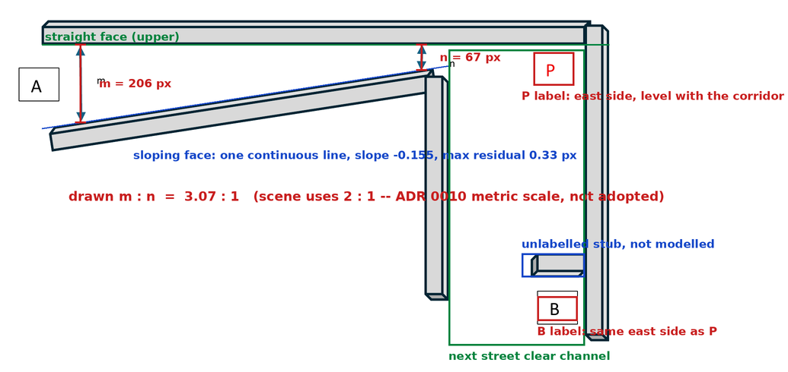

# Supplied-diagram source fidelity

This topic records what the supplied drawing in [`ROBO_TASK.pdf`](../../ROBO_TASK.pdf)
actually shows, measured rather than eyeballed, and how each observation is
disposed of in the scene.

It exists because the drawing is the only evidence for several load-bearing
claims — which corridor face slopes, which side of the junction P stands on,
which way A turns — and until now those claims rested on a reading of the figure
that no artifact recorded. A reading nobody can re-check is not evidence.

**Result: pass.** Every topological claim the scene attributes to the drawing is
confirmed. The drawing's *proportions* differ from the configured ones and are
deliberately not adopted; see "Proportions" below.



## Provenance

| Field | Value |
|---|---|
| Source | `docs/ROBO_TASK.pdf`, 1 page, A4 595.32 x 841.92 pt |
| Source sha256 | `7e00d431a39b0a7a73a48fb810444d370ce735aec21e79b3ac494a71615937a4` |
| Source author / created | *the task author* (name withheld; see below) — 2026-07-23, Adobe PDF Services from Word 2019 |
| Renderer | poppler `pdftoppm` 24.02.0 at 300 dpi, 2481 x 3508 px |
| Analysis | `measure.py` (this directory), NumPy + Pillow colour masks |
| Date measured | 2026-07-28 |
| Isaac Sim version | **Not applicable** — no simulator involved |
| GPU | **Not applicable** — CPU-only rasterisation of a vector PDF |
| Camera resolution / rate | **Not applicable** — no camera; this is not a render probe |

The author field is the PDF's own metadata and it names a real person, so this
repository records the role rather than the name. Nothing is lost: the digest
above pins the exact file, and `pdfinfo docs/ROBO_TASK.pdf` reads the field back
for anyone who holds it.

Commands:

```bash
source .venv/bin/activate
pdftotext -layout docs/ROBO_TASK.pdf -            # the prose, verbatim
python docs/evidence/source-diagram/measure.py    # render, measure, annotate
sha256sum docs/ROBO_TASK.pdf
```

`measure.py` writes to `out/evidence/source-diagram/` by default; the figure and
[`measurements.json`](measurements.json) here were promoted from that run. The
script lives beside its evidence rather than in `tools/` because it analyses one
immutable input: `test_source_document.py` pins the PDF by digest, and while that
test passes these numbers stand, so there is nothing to re-gate.

## The prose, verbatim

> Lets simulate an imaginary scenario where a robot (A) is delivering a packet
> autonomously to a person(B) located on the next street. There are traffic
> police (P) who is looking for speed violation at the corner using the data from
> the robot camera as the road is narrower there. The robot cannot see the
> traffic police, but the police can read the data from the robot.

Four sentences and one figure are the entire source. Quoted as written,
including its typography.

## What was measured

All coordinates are pixels in the 300 dpi render, origin top-left. Wall
positions are inner faces — the surfaces that bound the drivable channel.

| Feature | Measurement |
|---|---|
| Straight (upper) wall, inner face | constant `y = 1017` over `x` 360 → 1850 |
| Sloping (lower) wall, inner face | `y = 1217, 1170, 1124` at `x = 500, 800, 1100` |
| Sloping wall linear fit | slope `-0.155` px/px, **max residual 0.33 px** |
| `m` arrow | `x` 449–474; clear gap **205.8 px** |
| `n` arrow | `x` 1345–1369; clear gap **67.0 px** |
| Throat, where the sloping face meets the street's west wall | `x = 1428`; clear gap **56.0 px** |
| Next street, west wall | `x` 1365–1428 |
| Next street, east wall | `x` 1786–1850 |
| Next street, clear channel | `x` 1428 → 1786, **358 px** wide |
| `P` label box | `x` 1651–1758, `y` 1037–1125 |
| `B` label box | `x` 1661–1767 |
| East-wall stub beside B | `x` ~1620–1786, `y` 1567–1630 |

## What the drawing fixes, confirmed

| Claim | How the measurement confirms it | Scene |
|---|---|---|
| One face straight, one sloping | Upper face holds `y = 1017` end to end; lower face fits a line to 0.33 px | `taper_mode: one_sided_south`, north held at `+m/2` |
| `m > n` | 205.8 px against 67.0 px at the labelled arrows | `entry_width_m` ≥ `corner_width_m` on every profile |
| The taper is one continuous slope | 0.33 px residual over 600 px leaves no room for a constant-width section | The taper spans the whole `corridor_length_m` |
| The next street opens off the **sloping**-face side | The sloping wall's east end *is* the street's west wall at `x` 1365–1428 | A turns toward the tapering face |
| A turns right | Street runs away from the corridor on the sloping-face side, so east → that side is a right turn | `person_b_xyz` returns `-b_distance_m` |
| P is on the **east** side of the junction | P's box (1651–1758) sits in a channel of 1428–1786: 28 px from the east wall, 223 px from the west | P east of `EastBuilding`, per ADR 0017 |
| P is level with the corridor | P's box top is 20 px south of the straight face's inner line | `north_offset_m: 1.20` from that same face |
| B is along that street, past the corner | B's box is 697 px south of the corridor line | `b_distance_m: 8.0` |

## Proportions: observed, not adopted

The drawing is unscaled, so these are **dimensionless observations about the
figure**, not dimensions. They are recorded so a reviewer can see the gap rather
than discover it.

| Ratio | Drawn | Scene |
|---|---:|---:|
| `m : n` at the labelled arrows | 3.07 : 1 | 2.00 : 1 |
| `m : n` at the true throat | 3.68 : 1 | 2.00 : 1 |
| next-street width ÷ `m` | 1.74 | 1.00 |
| corridor length ÷ `m` | 7.24 | 2.00 |
| B's distance along the street ÷ `m` | 3.39 | 1.33 |

**These do not reopen the configured profiles.** A ratio is a metric-scale
quantity, and [ADR 0010](../../adr/0010-supplied-diagram-geometry.md) already
settled that the drawing fixes topology and nothing metric — it explicitly
rejected scaling the figure by measured pixel ratios. Beyond that, `n = 3.0` is
load-bearing downstream: the strict speed zone begins at 4.0 m clear width and
gates 8.0 and 10.0 must fall inside it, the reference plates were sized and
placed against the resulting geometry, and every live result was measured on it.
Nothing here is contradictory evidence; it is the same drawing, quantified.

Two caveats bound how far these numbers may be pushed:

1. The walls are drawn with an extrusion lip, so the figure is not a metrically
   consistent projection. Spans were taken on inner faces throughout for
   consistency, but a ratio read off it inherits that distortion.
2. The `n` arrow is drawn ~70 px west of the actual throat, where the channel is
   still 67 px rather than 56 px. Which of the two the symbol `n` denotes is
   itself a reading of the drawing, which is why both are reported.

## What the drawing shows that the scene does not follow

| Drawn | Scene | Disposition |
|---|---|---|
| P's label sits in the open street channel | P's body stands behind the street's east wall | [ADR 0017](../../adr/0017-relocate-p-to-diagram-east-corner.md): the drawing fixes the **side**, the written requirement fixes the standoff |
| Proportions above | Configured `(m, n)` and lengths | ADR 0010, `metric_scale: demo_assumption` |
| ~~An unlabelled block on the east wall beside B~~ | **Now modelled** | [ADR 0018](../../adr/0018-model-the-east-wall-stub.md). Superseded: it is drawn in the same wall style as every other wall, so the scene and its own source evidence disagreed about what the street contains. Its depth transfers as 0.4637 of the street; B sits in the pocket behind it at 0.7989 across the channel, which is why the route gained a delivery turn |

## What the source does not contain

Recorded so that nothing downstream can be mistaken for a supplied requirement.
The drawing and its four sentences carry **no**:

- scale bar, dimension text, north arrow, or coordinate frame;
- numeric value or unit of any kind, anywhere;
- speed limit, speed value, or enforcement threshold;
- fiducials, markers, or any means of measurement;
- sensor specification beyond the word "camera", and no resolution, rate, or
  message, topic, or middleware of any kind;
- route, trajectory, or turn geometry for A;
- wall height, thickness, material, or lighting;
- straight-then-taper split — the drawn slope is continuous.

Every one of these is a project choice, recorded as such in
[`DESIGN.md`](../../DESIGN.md) and the ADRs.

## One wording note

The prose says the robot **cannot see** the traffic police. That binds
*A-camera visibility*, which is the gate `scene.occlusion` proves. The separate
rule that A's software consumes nothing about P is additive and repo-added; it
is not in the source and can never stand in for the gate. See
[ADR 0011](../../adr/0011-visibility-semantics.md) for the four distinct
visibility concepts and why collapsing them is a defect.

> **Amended 2026-08-04.** The paragraph above records what this repository
> understood the prose to bind when the diagram was measured, and the reading is
> left unedited for that reason. Interview feedback has since clarified that the
> sentence was intended to mean ROS communication-domain isolation, not a
> sightline. The occlusion gate it describes still exists and still passes, but
> it is scenario realism rather than the constraint the task was asking for, and
> the concept list is now five rather than four. See
> [ADR 0020](../../adr/0020-communication-domain-isolation.md).
