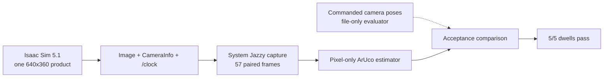
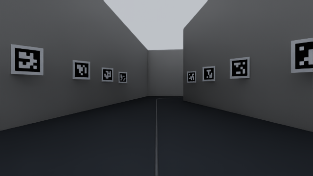

# Static production-camera fiducial qualification

> ## INVALIDATED — there is no canonical static qualification right now
>
> This run predates the renderer readback fix in `5bc1c99`. At the time it was
> captured, the adapter wrote the render mode it had **requested** into the
> truth schedule; nothing read the value back from the running renderer. Its
> summary is therefore preserved unmodified as
> [`qualification-summary-v1-request-echo-invalidated.json`](qualification-summary-v1-request-echo-invalidated.json)
> and is **not** the current result.
>
> | Claim from this run | Status |
> |---|---|
> | RGB frames, encoding, resolution, rate, calibration | **Still valid** historical camera evidence |
> | Recovered station error per dwell | **Still valid**, and independently reproduced bit-for-bit |
> | Mirror negative control failing | **Still valid** |
> | `renderer/mode`, `renderer/path_tracing` | **Invalid as measurement.** Requested, never observed |
>
> The renderer string was not shown to be *wrong* — it was never verified. A
> later live readback did report `RaytracedLighting` with AA enum 3, but that
> observation belongs to a different run and does not retroactively qualify
> this one.
>
> **No file in this directory is the canonical static qualification** until the
> planned Stage 2 rerun produces a fresh paired capture under the readback,
> encoding, and tightened intrinsic gates. Do not cite this run as current
> proof of the active render mode, and do not begin robot motion on the
> strength of it.

This topic records the first accepted proof that the real Isaac ROS camera path
delivers pixels from which the production estimator recovers surveyed station.
Bulk frames and logs remain under `out/evidence/static-fiducials/nominal-final/`.



## Provenance

| Field | Value |
|---|---|
| Date | 2026-07-27 |
| Scene profile | `nominal_m6_n3` |
| Scene fix | `3f7fa37` |
| Isaac contract fix | `bb203c0` |
| Isaac Sim | `5.1.0-rc.19+release.26219.9c81211b.gl`, Python 3.11 |
| ROS consumer | ROS 2 Jazzy, system Python 3.12 |
| GPU / driver | NVIDIA GeForce RTX 5070 Ti 16 GB / 580.173.02 |
| Render path | Real-time `RaytracedLighting`, DLSS enum 3, no path tracing |
| Camera | One RGB product, 640x360, 15 Hz |
| Kit log | `kit_20260727_023440.log` |
| Scratch run | `out/evidence/static-fiducials/nominal-final/` |

The representative frame is an unmodified `rgb8` image selected from the first
accepted dwell. It is included for human inspection; the JSON result, not the
picture alone, carries the acceptance claim.



## Exact commands

Build the stage first:

```bash
.venv/bin/python -m scene.build --m 6.0 --n 3.0 --out out/corridor.usda
.venv/bin/python -m scene.occlusion \
  --stage out/corridor.usda \
  --manifest out/corridor.manifest.json \
  --out out/occlusion-report.json
```

Start the capture in a system-Jazzy shell:

```bash
source /opt/ros/jazzy/setup.bash
source install/setup.bash
ROS_LOG_DIR=out/evidence/static-fiducials/nominal-final/ros-log \
PYTHONNOUSERSITE=1 .venv/bin/python tools/ros_aruco_capture.py \
  --out-dir out/evidence/static-fiducials/nominal-final/capture \
  --minimum-pairs 18 --timeout 240 --idle-after-minimum 3
```

Run Isaac in a separate shell without inherited system ROS Python paths:

```bash
env -u ROS_DISTRO -u AMENT_PREFIX_PATH -u PYTHONPATH \
ROS_LOG_DIR=out/evidence/static-fiducials/nominal-final/isaac-ros-log \
OMNI_KIT_ACCEPT_EULA=YES \
~/isaac/env_isaaclab/bin/python tools/isaac_5_1_ros_camera.py \
  out/corridor.usda \
  --manifest out/corridor.manifest.json \
  --profile nominal_m6_n3 \
  --static-probe-out \
    out/evidence/static-fiducials/nominal-final/static-truth.json \
  --report-gpu-memory
```

Apply the positive gate and the actual-capture negative control:

```bash
PYTHONPATH=src/police_observer .venv/bin/python tools/aruco_render_gate.py \
  --capture out/evidence/static-fiducials/nominal-final/capture/capture.json \
  --truth out/evidence/static-fiducials/nominal-final/static-truth.json \
  --manifest out/corridor.manifest.json --profile nominal_m6_n3 \
  --out out/evidence/static-fiducials/nominal-final/aruco-gate.json

PYTHONPATH=src/police_observer .venv/bin/python tools/aruco_render_gate.py \
  --capture out/evidence/static-fiducials/nominal-final/capture/capture.json \
  --truth out/evidence/static-fiducials/nominal-final/static-truth.json \
  --manifest out/corridor.manifest.json --profile nominal_m6_n3 \
  --negative-control mirror --expect-fail \
  --out \
    out/evidence/static-fiducials/nominal-final/aruco-gate-mirror-negative.json
```

## Result

| Check | Threshold | Measured | Result |
|---|---:|---:|---|
| Required dwells | 5 | 5 | Pass |
| Passing selected frames | at least 2/3 per dwell | 3/3 at every dwell | Pass |
| Maximum station error | 0.050 m | 0.010563 m | Pass |
| Maximum detected-corner RMSE | 3.0 px | 1.550047 px | Pass |
| Maximum estimator reprojection RMSE | 3.0 px | 1.091647 px | Pass |
| Delivered image rate | 14.5-15.5 Hz | 14.999999 Hz | Pass |
| Unsurveyed IDs | 0 | 0 | Pass |
| Mirrored actual capture | must fail | 0 passing frames | Pass |
| GPU memory | below 14,336 MiB | 3,024 MiB | Pass |

The delivered K matrix was constant at
`[[417.0321045, 0, 320], [0, 417.0321045, 180], [0, 0, 1]]`; its maximum
difference from the configured pinhole model was 0.0000149 px. The estimator
analysis had no truth parameter. Only the independent comparison step read the
commanded static schedule.

The preserved machine-readable result is
[`qualification-summary-v1-request-echo-invalidated.json`](qualification-summary-v1-request-echo-invalidated.json),
kept byte-for-byte as captured. Read it with the invalidation notice at the top
of this file: its pixel, calibration, rate, and station-error rows remain
historical evidence, while its `renderer` block records a requested value that
was never read back. There is deliberately no `qualification-summary.json` in
this directory until a fresh Stage 2 run passes under the readback, encoding,
and 0.05 px intrinsic gates.

Also note that the intrinsic tolerance quoted above was later tightened from
0.5 px to 0.05 px in `0c4e9b8`. The measured 0.0000149 px passes either way, so
this run's camera result is unaffected by that change.
