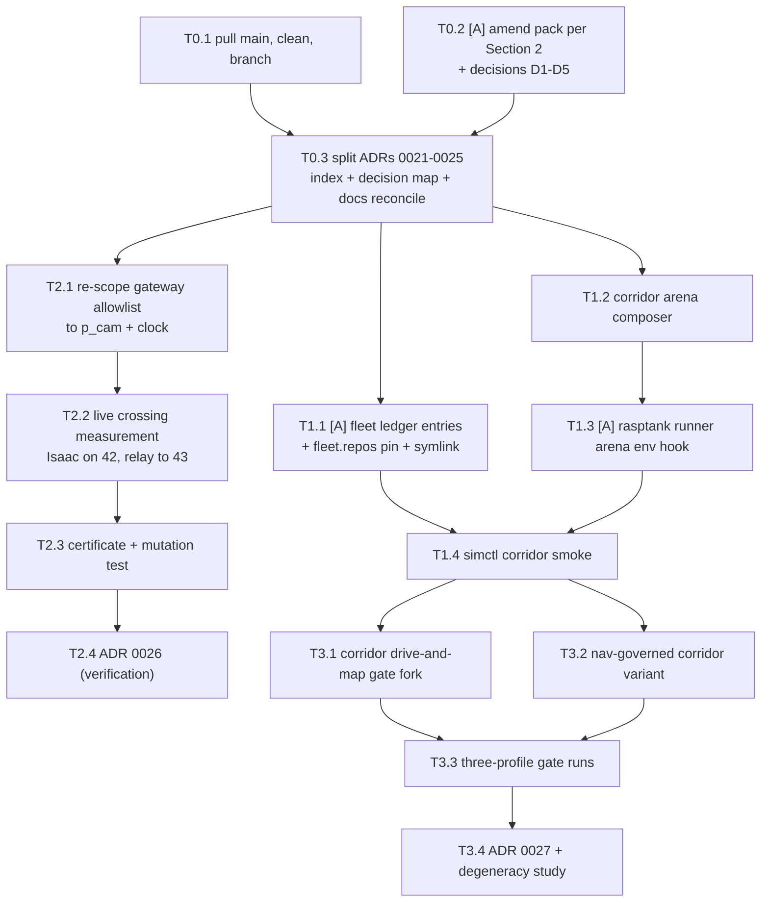

# v2 plan — pack verification and Days 0–3

| Field | Value |
|---|---|
| Status | Verification complete; open questions decided (Section 7); pack amendment (T0.2) pending |
| Date | 2026-08-11 |
| Governing draft | `corridor-v2-adr-pack.md` (repo root, untracked) |
| Method | Static reading only; every claim cited as path:line; [code] = verified in executable source, [doc-only] = prose assertion |

Repo roots abbreviated: **corridor** = this repo; **fleet** =
`../robot-fleet`; **rasptank** = `../robot-fleet/src/rasptank-ros2`;
**yahboom** = `../robot-fleet/src/yahboomcar-ros2`; **bringup** =
`../robot-fleet/ground_station/src/fleet_bringup`.

## 1. Verified facts

### Git and repo state (decisive, checked first-hand)

| # | Assumption / question | Verdict | Tag | Evidence |
|---|---|---|---|---|
| F1 | `docs/visual-documentation-pass` needs resolving (pack Day 0) | **Already resolved.** PR #4 (`feat/isolate-robot-and-police-domains`, stacked on the docs branch) merged into origin/main 2026-08-11T17:23:02Z as true merge commit `f48c515`; PR #3 auto-closed as merged 2 s later. Additive history preserved (no squash). | code | GitHub API: PR #4 mergeCommit f48c515 = origin/main HEAD; PR #3 mergeCommit 16ca64e |
| F2 | Local checkout state | Local main is **stale at 4821b21** (PR #2 merge); needs `git pull`. Working tree clean except untracked `corridor-v2-adr-pack.md`. Stale gitignored colcon residue (`build/`, `install/`, `log/`, `src/corridor_gateway/**/__pycache__`) predates the checkout back to main. | code | `git status`; reflog shows merge/squash rehearsals in deleted `tmp/*` branches, ending on main |
| F3 | ADRs 0020–0024 are free numbers | **Refuted.** `docs/adr/0020-communication-domain-isolation.md` exists, Accepted, dated 2026-08-04, now on remote main. It amends one row of 0011 ("Supersedes nothing"), pins `ROBOT_DOMAIN_ID=42` / `POLICE_DOMAIN_ID=43`, bridges exactly image_raw + camera_info + /clock one-way 42→43 via upstream `domain_bridge`, keeps A's camera as the only evidence source, retains the geometric gate as scenario realism, and **explicitly rejects "Give P its own camera"** (one-camera invariant, ADR 0002, source prose). | code | ADR 0020 (213 lines, read in full); `src/corridor_gateway/config/corridor_domain_bridge.yaml`; `corridor_gateway/domains.py:22,25` |
| F4 | Isolation mechanism is unproven (spike needed from zero) | **Partially done.** On main now: `test/test_domain_isolation.py` (two rclpy Contexts, DDS discovery + delivery, skip-not-pass controls, `domain_coordinator`-allocated ids), `test/integration/test_bridged_camera_delivery.py` (spawns the real `domain_bridge` binary against the shipped YAML: 0 images before, >0 after), `src/corridor_gateway/test/test_gateway_config.py` (allowlist restated; refuses `reversed`/`bidirectional`/`remap`; refuses domain 0). The `/clock` trap is documented and solved (rclpy TimeSource subscribes implicitly; dropping /clock silently zeroes all estimates). | code | test files read via git show; corridor_domain_bridge.yaml:22-26 |
| F5 | What committed-0020 did NOT settle for v2 | (a) One Isaac process serving two domains; (b) Isaac publishing on a nonzero domain was never live-run (ADR 0020: "This branch changes no measured result"; its two-domain run was the synthetic fallback); (c) bridge throughput above 640×360; (d) a runtime isolation *certificate* artifact (tests exist, certificate artifact doesn't); (e) anything about Nav2 or ML — zero footprint repo-wide (grep: only the quoted task prose). | code | ADR 0020 Consequences; repo-wide grep for nav2/yolo/neural/ml |

### Fleet domains and conventions

| # | Assumption | Verdict | Tag | Evidence |
|---|---|---|---|---|
| F6 | Reserved set = 20 hardware, 66/67 sim, 68 replays | **Mostly confirmed — in yahboom code, not fleet docs.** 20 = hardware [code: `yahboom/tools/_cmd_vel_safety.py:48` CAR_DOMAIN, refusals at simctl:512-515, :1074-1078]; 66 = simulator default [code: simctl:78 `SIM_DOMAIN = 66`, default of every `--domain` flag]; 68 = replay default [code: `yahboom/tools/replay_slam_bag.py:55` DEFAULT_DOMAIN=68]; 67 = scratch **convention in prose only** (yahboom CLAUDE.md:139 "67/69 convention"; always passed explicitly). Fleet top-level docs say 67–69 (+73–75 console) scratch; word "replay" absent there. | mixed | as cited |
| F7 | Domain enforcement location | **Convention, not mechanism.** Only executable checks anywhere: equality-vs-20 refusals (simctl, _cmd_vel_safety, replay_slam_bag) and `fleet_console/safety_guard.py` (per fleet operator-console.md:364). Domains propagate as `export ROS_DOMAIN_ID` per child process (simctl:113-115). No range check, no uniqueness check, no registry. | code | as cited |
| F8 | 70/71/72 free to allocate | **70 is NOT untouched** — used ad hoc in two 2026-08-09 bench-card rehearsals ("any free scratch domain", fleet docs/bench-cards/P3-teleop-mapping.md:51, P1-occlusion-bag.md:88). 71/72 unclaimed anywhere. No reservation table exists; allocation = writing it into architecture.md. Corridor already pins **42/43** [code, committed ADR 0020] — unused fleet-side. | mixed | as cited |
| F9 | `simctl --domain` exports to the caller | **No** — exports only to processes it starts; recorded twice as a live gotcha. A corridor gate must export its own domain. | doc-only | fleet docs/bench-cards/P1-occlusion-bag.md:19-22, P3-teleop-mapping.md:41 |

### simctl, Isaac lock, arenas (yahboom)

| # | Assumption | Verdict | Tag | Evidence |
|---|---|---|---|---|
| F10 | `--robot robot2 --backend isaac --domain N` exist | **Confirmed.** `start` flags: `--backend {2d,isaac}` (default 2d), `--robot {robot1,robot2}` (default robot1), `--domain` (default 66), plus `--no-isaac-gui --slip --max-speed --fun --no-bag --ekf --no-rviz --no-slam --no-safety --no-patrol`. Subcommands: start, stop, status, teleop, patrol, estop. One robot per invocation (robot2 dispatch returns at simctl:614-615); one domain per session. | code | yahboom/tools/simctl:1202-1262 |
| F11 | Arena selection / can a corridor arena be passed | **No simctl flag.** robot1 Isaac: `YAHBOOM_ARENA_USD` env var (abs path or basename under USD_DIR) works [code: sim_runner.py:44-46] — simctl only sets it for `--fun`, but plain env inheritance reaches the child (untested usage). robot2 Isaac: **hardcoded** `ARENA_USD` constant, no env hook (rasptank/tools/rasptank_twin_runner.py:58). 2D backends: rooms hardcoded (fake_robot.py:97; fake_rasptank.py:130). `build_arena.py --size` authors only a square room — a tapered corridor is not expressible by flag anywhere. | code | as cited |
| F12 | Isaac single-occupancy lock (`/tmp/fleet-isaac.lock`) | **Doc-only protocol, zero code.** Grep of the whole fleet tree for the lock/flock: prose hits only (yahboom README:96-99, CLAUDE.md:130-135, rasptank CLAUDE.md:272-281, handoffs). simctl's only guard is per-domain ROS discovery ("already running on domain N", simctl:583-586) which a second Isaac on another domain sails past. The Isaac backend advertises **no ROS nodes**, only topics (simctl:1022-1030). | doc-only | as cited |
| F13 | Isaac environment a corridor session shares | Isaac Sim 5.1.0 (pip, env_isaaclab), RTX 5070 Ti, ~9–11 GB GPU per session, ~90 s startup, 420 s readiness budget in simctl. | doc-only (measured entries) | fleet docs/architecture.md:333-336; simctl:323,702-703 |

### robot2 (rasptank) — twin, gate, Nav2

| # | Assumption | Verdict | Tag | Evidence |
|---|---|---|---|---|
| F14 | robot2 odometry = scan matching → EKF, no encoders (D-05) | **Confirmed, enforced in code** (contract check fails on any robot-side Odometry topic). EKF fuses matcher pose (x,y,yaw) + IMU yaw-rate only. | code | bringup/launch/robot2_sim_bringup_launch.py:168-184; bringup/param/ekf_robot2.yaml:37-52; rasptank/tools/check_rasptank_contract.py:117-126 |
| F15 | Session 6: Nav2 SUCCEEDED, 82 mm, override | **Two conflicting recorded runs, no artifact.** rasptank README:246,323 says 82 mm, override 3 ms, 42 samples; fleet research-plan.md:91,278 says **131 mm**, override 15 ms, 53 samples, "(tol 150)". Both under 150 mm; neither writes JSON (unlike failsafe/G4 gates). Pack quotes only 82. | mixed | as cited |
| F16 | The 150 mm tolerance's real home | **nav2 params, not the gate.** `xy_goal_tolerance: 0.15` (bringup/param/nav2_robot2.yaml:33, :59; planner tolerance :82). `test_nav_governed.py` **prints** "tolerance was 150 mm" (:204) but **enforces `err < 0.30`** (:209). `robot2_sim_gate.py` has no tolerance at all. | code | as cited |
| F17 | robot2_sim_gate.py CLI / measurements | CLI = `--seconds` only (default 90; :65-67). Domain from ambient env. Measures: odom_laser ≥ 5·s msgs, covariance sanity (xx/yy/yawyaw ∈ (0,1e5)), EKF ≥ 10·s msgs, TF odom→base and map→odom, map occupied ≥ 200 cells, distance ≥ 1.0 m — all inline literals (:131-145). Drive schedule: 0.15 m/s forward 4 s / 0.6 rad/s turn 2.5 s polygon via `/robot2/cmd_vel_raw` — written for an open room; would fight corridor walls through the governor. No arena knowledge at all. | code | fleet/tools/robot2_sim_gate.py |
| F18 | test_nav_governed.py attachability | Flags: `--goal-x --goal-y --inject-after --inject-seconds --timeout` only. Hardcoded (code change needed): topics `/robot2/sim/ground_truth`, `/robot2/cmd_vel[_raw]`, `/robot2/scan_filtered`, action `/robot2/navigate_to_pose`; frames `robot2/laser_frame`, `robot2/base_footprint`; scan shape n=500 / 12 m; 0.22 m obstacle distance (tuned to the governor's 0.35 m stop); 0.30 m pass bound. Requires a ground-truth Odometry publisher (the twin runner provides it, :215-217). | code | rasptank/tools/test_nav_governed.py:59-131,138-143,209 |
| F19 | Twin USD source; MICROROS_ASSETS | **No env var for robot2** — MICROROS_ASSETS/YAHBOOM_USD_DIR are yahboom-only (`yahboom/tools/_layout.py:52,63`). rasptank USD paths are hardcoded repo-relative: `rasptank_twin/usd/` (gitignored build output; rasptank.usd generated by yahboom's `urdf_to_usd.py --urdf --out`; arena flattened by `build_rasptank_arena.py` → `arena_rasptank.usd`). Referenced `rasptank_twin/usd/README.md` doesn't exist on disk. | code | rasptank/tools/build_rasptank_arena.py:32-41,127,147; rasptank_twin/.gitignore |
| F20 | C1 RTX lidar config reusability | **Reusable as a function, not as an asset.** All config = `omni:sensor:Core:*` prim attributes authored + read back by `author_lidar()` (yahboom/tools/build_arena.py:59-164 — JSON profiles proven inert in Isaac 5.1; elevation must be all-zero or FlatScan publishes nothing; `minDistBetweenEchosM` must be 0.05 not 0.4 or near-wall returns vanish 91% [measured]). rasptank.usd contains **no lidar**; a corridor scene must import and call `author_lidar(beams=500, hz=10, range 0.05–12.0, xyz=(0.08,0,0.10), name='c1_lidar')` (C1 constants: rasptank/tools/build_rasptank_arena.py:44-48). | code | as cited |
| F21 | twin_scan_conditioner role | Mandatory for any Isaac→slam_toolbox path: fixes 499-vs-500 beam metadata (Karto rejects every scan otherwise — map silently never builds) and −1.0 no-return → +inf. Scene-independent. Isaac-only wiring in bringup (:108-113). | code | rasptank_twin/rasptank_twin/twin_scan_conditioner.py:10-17,61-67 |
| F22 | Measured Isaac rates | Scan 10.6 Hz, IMU 60 Hz, matcher 10.4–10.8 Hz, EKF ~20.5 Hz [measured in sim, 2026-08-08]; scan rate is closed-loop calibrated against an unexplained 72 msgs/render-second emission; wheel joint-velocity has a corroborated ~2.0× factor (WHEEL_R_EFF 0.050 vs geometric 0.025); pivot yaw slip 32.2% of commanded. Contract check default `--imu-hz 100 ±25%` **cannot pass** the Isaac twin's 60 Hz — must be invoked with `--imu-hz 60`. | mixed | fleet architecture.md:344-350; rasptank_twin_runner.py:62-67,327-372; check_rasptank_contract.py:42,71 |
| F23 | Nav2 governed wiring, live SLAM | **Confirmed.** controller_server + behavior_server remapped `cmd_vel→cmd_vel_raw`; rasptank_safety governor owns `cmd_vel`; no AMCL, no map_server — live slam_toolbox map (`mode: mapping`, resolution 0.02, absolute `/robot2/map` [a measured trap: relative map_topic silently kills the planner]); `bond_timeout: 0.0` (D-19). Standing floor rule: Nav2 bypasses the governor unless routed — sim-only until stopping numbers exist. | code | bringup/launch/robot2_nav_sim_launch.py:37-69; param/nav2_robot2.yaml:171-175; param/slam_robot2.yaml:19-36; fleet research-plan.md:76-95 |
| F24 | **Speed envelope vs corridor policy** | **Mismatch, blocks ADR 0022 as drafted.** Nav2 caps: `max_vel_x`/`max_speed_xy` **0.22 m/s** (nav2_robot2.yaml:37,42; chosen under the governor's 0.35 m/s cap; twin clamp 0.5). Corridor policy (ADR 0016): 0.8 / 1.2 / 1.5 m/s tiers. No robot in the fleet can exceed the *lowest* corridor limit. Footprint `robot_radius: 0.12`, `inflation_radius: 0.35`, costmap resolution 0.05 — throat passability is trivial at corridor scale (3 m ≫ 0.94 m effective minimum). | code | as cited |

### Corridor repo — observer runtime, colcon, CI, pip path

| # | Assumption | Verdict | Tag | Evidence |
|---|---|---|---|---|
| F25 | ROS side must "become colcon packages" (pack 0024.1) | **Already is.** Four packages since v1: corridor_scene (ament_python; provides module `scene`), corridor_interfaces (ament_cmake; the two msgs), police_observer (3 nodes, 2 launch files), corridor_gateway (config+launch only, no nodes). Dual-mode already: pyproject `pythonpath` makes src/ importable for pip-venv pytest before colcon. | code | src/*/package.xml; pyproject.toml |
| F26 | pip-only proof path = usd-core + numpy<2 + PyYAML (pack 0024.2) | **Half false.** occlusion.py chain is clean (pxr + PyYAML + stdlib). **build.py unconditionally imports cv2** via `scene/marker_assets.py:7`; cv2 is in neither requirements.txt nor corridor_scene/package.xml (which also omits numpy) — it works only because the venv is `--system-site-packages` over apt's python3-opencv. A clean pip-only checkout cannot run `python -m scene.build`. | code | src/corridor_scene/scene/build.py:12; marker_assets.py:7; requirements.txt |
| F27 | "CI keeps its ROS-free jobs" (pack 0024 consequence) | **No such jobs exist or ever existed.** ci.yml = exactly one job: setup-ros jazzy → venv → rosdep install → check_workspace.sh (ruff, pytest, colcon build, colcon test). The isolation branch didn't touch CI. | code | .github/workflows/ci.yml (38 lines); git log of the file |
| F28 | Observer runtime under 0008/0009 | System Jazzy / Python 3.12 venv; Isaac adapter re-execs with system-ROS paths stripped; the only cross-boundary import is Isaac→scene.trajectory (pure-Python chain, safe today, unguarded direction). Relocation into a fleet checkout is safe for src/ (only `__file__`-relative anchors); hazards are cwd-relative `out/` defaults in tools/ and check_workspace.sh's hardcoded venv path + repo-root colcon (a nested-workspace/double-build hazard under robot-fleet). | code | tools/isaac_5_1_ros_camera.py:308-311; check_workspace.sh:5,23; tools/*:out/ defaults |
| F29 | Repo contract tests that gate the v2 pack | (a) `test_the_adr_decision_map_shows_every_adr` — every new ADR must be in **both** the index table and the mermaid decision map, same commit (test/test_repository_contract.py:96). (b) Mermaid minimum counts per named doc; structural validity of every mermaid block repo-wide. (c) `test_live_run_headline_figures_match_the_recorded_summary` ties README/CLAUDE/docs figures to docs/evidence/live-demo/summary.json — any v2 requalification forces a coordinated doc update. (d) The estimate-path AST guard and its meta-test. | code | test/test_repository_contract.py:24-36,64-93,96,175,281-432 |
| F30 | domain_bridge resolvable | **Installed on this host**: ros-jazzy-domain-bridge 0.5.0 + ros-jazzy-domain-coordinator 0.12.1 (dpkg), binary at /opt/ros/jazzy/lib/domain_bridge/. ground_station is the same host/Jazzy → resolvable. Fleet repo itself never declares it; its only two mentions are denials, and per-robot domain isolation is a **rejected fleet alternative (R-06)** — for the shared-map fleet, not for this scenario; the corridor ADR should cite R-06 and distinguish the cases. | code | dpkg query; fleet docs/rejected-alternatives.md:15; operator-console.md:101,330 |
| F31 | Isaac bridge domain semantics (spike input) | domain_id is a **per-graph OGN input** on the ROS2Context node — `('Ctx.inputs:domain_id', int(domain))` — not a read-once-at-extension-init env. Both runners inject it per process. This is the primitive a dual-domain single-process design needs; two contexts in one process remain unverified. | code | rasptank_twin_runner.py:197,316; yahboom sim_runner.py:631,869 |
| F32 | Fleet integration footprint | Zero references in either direction: corridor repo never mentions fleet/rasptank/yahboom/simctl (only the untracked pack does); fleet repo never mentions corridor/omniverse. fleet.repos = vcstool manifest, 4-line pins, `version:` = branch names; `src/fleet-console` exists unpinned (precedent). ground_station = committed symlink farm + one real package (fleet_bringup); OI-07: full workspace build never verified. | code | greps both ways; fleet.repos; ground_station/README.md:1-11 |
| F33 | Corridor USD is Isaac-arena-capable | Already authors `/World/PhysicsScene`, `UsdPhysics.CollisionAPI` + MeshCollisionAPI(convexHull) on meshes, UsdLux imported. Remaining for an arena: physics material/friction binding, dome light check, `/World/Robot` reference, `author_lidar` call, ground-truth publisher. | code | src/corridor_scene/scene/usd_authoring.py:8,72,100-101,386 |

## 2. Corrections the ADR pack needs

Severity: **blocks-commit** (the ADR would be false or fail CI as written) /
**wording** / **cosmetic**. The pack itself is not edited; these are inputs to
Alexander's amendment pass.

**Blocks-commit**

1. **Renumber the whole pack.** ADR 0020 is taken — Accepted, merged to main
   (F3). Drafts become **0021–0025**; reserved outcome ADRs become **0026
   (isolation mechanism)** and **0027 (robot A)**. The pack's 0020 content must
   be recast as a supersession-by-new-record of *parts of committed 0020* (the
   requirement gate, camera ownership, what crosses the boundary), on the new
   evidence that the 2026-08-04 feedback also contained corrections 2 and 3,
   which committed 0020 (same-day, correction-1-only) never saw. Committed
   0020's transport work (domain split, gateway, /clock discipline, tests) is
   *retained and built on*, not reversed.
2. **Fix the index diff.** "0011 → Superseded by 0020" contradicts the merged
   record: committed 0020 *amends one row* of 0011 and "supersedes nothing",
   and the index already carries a 0020 row with a different decision string
   than the pack's (F3). The new ADR's row must state what it actually
   supersedes: the *requirement reading* held jointly by 0011 (as amended) and
   0020, not 0011 wholesale.
3. **Decision-map timing.** `test_the_adr_decision_map_shows_every_adr`
   (test_repository_contract.py:96) fails any commit that adds an ADR file
   without adding it to both the index table and the mermaid map (F29). The
   pack's "decision-map additions can ride the same commit as 0026" is not
   available; each ADR commit updates the map. (Mermaid-minimum and
   structural checks also apply to any new doc.)
4. **ADR 0022 decision 3 is unachievable as written.** "Controller speed limits
   configured above the corridor policy limit" requires the robot to be able to
   exceed a policy limit; the strictest corridor limit (0.8 m/s) is ~4× robot2's
   Nav2 cap (0.22) and ~2.3× the governor's ceiling (0.35) (F24). Either the
   width→limit policy is re-pinned to robot-scale values (ADR 0007 requires
   owner approval of policy values) or the caps are raised in a corridor
   variant of nav2/governor params. The ADR text must name the chosen
   resolution — decided: D3, re-pin the policy, neither ceiling moves
   (Section 7).
5. **ADR 0024.2's pip-only claim is false today.** `scene.build` needs cv2
   (F26) and CI has no ROS-free lane (F27). Reword to the truth: *occlusion/
   certificate path* is pip-only; `scene.build` requires opencv, currently
   satisfied by system-site-packages; and either add the missing declarations
   (cv2 in requirements.txt + python3-opencv/python3-numpy in
   corridor_scene/package.xml) and a genuinely pip-only CI job, or stop
   claiming CI coverage for the pip path.
6. **ADR 0023 must name what it supersedes.** P-owned sensing contradicts, at
   once: CLAUDE.md invariant 3 ("no police-side sensor"), ADR 0013's rejection
   of a second camera, ADR 0002's premise (A's camera; optical-flow and
   non-fiducial methods explicitly rejected), and committed 0020's rejected
   alternative "Give P its own camera" (F3). "Extends ADR 0002" is the wrong
   relationship — this supersedes 0002's evidence-source decision while keeping
   its truth-isolation intent. The invariant edit to CLAUDE.md must ride the
   same change, and the one-camera *budget* should be restated for v2 —
   decided: D4, the single render product becomes P's enforcement instrument
   (Section 7).

**Wording**

7. **Session-6 figures.** Two recorded, conflicting numbers exist: 82 mm
   (rasptank README) and 131 mm (fleet research-plan) — different runs, same
   gate, no machine-readable artifact (F15). The pack's "82 mm" should cite
   both or the fleet ledger's 131, and note reproducibility is rerun-only.
8. **"150 mm [fleet tolerance]".** The real 150 mm is Nav2's
   `xy_goal_tolerance` (params yaml); the measuring script *enforces 300 mm*
   and merely prints 150 (F16). ADR 0021 should pin its own threshold and
   require the gate script's enforcement to match it.
9. **Spike candidate 1 prediction is stale.** domain_id is a per-graph OGN
   input, not extension-init env (F31). The candidate is more viable than
   "expected reject"; the spike should test two ROS2Context nodes in one
   process before reaching for the bridge.
10. **Front-runner allowlist omits /clock.** "Relays only `/p_cam/*`" repeats
    the exact silent failure committed 0020 documented and solved: P's plane
    without /clock produces zero estimates while looking healthy (F4). Any
    relay allowlist carries /clock (and the certificate should assert it).
11. **"P's plane contains no A-side topic" needs rephrasing.** Under the
    front-runner, P's camera topics *originate* in A's plane and are relayed.
    The enforceable statement is certificate equality: P's observed graph
    equals the declared allowlist exactly — which is also what the mutation
    test can falsify.
12. **Fleet ledger placement.** OI-nn entries live in `architecture.md` §11
    (`| ID | Item | Why it matters | Retired by |`), not research-plan.md;
    research-plan.md carries gate tables and session-result sections (F6 area).
    Also: domain allocation must be written as a *new reservation* — 70 was
    already used ad hoc as a scratch domain twice (F8). Decided: D2 keeps
    42/43, so the 70/71/72 allocation is dropped and the entry instead records
    42/43, reserves 44 for corridor replays, and marks 70 dirty (Section 7).
13. **"robot2_sim_gate.py, corridor arena" is not a flag away.** The gate has
    no arena/domain flags; the arena is hardcoded two layers down with no env
    hook for robot2 (F11, F17); its open-room drive polygon fights corridor
    walls via the governor. Plan: fork the gate (fleet copy precedent) with a
    corridor drive schedule + add a `RASPTANK_ARENA_USD`-style env hook in
    rasptank_twin_runner.py (a rasptank-repo edit, mirroring
    YAHBOOM_ARENA_USD semantics and the variants-live-next-to-canonical rule).
14. **ADR 0024.1 reword.** The ROS side is already colcon (F25); the actual
    deltas are: fleet.repos pin, ground_station symlink-farm entries, asset
    export by env var, and managing the double-build hazard
    (check_workspace.sh's repo-root colcon vs ground_station's build; F28).
15. **Kickoff Day 0 is stale.** The branch resolution already happened (F1);
    replace with: pull main, branch `feat/v2-corrections`, and add the missing
    docs reconciliation task — CLAUDE.md's "active handoff" pointer and
    docs/README's "Next milestone" still point at the police-placement audit,
    and REVIEW-LOG round 7 still says "pending independent review".

**Cosmetic**

16. Retired-metric citations: use the recorded values verbatim (24.62 s in the
    docs table; exceedance 0.195 after 0016's correction banner) rather than
    re-deriving.
17. Degeneracy narrative: C1 range is 12 m [vendor claim] — end-wall/corner
    returns partially re-constrain the travel axis over much of the corridor;
    say so, so the study's nulls aren't oversold. Carry the
    `minDistBetweenEchosM = 0.05` near-wall lesson into the corridor build
    (F20).
18. Verify `omni.replicator` namespaces against the installed Isaac 5.1 before
    committing the renumbered 0023's dataset plan (CLAUDE.md installed-version
    rule).

## 3. Branch strategy

State: PRs #1–#4 all merged; origin/main = `f48c515` ("Merge pull request #4"),
a true merge that contains both `docs/visual-documentation-pass` (its four
commits) and the seven isolation commits. Local main is behind at `4821b21`;
both feature branches still exist locally and on origin; the merge/squash
rehearsal branches (`tmp/*`) are already deleted.

**Recommendation (the merge-vs-branch question is moot):**
1. `git pull` on main (fast-forward to f48c515).
2. Delete the stale local colcon residue (`build/ install/ log/` and the
   `__pycache__`-only `src/corridor_gateway` remnant) and rebuild once —
   the residue predates the checkout and can mask missing-package failures.
3. Branch `feat/v2-corrections` from f48c515.
4. Optionally delete the merged local branches to keep the branch list honest.

Rationale: everything the pack wanted from "merge or rebase — your call" is
already on main with additive history intact; any other base would re-litigate
a merge that has landed and been pushed.

## 4. Task DAG — Days 0–3

Tasks ≤ half a day. **[A]** = Alexander-only (decision or fleet-repo edit).
Acceptance evidence named per task. Dependencies flow downward.

| ID | Day | Task | Acceptance evidence |
|---|---|---|---|
| T0.1 | 0 | Pull main to f48c515; remove stale build/install/log; `colcon build`; branch `feat/v2-corrections` | `git log -1` = f48c515; `bash tools/check_workspace.sh` green from clean tree |
| T0.2 | 0 | **[A]** Amend the pack: fold in the 18 corrections (Section 2) and the five decisions D1–D5 (Section 7, already made) | Amended pack ready to split |
| T0.3 | 0 | Split renumbered ADRs 0021–0025 into docs/adr/ with index + decision-map updates **in each commit**; reconcile CLAUDE.md active-handoff pointer, docs/README Next milestone, REVIEW-LOG status | `pytest test/test_repository_contract.py` green (map, mermaid, index); one commit per ADR |
| T0.4 | 0 | **[A]** Biswal ping (two lines, Aug 24) | Sent |
| T1.1 | 1 | **[A]** Fleet ledger: architecture.md D-nn — corridor adoption; domains **42 (A-plane) / 43 (P-plane) recorded, 44 reserved for corridor replays** (reserve-only until first replay use; cleanliness grep of both repos came back empty 2026-08-11), **70 marked dirty/unavailable** per F8 — plus §11 OI rows (verification; gate); research-plan gate-table rows; fleet.repos 4-line pin; **symlink `robot-fleet/src/corridor-twin` → the existing checkout** (Flow-A precedent, per D5) + ground_station symlinks for corridor packages | fleet repo diff; `colcon list` resolves in ground_station; symlinked path reaches the corridor checkout |
| T1.2 | 1 | Corridor arena composer (new corridor-twin tool, pattern: build_rasptank_arena.py): open out/corridor.usda → verify/add physics material + dome light → reference rasptank.usd at `/World/Robot` → import `author_lidar` from yahboom tools with C1 constants → add ground-truth publisher graph hook point → export corridor arena USD + report. **Hard condition (D5): resolve the fleet root env-override-first, then symlink-preserving path walking (the `_layout.py` contract) — never `realpath(__file__)`**, which escapes the symlink into ~/Development and silently breaks the `../yahboomcar-ros2/tools` import | Arena report shows all 14 lidar params read back; `author_lidar` import succeeds **from the symlinked checkout**; stage opens headless in Isaac python; forward-sign gate passes (build_rasptank_arena precedent) |
| T1.3 | 1 | **[A]** rasptank-ros2: add `RASPTANK_ARENA_USD` env hook at rasptank_twin_runner.py:58 (mirror YAHBOOM_ARENA_USD abs-or-basename semantics; default unchanged) | Default run unchanged; env-pointed run opens the corridor stage |
| T1.4 | 1 | Corridor smoke under simctl: `export ROS_DOMAIN_ID=<scratch>` + `RASPTANK_ARENA_USD=<corridor>` then `simctl start --robot robot2 --backend isaac --domain <scratch>`; `check_rasptank_contract.py --imu-hz 60 --json` | Contract JSON pass; `/robot2/scan_filtered` + `/robot2/odom_laser` alive; session stopped + verified dead (occupancy protocol) |
| T2.1–T2.4 | 1 | Isolation **verification** per Section 5 (re-scope gateway allowlist → live crossing measurement → certificate + mutation test) → ADR 0026, a verification ADR per D1 | Section 5 pass/fail table filled; certificate red under mutation, green under config; first Isaac-on-nonzero-domain run recorded |
| T3.1 | 2 | Fork robot2_sim_gate → corridor_sim_gate (corridor drive schedule: straight passes, no polygon; same JSON-report shape; thresholds per Section 6) | Gate JSON on nominal profile |
| T3.2 | 2 | test_nav_governed corridor variant: goal = B; align enforced bound to the pinned tolerance (currently 0.30 vs printed 0.15); keep /robot2 namespaces | Script enforces the pinned number; dry run accepted goal |
| T3.3 | 2–3 | Gate runs: nominal_m6_n3 + wide_corner_m6_n4_5 (gating), uniform_m6_n6 (stress report); bags + JSON per run; domain exported per F9 (scratch sim id; corridor 42/43 are the demo planes, D2); evidence under out/evidence/robot-a-gate/ | Per-profile JSON + bag paths; covariance traces at midpoint |
| T3.4 | 3 | ADR 0027 (robot A outcome) + degeneracy study writeup; promote representative evidence with NOTES.md | ADR committed with map/index; NOTES.md carries exact commands + environment |

Not in this DAG (Days 3–14): Phase 2 Nav2 tuning, Phase 3 detector — the pack's
rows stand under decisions D3/D4. Ordering note from D3: Phase 2 opens with a
**profile-measurement run** (A's natural speed through the corridor, unpinned
policy) and only then are the width→limit values pinned — the policy table
stays `[to pin after first profile run]` until that evidence exists.

## 5. Isolation verification protocol (input to ADR 0026; timebox ½ day)

Decision D1 collapsed this section from *choose a mechanism* to *verify the
committed mechanism under the recast crossing rules*. Committed 0020 already
shipped the mechanism — the `domain_bridge` allowlist YAML, launch wiring, and
the discovery/delivery/config test suite [F3, F4] — so v2 adopts it and ADR
0026 becomes a **verification ADR**: certificate + mutation green under the
P-camera-only crossing. The kickoff's Day 1–2 compresses to Day 1.

Recast crossing (per D1 + D4): A is camera-less; the single render product is
**P's enforcement camera**, published by Isaac in A's plane (42) and relayed
one-way into P's plane (43). The allowlist becomes exactly `/p_cam/image_raw`
+ `/p_cam/camera_info` + `/clock`. No image topic originates anywhere else —
A's plane carries only lidar/odom/TF/Nav2 traffic, none of which crosses.

The dual-ROS2Context candidate is recorded as an alternative **not pursued**:
viable on the evidence [F31], unnecessary once the committed mechanism is
adopted. It re-enters only if the bridge fails the resolution measurement
below. The second-Isaac-process candidate stays rejected without measurement
(single-occupancy is honor-system [F12], but it is house law).

What is still genuinely unverified [F5] and how this protocol closes it:

| Step | What it verifies | Procedure | Output |
|---|---|---|---|
| 1 (~1 h) | — | Re-scope the gateway on the v2 branch: YAML topics → `/p_cam/*` + `/clock`, `domains.py` RELAYED_TOPICS, `test_gateway_config.py` expectations | Config + tests updated in one commit |
| 2 (~2 h) | Isaac publishing on a nonzero domain, live [F5b]; bridge throughput above 640×360 [F5c] | Publisher = the existing 0009 adapter with the v2 topic names (camera pose irrelevant to the crossing claim). 60 s capture in P's plane at 640×360/15 Hz, plus one 1280×720 trial for the renumbered-0023 resolution question: delivered-frame ratio, stamp monotonicity, /clock advancing in P's plane, stamp→receipt latency (same host), VRAM (nvidia-smi, house method), bridge CPU | Measured table for ADR 0026 |
| 3 (~1 h) | The requirement gate itself [F5d] | Isolation certificate: graph introspection inside P's plane must equal the declared allowlist exactly; then deliberately relay one A-plane topic (e.g. `test/ground_truth/speed`) and assert the certificate goes red | Certificate + mutation test committed |

Pass/fail criteria:
- Certificate green with live positive controls (skip-never-pass, per the
  merged discipline) and red under mutation.
- Delivered frames ≥ 95% of nominal over 60 s at the target resolution.
- Added stamp→receipt latency < one camera period (66 ms).
- No A-plane topic discoverable from P's plane outside the allowlist.

Fallback: if the 1280×720 trial fails delivery or latency, pin 640×360 for the
crossing and record the ceiling in ADR 0026 — the resolution question then
re-enters at the renumbered-0023 measurement, with the dual-context
alternative available as the recorded escape hatch.

## 6. Robot-A gate protocol (input to renumbered ADR 0021's run + ADR 0027)

All thresholds **PROPOSED** — they are Alexander's to pin (T0.2). Each is
derived from fleet evidence actually found this session.

| Criterion | PROPOSED value | Derivation |
|---|---|---|
| Nav2 goal result | action status SUCCEEDED **and** map-frame error ≤ **0.15 m** | The only pinned tolerance in the fleet: `xy_goal_tolerance: 0.15` (nav2_robot2.yaml:33,:59). Both recorded session-6 runs (82 mm, 131 mm) pass it [F15]. Requires aligning test_nav_governed's enforced bound (0.30 at :209) to the pinned value [F16] |
| Matcher withholding | ≤ **5 consecutive** withheld/missing matcher updates | At the measured 10.4–10.8 Hz matcher rate [F22], 5 scans ≈ 0.5 s ≈ ≤ 0.11 m blind travel at the 0.22 m/s cap — under the goal tolerance. Measured as max publication-stamp gap on `/robot2/odom_laser` during the run |
| Longitudinal drift at corridor midpoint | ≤ **5% of distance travelled** | ~6 m to midpoint → ≤ 0.30 m, consistent with the only enforced end-to-end bound in the fleet today (0.30 m, test_nav_governed.py:209). Measured as \|station(EKF odom) − station(truth)\| along the corridor axis; truth `/robot2/sim/ground_truth` consumed by the evaluation plane only |
| Gate profiles | nominal_m6_n3 + wide_corner_m6_n4_5 gate; uniform_m6_n6 reported, never gated | Pack decision confirmed sensible; profile names/(m,n) verified in config (corridor.yaml:54-64) |
| Covariance sanity | matcher covariance xx/yy/yaw ∈ (0, 1e5) at every sample; full traces logged at midpoint | Same check the fleet gate runs (robot2_sim_gate.py:134); the corridor midpoint trace **is** the degeneracy study's primary artifact |

Preconditions surfaced by verification (gate cannot run without):
- Corridor arena composed with C1 lidar via `author_lidar` (F20) and
  `minDistBetweenEchosM = 0.05`;
- twin_scan_conditioner in the loop (F21 — otherwise the map silently never
  builds);
- contract check invoked with `--imu-hz 60` for the Isaac backend (F22);
- absolute `/robot2/map` map_topic and `bond_timeout: 0.0` retained (F23);
- domain exported by the gate wrapper itself (F9);
- honor the Isaac single-occupancy protocol manually — it is not enforced in
  code (F12).

Honest-scope notes for the ADR: C1's 12 m range sees the end wall/corner over
much of the 12 m corridor, so uniform_m6_n6's degeneracy is strongest
mid-corridor (report covariance vs station, not a single verdict); pivot-yaw
slip is 32.2% of commanded [measured] and uncompensated — expect it at the
corner arc.

## 7. Decisions on the open questions (Alexander, 2026-08-11)

All five questions are decided; D-numbers below are referenced from Sections
4–6.

1. **D1 — Renumbering: confirmed.** Drafts land as ADR 0021–0025, outcomes
   reserve 0026/0027. The recast is the house move: committed 0020 stays
   immutable, and new-0021 names *surgically* which clauses are superseded
   (crossing contents, camera ownership, requirement-gate status) versus
   extended (domain separation itself, the 42/43 allocation). Downstream
   consequence taken: since committed 0020 already shipped the bridge YAML,
   launch wiring, and tests, the isolation-mechanism spike collapses to
   *verifying the committed mechanism under the recast crossing rules* —
   ADR 0026 becomes a verification ADR and Day 1–2 compresses (Section 5
   rewritten accordingly).
2. **D2 — Domains: keep 42/43.** The principle behind 70/71/72 was recorded,
   collision-free allocation, not those digits; migrating buys aesthetic
   symmetry at the cost of an amendment ADR, seven-plus file edits, and
   re-verifying four tests inside a two-week window. Two riders for the fleet
   architecture.md entry (T1.1): **reserve 44 for corridor replays** in the
   same D-nn line, reserve-only until first replay use — the cleanliness
   check ran 2026-08-11: no reference to domain 44 in either repo — and
   **mark 70 dirty/unavailable** per F8 so nobody allocates it later.
3. **D3 — Speed policy: re-pin; neither ceiling moves.** The governor cap is a
   safety envelope with measured lineage — untouchable; the Nav2 0.22 m/s cap
   is the profile generator and needs no raising once policy re-pins. ADR-text
   argument: this is ADR 0010's own principle applied to the velocity axis —
   topology from the task, scale a project choice. Final values are pinned
   **after** measuring A's natural profile through the corridor, not before:
   with wide 0.25 / mid 0.15 / strict 0.10 under a 0.22 cruise, A violates the
   whole mid+strict stretch (one long episode per 0014); setting the strict
   limit between cruise speed and the measured throat speed yields a short,
   boundary-localized episode instead. Either story works — choose deliberately
   from the measured profile; the table stays `[to pin after first profile
   run]`. Note: policy values live on the evaluation/P side only — A never
   reads them — so re-pinning touches zero of A's stack.
4. **D4 — One camera: the single render product is P's enforcement
   instrument; A is camera-less.** Four reinforcing reasons: Nav2 needs only
   lidar+odom (proven camera-free in session 6); both fleet robot contracts
   are camera-less today, so an A without a camera is the honest twin; the
   detector must watch A from outside — A's own camera is useless to
   correction #3; and the isolation story becomes airtight — zero image topics
   exist in A's plane, so there is nothing tempting to bridge. Recast the
   invariant's *wording*, not just its number: "one render product = P's
   enforcement instrument." Budget re-measures regardless (resolution is going
   up), but one product keeps it apples-to-apples. A-with-camera goes in
   Alternatives considered as a future-variant ADR, rejected for v2.
5. **D5 — Checkout layout: symlink + pin**, on the MicroROS Flow-A precedent,
   with one hard condition attached to T1.2: the arena composer's sibling
   bootstrap must resolve the fleet root **the `_layout.py` way** — env
   override first, then walking the symlink-preserving path — never
   `realpath(__file__) + ...`, which escapes the symlink into ~/Development
   and silently breaks the `../yahboomcar-ros2/tools` resolution. If the
   bootstrap imports or mimics the existing fleet resolver contract, the
   symlink is safe, the working layout survives, and the fleet.repos pin
   preserves the clean-clone flow for anyone (including CI or a future
   teammate) who materializes the fleet from scratch.
